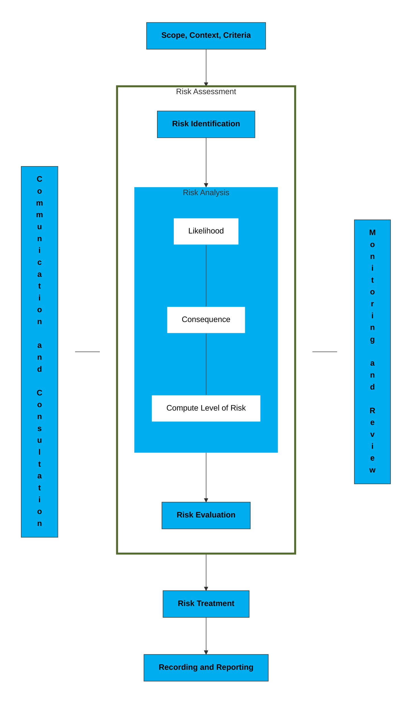
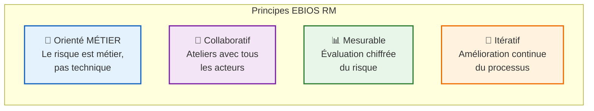
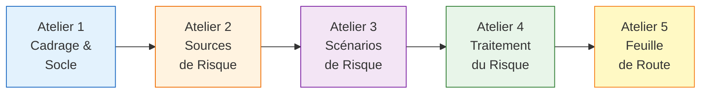
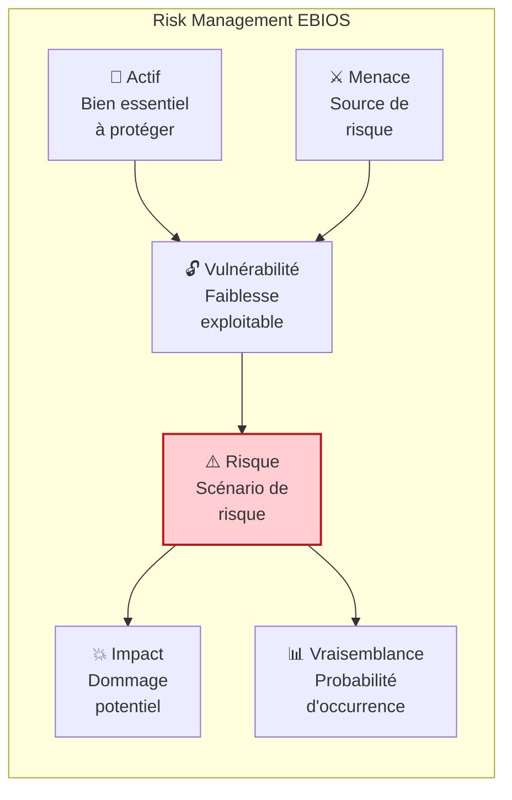
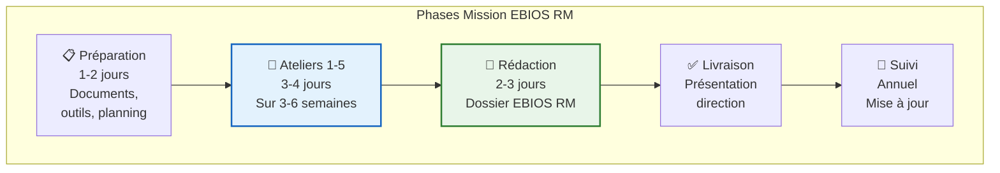

<!-- === EN-TÊTE DOCUMENTAIRE ISO-GRADE === -->

| Métadonnées | Valeur |
|-------------|--------|
| **Référence** | `EBIOS-METH-001` |
| **Titre** | EBIOS RM - Méthodologie de Base |
| **Version** | `1.0` |
| **Date** | `05/03/2026` |
| **Propriétaire** | `ANSSI / Direction Conformité` |
| **Classification** | `Publique` |

---

# EBIOS RM - Méthodologie de Base

**Référence** : EBIOS-METH-001 | ANSSI EBIOS RM v1.0 (2021)

---

## 1. PRÉSENTATION DE LA MÉTHODE

### 1.1 Qu'est-ce qu'EBIOS RM ?

**EBIOS RM** (Expression des Besoins et Identification des Objectifs de Sécurité - Risk Manager) est la méthodologie d'analyse de risques cyber de l'ANSSI (Agence Nationale de la Sécurité des Systèmes d'Information).

Elle permet de :
- Identifier et évaluer les risques cyber d'un système d'information
- Définir des mesures de sécurité adaptées
- Établir une feuille de route de mise en œuvre

### 1.2 Conformité ISO 31000

EBIOS RM est **conforme au cadre de l'ISO 31000** (Management du risque — Principes et lignes directrices), la norme internationale de référence pour le management des risques.



| Principe ISO 31000 | Application EBIOS RM |
|:-------------------|:---------------------|
| **Intégration** | Les 5 ateliers intègrent tous les niveaux de l'organisation |
| **Structure complète** | Processus allant du cadrage à la feuille de route |
| **Personnalisation** | Adaptable à tout type de système d'information |
| **Inclusion des parties prenantes** | Ateliers collaboratifs avec métier, RSSI, direction |
| **Dynamique** | Suivi annuel et mise à jour continue |
| **Information et données** | Documentation complète et traçable |

Pour plus d'informations sur ISO 31000 : [Practical Risk Training - ISO 31000](https://practicalrisktraining.com/iso31000)

### 1.3 Principes Fondamentaux



---

## 2. LES 5 ATELIERS

### 2.1 Vue d'Ensemble



### 2.2 Détail des Ateliers

| N° | Nom | Durée | Objectif | Livrable |
|:--:|:----|:------|:---------|:---------|
| **1** | **Cadrage et Socle de Sécurité** | 4-6h | Définir le périmètre, identifier les biens essentiels, évaluer les mesures existantes | Périmètre, Biens essentiels, Socle de sécurité |
| **2** | **Sources de Risque** | 4-6h | Identifier les menaces (attaquants, cyberattaques, non-malveillant) | Sources de risque cartographiées |
| **3** | **Scénarios de Risque** | 6-8h | Construire et évaluer les scénarios de risque | Scénarios évalués avec niveau de risque |
| **4** | **Traitement du Risque** | 4-6h | Définir les mesures de sécurité et le risque résiduel | Plan de traitement du risque |
| **5** | **Feuille de Route** | 3-4h | Construire le plan d'action et finaliser le dossier | Feuille de route, Dossier EBIOS RM |

---

## 3. CONCEPTS CLÉS

### 3.1 Le Risk Management selon EBIOS



### 3.2 Glossaire des Termes Essentiels

| Terme | Définition | Exemple |
|:------|:-----------|:--------|
| **Bien Essentiel** | Actif métier critique dont la compromission aurait un impact majeur | Système de production, données clients |
| **Source de Risque** | Origine potentielle d'un événement nuisible | Attaquant externe, erreur humaine |
| **Scénario de Risque** | Description d'un événement de sécurité et de ses conséquences | Vol de données par phishing |
| **Impact** | Conséquence d'un événement de sécurité sur les objectifs métier | Perte financière, atteinte à la réputation |
| **Vraisemblance** | Probabilité qu'un scénario de risque se réalise | Élevée, Moyenne, Faible |
| **Niveau de Risque** | Combinaison de l'impact et de la vraisemblance | Critique, Élevé, Moyen, Faible |
| **Mesure de Sécurité** | Action ou dispositif réduisant le risque | Firewall, formation, chiffrement |
| **Risque Résiduel** | Risque restant après application des mesures de sécurité | Risque accepté ou à traiter |

---

## 4. PROCESSUS GLOBAL

### 4.1 Phases d'une Mission EBIOS RM



### 4.2 Durée Totale Estimée

| Phase | Durée | Commentaire |
|:------|:------|:------------|
| Préparation | 1-2 jours | Rassemblement documents, outils |
| 5 ateliers | 3-4 jours | Répartis sur 3-6 semaines |
| Rédaction | 2-3 jours | Dossier complet |
| **Total mission** | **1 à 2 mois** | Selon complexité |

---

## 5. RÔLES ET RESPONSABILITÉS

| Rôle | Responsabilité | Implication |
|:-----|:---------------|:------------|
| **Auditeur EBIOS** | Animer les ateliers, rédiger le dossier | 100% - Pilote la mission |
| **RSSI** | Fournir informations techniques, valider le socle | 60% - Expert technique |
| **Direction** | Arbitrer, valider les scénarios, décider du traitement | 30% - Décisionnaire |
| **Référents Métier** | Participer aux ateliers, identifier les biens essentiels | 40% - Connaissance métier |
| **Juridique** | Valider aspects réglementaires | 20% - Support |

---

## 6. LIVRABLES

### 6.1 Dossier EBIOS RM Complet

```
DOSSIER_EBIOS_RM/
├── 01-Cadrage/
│   ├── Périmètre.md
│   ├── Biens-essentiels.md
│   └── Socle-sécurité.md
├── 02-Sources-risque/
│   └── Sources-identifiées.md
├── 03-Scénarios/
│   └── Scénarios-évalués.md
├── 04-Traitement/
│   └── Plan-traitement.md
├── 05-Feuille-route/
│   └── Plan-action.md
└── Annexes/
    ├── Comptes-rendus-ateliers/
    └── Documents-référence/
```

### 6.2 Synthèse pour la Direction

- **Cartographie des risques** (matrice impact/vraisemblance)
- **Top 5 des risques critiques**
- **Plan d'action priorisé**
- **Budget estimé**

---

## 7. RÉFÉRENCES

| Référence | Description | Lien |
|:----------|:------------|:-----|
| **ANSSI** | Site officiel EBIOS RM | https://www.ssi.gouv.fr/ebios |
| **Guide EBIOS RM** | Document officiel ANSSI | v1.0 (2021) |
| **ISO 31000** | Management du risque - Principes et lignes directrices | ISO 31000:2018 |
| **ISO 27005** | Management du risque en sécurité de l'information | ISO/IEC 27005:2022 |

---

## 8. RÉVISION

| Version | Date | Auteur | Modifications |
|:--------|:-----|:-------|:--------------|
| 1.0 | 05/03/2026 | Direction Conformité | Création méthodologie de base ISO-Grade |

---

**Document approuvé par :**
- [ ] RSSI
- [ ] Direction Conformité

**Date d'approbation :** _______________

---

*EBIOS RM Méthodologie — Version 1.0 ISO-Grade*  
*Réf. EBIOS-METH-001*

---

## ⚠️ NOTE

> Ce document présente la méthodologie EBIOS RM de manière générique 
> et applicable à tout type de système d'information.
> 
> Pour des applications spécifiques (SIA, santé, finance, etc.), 
> consulter les documents de la section **01-APPLICATION-SIA/**.
