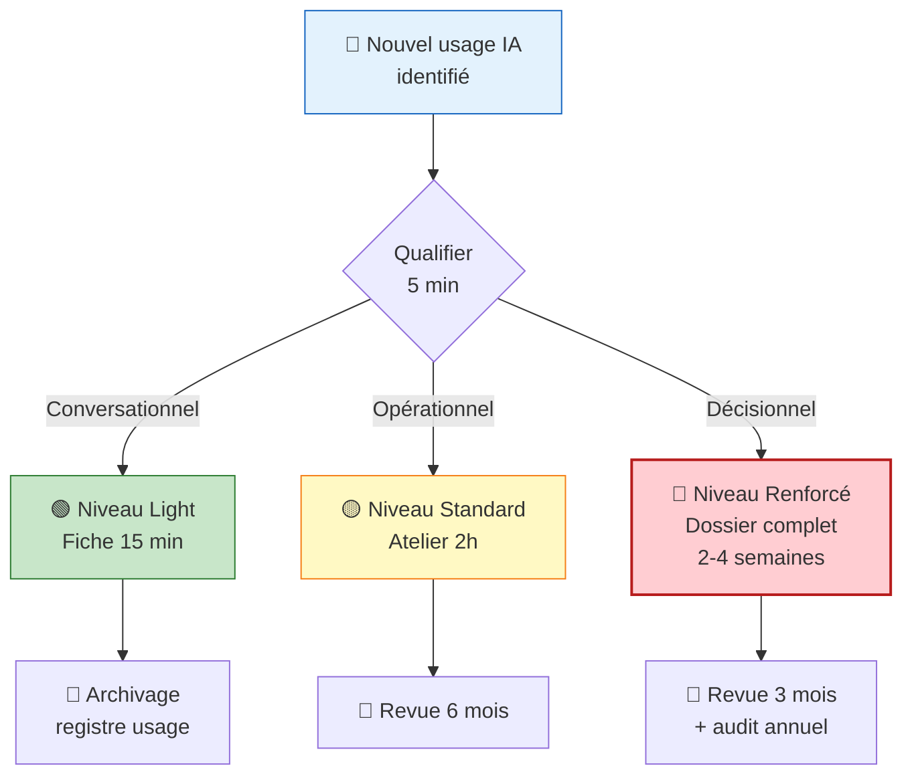

<!-- === EN-TÊTE DOCUMENTAIRE ISO-GRADE === -->

| Métadonnées | Valeur |
|-------------|--------|
| **Référence** | `EBIOS-IA-USAGE-001` |
| **Titre** | Usage-First Qualifier - Grille de Classification EBIOS-RM IA |
| **Version** | `1.0` |
| **Date** | `06/03/2026` |
| **Propriétaire** | `Direction Conformité / AI Officer` |
| **Classification** | `Interne` |

---

# Usage-First Qualifier

**Référence** : EBIOS-IA-USAGE-001 | Qualifier l'usage avant de choisir la méthodologie

---

## 🎯 Principe Fondamental

> **"Qualifier l'usage avant de choisir la méthodologie"**

La clé pour rendre EBIOS-RM IA opérationnel est de classifier l'**usage** du SIA avant de décider de la profondeur de l'analyse de risques.

---

## 📊 Classification par Type d'Usage

| Type d'usage | Exemple | Traçabilité requise | Niveau EBIOS-RM |
|:-------------|:--------|:--------------------|:----------------|
| **💬 Conversationnel** | Chat, rédaction, brainstorming | Aucune ou minimale | 🟢 **"Light"** (optionnel) |
| **⚙️ Workflow semi-automatisé** | RAG documentaire, aide au tri | Logs des prompts/sorties | 🟡 **"Standard"** |
| **🤖 Agentique / décisionnel** | Tri automatique, scoring, action autonome | Traçabilité complète + supervision | 🔴 **"Renforcé"** |

---

## 🧭 Grille de Qualification d'Usage

*À remplir en 5 minutes avant de choisir l'approche méthodologique*

---

### FICHE USAGE-QUALIFIER

```yaml
usage_nom: "[Ex: Assistant de rédaction RH]"
description_1_ligne: "[Ex: Génération de brouillons de feedback employés]"
date_qualification: "[JJ/MM/AAAA]"
qualifie_par: "[Nom, Prénom, Rôle]"
```

---

## 1️⃣ Niveau d'Automatisation

☐ **Conversationnel** : l'humain copie/colle, décide tout  
☐ **Assisté** : l'IA propose, l'humain valide systématiquement  
☐ **Semi-auto** : l'IA exécute des étapes, l'humain supervise  
☐ **Auto** : l'IA décide et agit, l'humain intervient en exception

---

## 2️⃣ Impact de la Sortie

☐ **Informel** : pas de conséquence si erreur (ex: brouillon)  
☐ **Opérationnel** : impact sur efficacité, mais réversible  
☐ **Décisionnel** : impact sur personne/processus métier  
☐ **Réglementaire** : impact légal, financier, réputationnel

---

## 3️⃣ Données Manipulées

☐ **Publiques / génériques**  
☐ **Internes non sensibles**  
☐ **Données personnelles (RGPD)**  
☐ **Données critiques** (secret, santé, financier)

---

## 4️⃣ Réversibilité / Supervision

☐ **Sortie toujours revue avant usage**  
☐ **Revue aléatoire / par échantillonnage**  
☐ **Monitoring a posteriori uniquement**  
☐ **Aucune supervision documentée**

---

## → Classification Finale

| [ ] | Niveau | Approche | Délai |
|:---:|:-------|:---------|:------|
| ☐ | 🟢 **Usage Assistif** | Fiche Light (optionnelle) | 15 min |
| ☐ | 🟡 **Usage Opérationnel** | EBIOS-RM Standard (2h) | 1-2 semaines |
| ☐ | 🔴 **Usage Décisionnel** | EBIOS-RM Renforcé + conformité | 2-4 semaines |

---

## 📋 Les 3 Niveaux EBIOS-RM Adaptés

### 🟢 Niveau Light — Usage Conversationnel

**Pour :** Chat, rédaction, brainstorming, veille documentaire

**Objectif :** "Avoir une trace si incident, pas de surcharge"

**Livrable unique (1/2 page) :**

```
┌─────────────────────────────────────────────────────────┐
│  FICHE LIGHT - USAGE IA                                 │
├─────────────────────────────────────────────────────────┤
│  Usage : [1 ligne]                                      │
│  Outil : [Nom du SIA/API]                               │
│                                                         │
│  Donnée sensible ? ☐ Oui ☐ Non                        │
│  → Si oui, référence AIPD : [ID]                       │
│                                                         │
│  Précaution prise :                                     │
│  [Ex: pas de copier de données clients]                 │
│                                                         │
│  Responsable : [Nom]                                    │
│  Date : [JJ/MM/AAAA]                                    │
└─────────────────────────────────────────────────────────┘
```

| Caractéristique | Valeur |
|:----------------|:-------|
| **Temps** | 15 minutes |
| **Fréquence** | Par équipe / par outil, pas par usage |
| **Atelier formel** | ❌ Non requis |
| **Qui remplit** | Responsable d'équipe |

> ✅ **Pas d'atelier formel requis.** Cette fiche peut être remplie par le responsable d'équipe.

---

### 🟡 Niveau Standard — Usage Opérationnel / Workflow

**Pour :** RAG métier, aide au tri, génération structurée avec validation

**Objectif :** "Maîtriser les risques d'erreur et de biais dans l'exécution"

**EBIOS-RM adapté (5 ateliers allégés) :**

| Atelier | Focus | Durée |
|:--------|:------|:------|
| **Atelier 1** | Biens essentiels = [qualité sortie, continuité service, conformité] | 20 min |
| **Atelier 2** | Sources de risque = [hallucination, biais, fuite contexte, prompt injection] | 30 min |
| **Atelier 3** | Scénarios = 2-3 max, focalisés sur l'impact métier | 30 min |
| **Atelier 4** | Mesures = [validation humaine, logs, monitoring simple] | 20 min |
| **Atelier 5** | Revue = [6 mois ou après incident] | 10 min |

**Livrable :** "Fiche Risques Workflow IA" (2 pages max)

| Caractéristique | Valeur |
|:----------------|:-------|
| **Temps** | 1h30-2h en atelier pluridisciplinaire |
| **Participants** | Métier + RSSI + Utilisateurs |
| **Focus** | Interface humain-IA : où est la validation ? comment on détecte une erreur ? |

> ✅ **Focus sur l'interface humain-IA** : où est la validation ? comment on détecte une erreur ?

---

### 🔴 Niveau Renforcé — Usage Agentique / Décisionnel

**Pour :** Tri automatique, scoring, actions autonomes, impact réglementaire

**Objectif :** "Garantir la conformité réglementaire et la protection des droits"

**EBIOS-RM complet + conformité AI Act :**

| Composant | Description | Référence |
|:----------|:------------|:----------|
| **EBIOS-RM Standard** | Les 5 ateliers complets | Méthode ANSSI |
| **FRIA** | Fundamental Rights Impact Assessment | AI Act Art. 27a |
| **DPIA** | Data Protection Impact Assessment | RGPD Art. 35 |
| **Documentation technique** | Relevé des exigences fournisseur | AI Act Art. 11 |
| **Plan de supervision** | Procédures HITL détaillées | AI Act Art. 14 |
| **Registre UE** | Enregistrement Article 60 | AI Act Art. 60 |

**Livrable :** "Dossier Conformité SIA" (10-20 pages)

| Caractéristique | Valeur |
|:----------------|:-------|
| **Temps** | 2-4 semaines |
| **Participants** | Métier + RSSI + DPO + Juridique + Direction |
| **Validation** | Comité éthique IA si HR/Justice |

---

## 🔄 Processus de Décision



---

## 📊 Matrice de Décision Rapide

| Automatisation | Impact | Données | Supervision | → Niveau |
|:---------------|:-------|:--------|:------------|:---------|
| Conversationnel | Informel | Publiques | Revue systématique | 🟢 Light |
| Assisté | Opérationnel | Internes | Revue systématique | 🟡 Standard |
| Semi-auto | Décisionnel | RGPD | Échantillonnage | 🟡 Standard |
| Semi-auto | Décisionnel | Critiques | Échantillonnage | 🔴 Renforcé |
| Auto | Réglementaire | RGPD/Critiques | A posteriori | 🔴 Renforcé |
| Auto | Réglementaire | Critiques | Aucune | 🔴 Renforcé + STOP |

---

## 🎯 Exemples de Classification

### Exemple 1 : ChatGPT pour rédaction d'emails

| Critère | Évaluation |
|:--------|:-----------|
| Automatisation | Conversationnel |
| Impact | Informel |
| Données | Internes non sensibles |
| Supervision | Revue avant envoi |
| **→ Classification** | 🟢 **Light** |

### Exemple 2 : RAG pour recherche jurisprudence

| Critère | Évaluation |
|:--------|:-----------|
| Automatisation | Assisté |
| Impact | Décisionnel (conseil juridique) |
| Données | Internes sensibles |
| Supervision | Revue systématique par juriste |
| **→ Classification** | 🟡 **Standard** |

### Exemple 3 : Scoring automatique candidats

| Critère | Évaluation |
|:--------|:-----------|
| Automatisation | Auto (scoring + tri) |
| Impact | Réglementaire (recrutement) |
| Données | RGPD (CV, données candidats) |
| Supervision | Échantillonnage |
| **→ Classification** | 🔴 **Renforcé** |

---

## ✅ Checklist de Qualification

### Avant de commencer toute analyse de risques :

| ☐ | Étape | Action |
|:--|:------|:-------|
| ☐ | 1 | Identifier l'usage précis du SIA |
| ☐ | 2 | Remplir la grille Usage-Qualifier (5 min) |
| ☐ | 3 | Déterminer le niveau EBIOS-RM |
| ☐ | 4 | Allouer les ressources appropriées |
| ☐ | 5 | Documenter la classification |

---

## 📁 Templates à Utiliser

| Niveau | Template | Emplacement |
|:-------|:---------|:------------|
| 🟢 Light | `template-fiche-light.md` | `20-OUTILS/templates/` |
| 🟡 Standard | `template-fiche-standard.md` | `20-OUTILS/templates/` |
| 🔴 Renforcé | `template-dossier-renforce.md` | `20-OUTILS/templates/` |

---

## 7. RÉVISION

| Version | Date | Auteur | Modifications |
|:--------|:-----|:-------|:--------------|
| 1.0 | 06/03/2026 | Direction Conformité | Création Usage-First Qualifier |

---

**Document approuvé par :**
- [ ] AI Officer
- [ ] RSSI
- [ ] Direction Conformité

**Date d'approbation :** _______________

---

*Usage-First Qualifier — Version 1.0 ISO-Grade*  
*Réf. EBIOS-IA-USAGE-001*

---

## 💡 Conseil d'Utilisation

> Commencez **toujours** par qualifier l'usage avant d'ouvrir un atelier EBIOS.  
> Cette grille évite 80% des sur-analyses inutiles et garantit la proportionnalité des moyens.
