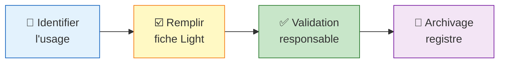

<!-- === EN-TÊTE DOCUMENTAIRE ISO-GRADE === -->

| Métadonnées | Valeur |
|-------------|--------|
| **Référence** | `EBIOS-LIGHT-001` |
| **Titre** | EBIOS-RM Light - Niveau Conversationnel |
| **Version** | `1.0` |
| **Date** | `06/03/2026` |
| **Propriétaire** | `Direction Conformité` |
| **Classification** | `Interne` |

---

# EBIOS-RM Light - Niveau Conversationnel

**Référence** : EBIOS-LIGHT-001 | 🟢 Usage conversationnel uniquement

---

## 🎯 Objectif

> "Avoir une trace si incident, pas de surcharge"

Pour les usages **conversationnels** où l'IA n'agit pas sur des données/processus métier : chat, rédaction, brainstorming, veille documentaire.

---

## 📋 Fiche Light (Template)

```
┌─────────────────────────────────────────────────────────────────┐
│                    FICHE EBIOS-RM LIGHT 🟢                      │
├─────────────────────────────────────────────────────────────────┤
│ Référence     : LIGHT-[YYYY]-[XXX]                              │
│ Date          : [JJ/MM/AAAA]                                    │
│ Qualifié par  : [Nom, Prénom, Rôle]                             │
├─────────────────────────────────────────────────────────────────┤
│ 1. IDENTIFICATION DE L'USAGE                                    │
├─────────────────────────────────────────────────────────────────┤
│ Nom de l'usage        : [Ex: Assistant rédaction emails]        │
│ Outil/SIA utilisé     : [Ex: ChatGPT Enterprise]                │
│ Équipe/Service        : [Ex: Communication]                     │
│ Description (1 ligne) : [Génération brouillons emails internes] │
├─────────────────────────────────────────────────────────────────┤
│ 2. JUSTIFICATION DU NIVEAU LIGHT                                │
├─────────────────────────────────────────────────────────────────┤
│ ☐ Conversationnel : copier/coller, humain décide tout           │
│ ☐ Impact informel : pas de conséquence si erreur                │
│ ☐ Données publiques ou internes non sensibles                   │
│ ☐ Sortie toujours revue avant usage                             │
├─────────────────────────────────────────────────────────────────┤
│ 3. PRÉCAUTIONS PRISES                                           │
├─────────────────────────────────────────────────────────────────┤
│ ☐ Pas de données clients/personnelles dans les prompts          │
│ ☐ Vérification systématique avant envoi/utilisation             │
│ ☐ Utilisation conforme à la politique IA de l'entreprise        │
│ ☐ Formation de base des utilisateurs effectuée                  │
│                                                                 │
│ Précisions : [Champ libre pour spécificités]                    │
├─────────────────────────────────────────────────────────────────┤
│ 4. RISQUES IDENTIFIÉS (simplifié)                               │
├─────────────────────────────────────────────────────────────────┤
│ Risque principal    : [Ex: Fuite données sensibles par erreur] │
│ Mitigation          : [Ex: Consignes claires, DLP activé]       │
│                                                                 │
│ Risque secondaire   : [Ex: Hallucination dans contenu généré]  │
│ Mitigation          : [Ex: Revue obligatoire avant usage]       │
├─────────────────────────────────────────────────────────────────┤
│ 5. VALIDATION                                                   │
├─────────────────────────────────────────────────────────────────┤
│ Responsable équipe  : [Nom]        Date : [JJ/MM/AAAA]         │
│ Visa RSSI (si besoin): [Nom/NA]    Date : [JJ/MM/AAAA]         │
├─────────────────────────────────────────────────────────────────┤
│ 6. RÉVISION                                                     │
├─────────────────────────────────────────────────────────────────┤
│ Fréquence : Annuelle ou si changement d'usage                   │
│ Prochaine revue : [JJ/MM/AAAA]                                  │
└─────────────────────────────────────────────────────────────────┘
```

---

## ⏱️ Processus Light (15 minutes)



| Étape | Durée | Qui |
|:------|:------|:----|
| Identifier l'usage | 2 min | Utilisateur/Responsable |
| Remplir la fiche | 10 min | Responsable d'équipe |
| Validation | 2 min | Responsable |
| Archivage | 1 min | RSSI/Conformité |
| **Total** | **15 min** | |

---

## ✅ Critères d'Éligibilité au Niveau Light

Tous les critères suivants doivent être respectés :

| Critère | Description | Vérification |
|:--------|:------------|:-------------|
| **Automatisation** | Conversationnel uniquement | L'humain copie/colle, décide tout |
| **Impact** | Informel | Pas de conséquence métier si erreur |
| **Données** | Publiques ou internes non sensibles | Pas de RGPD, pas de secret |
| **Supervision** | Revue systématique | Toute sortie est revue avant usage |

⚠️ **Si un critère n'est pas rempli → Passer au niveau Standard 🟡**

---

## 🚫 Exclusions du Niveau Light

Ne **peut pas** être classé Light si :

- ❌ L'IA agit directement sur des données/processus métier
- ❌ La sortie influence une décision sans validation humaine
- ❌ Des données personnelles (RGPD) sont traitées
- ❌ L'usage est dans les secteurs Annex III AI Act (RH, justice, etc.)
- ❌ Il n'y a aucune supervision de l'output

---

## 📊 Exemples d'Usages Light

| Usage | Outil | Justification |
|:------|:------|:--------------|
| Rédaction brouillons emails | ChatGPT | Informel, revue obligatoire, pas de données sensibles |
| Brainstorming idées | Claude | Créatif, pas d'impact décisionnel |
| Reformulation textes | Grammarly | Aide rédactionnelle, validation humaine |
| Veille documentaire synthétique | Perplexity | Informationnel, pas d'action automatique |
| Génération code snippets | Copilot | Revue code obligatoire, tests à faire |

---

## 🔄 Fréquence de Révision

| Événement | Action |
|:----------|:-------|
| **Annuelle** | Revue systématique de toutes les fiches Light |
| **Changement d'usage** | Requalification si l'usage évolue |
| **Incident** | Analyse et mise à jour post-incident |
| **Nouvel outil** | Nouvelle fiche si changement de SIA |

---

## 📁 Archivage et Registre

Les fiches Light sont archivées dans :
```
REGISTRE_USAGES_IA/
├── LIGHT/
│   ├── 2026/
│   │   ├── LIGHT-2026-001.md
│   │   ├── LIGHT-2026-002.md
│   │   └── ...
│   └── index.csv
```

**Format index.csv :**
```csv
Référence,Date,Usage,Outil,Équipe,Responsable,Prochaine revue
LIGHT-2026-001,06/03/2026,Rédaction emails,ChatGPT,Com,Nom Prénom,06/03/2027
```

---

## 7. RÉVISION

| Version | Date | Auteur | Modifications |
|:--------|:-----|:-------|:--------------|
| 1.0 | 06/03/2026 | Direction Conformité | Création EBIOS-RM Light |

---

**Document approuvé par :**
- [ ] AI Officer
- [ ] RSSI

**Date d'approbation :** _______________

---

*EBIOS-RM Light — Version 1.0 ISO-Grade*  
*Réf. EBIOS-LIGHT-001*
