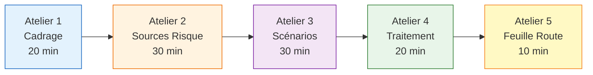
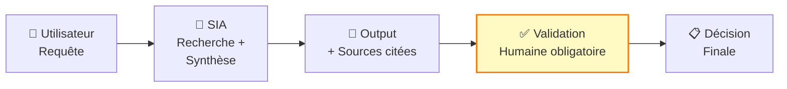

<!-- === EN-TÊTE DOCUMENTAIRE ISO-GRADE === -->

| Métadonnées | Valeur |
|-------------|--------|
| **Référence** | `EBIOS-STANDARD-001` |
| **Titre** | EBIOS-RM Standard - Niveau Workflow |
| **Version** | `1.0` |
| **Date** | `06/03/2026` |
| **Propriétaire** | `Direction Conformité` |
| **Classification** | `Confidentiel` |

---

# EBIOS-RM Standard - Niveau Workflow

**Référence** : EBIOS-STANDARD-001 | 🟡 Usage opérationnel / workflow

---

## 🎯 Objectif

> "Maîtriser les risques d'erreur et de biais dans l'exécution"

Pour les usages **opérationnels** où l'IA aide au workflow mais avec validation humaine : RAG métier, aide au tri, génération structurée.

---

## 📋 Processus Standard (5 Ateliers Allégés)



**Durée totale : 1h30 - 2h**

---

## 🏢 Atelier 1 : Cadrage (20 min)

### Objectif
Définir le périmètre et identifier les biens essentiels spécifiques au workflow IA.

### Points de décision délégués

| Décision | Déléguée à l'IA ? | Supervision humaine |
|:---------|:------------------|:--------------------|
| Recherche documentaire | ✅ Oui | Échantillonnage |
| Synthèse information | ✅ Oui | Validation finale |
| Recommandation action | ❌ Non | Humain décide |
| Exécution action | ❌ Non | Jamais délégué |

### Biens Essentiels (Workflow IA)

| ID | Bien | Valeur | Justification |
|:---|:-----|:-------|:--------------|
| BE-001 | Qualité des sorties | Élevée | Impact décisions métier |
| BE-002 | Continuité service | Élevée | Dépendance opérationnelle |
| BE-003 | Conformité processus | Moyenne | Respect procédures |
| BE-004 | Données sources | Élevée | Intégrité RAG |

### Livrable
- Périmètre workflow documenté
- Matrice décision déléguée
- 3-4 biens essentiels identifiés

---

## ⚔️ Atelier 2 : Sources de Risque (30 min)

### Focus Risques IA Spécifiques

| Risque | Description | Exemple |
|:-------|:------------|:--------|
| **Hallucination** | Information fausse dans la synthèse | Référence inexistante citée |
| **Biais contexte** | Sous-représentation certaines sources | RAG ignore documents récents |
| **Fuite contexte** | Prompt injection via documents | Document malveillant injecté |
| **Prompt injection** | Détournement via requête utilisateur | "Ignore instructions précédentes" |
| **Dérive modèle** | Perte qualité dans le temps | Résultats moins pertinents |

### Sources à Documenter

```
Attaquants potentiels :
├── Internes (inadvertance)
│   └── Requêtes mal formulées, sur-confiance
├── Externes (si exposition publique)
│   └── Prompt injection, manipulation
└── Systémiques
    └── Drift modèle, obsolescence
```

### Livrable
- 4-6 sources de risque identifiées
- Évaluation capacité/opportunité simplifiée

---

## 🎭 Atelier 3 : Scénarios de Risque (30 min)

### Scénarios Types Workflow IA

#### SC-STD-001 : Hallucination dans Synthèse RAG

| Attribut | Description |
|:---------|:------------|
| **Source** | Hallucination + confiance utilisateur |
| **Actif** | Qualité décision métier |
| **Impact** | Décision erronée basée sur faux [3] |
| **Vraisemblance** | Moyenne (fréquent RAG) [3] |
| **Niveau** | 🟠 **ÉLEVÉ** |
| **Mitigation** | Validation sources, double-check faits |

#### SC-STD-002 : Contamination Vector DB

| Attribut | Description |
|:---------|:------------|
| **Source** | Document malveillant injecté |
| **Actif** | Intégrité base connaissances |
| **Impact** | Propagation info fausse [3] |
| **Vraisemblance** | Faible (contrôles existants) [2] |
| **Niveau** | 🟡 **MOYEN** |
| **Mitigation** | Sanitization documents, contrôle accès |

#### SC-STD-003 : Dérive Utilisateur (Over-reliance)

| Attribut | Description |
|:---------|:------------|
| **Source** | Sur-confiance dans recommandations IA |
| **Actif** | Qualité décisions métier |
| **Impact** | Erreurs jugement, biais automation [3] |
| **Vraisemblance** | Élevée (comportement humain) [4] |
| **Niveau** | 🟠 **ÉLEVÉ** |
| **Mitigation** | Formation, rappels réguliers limites IA |

### Livrable
- 2-3 scénarios prioritaires
- Matrice impact/vraisemblance
- Focus sur interface humain-IA

---

## 🛡️ Atelier 4 : Traitement (20 min)

### Mesures "IA-Hardened" pour Workflow

| ID | Mesure | Priorité | Implémentation |
|:---|:-------|:---------|:---------------|
| **M-001** | Validation humaine obligatoire | 🔴 | Échantillonnage ou systématique |
| **M-002** | Logs prompts/réponses | 🔴 | Conservation 6 mois minimum |
| **M-003** | Monitoring qualité | 🟠 | Métriques pertinence, satisfaction |
| **M-004** | Sources citées | 🔴 | RAG avec référence documents |
| **M-005** | Alertes anomalies | 🟠 | Détection comportements atypiques |
| **M-006** | Formation utilisateurs | 🔴 | Limites du SIA, validation requise |

### Focus Interface Humain-IA



**Questions clés :**
- Où se fait la validation humaine ?
- Comment détecte-t-on une erreur ?
- Quel est le taux de revue ?

### Livrable
- 4-6 mesures prioritaires
- Plan de validation humaine
- Programme formation

---

## 🗓️ Atelier 5 : Feuille de Route (10 min)

### Jalons de Réévaluation Obligatoires

| Jalon | Délai | Action |
|:------|:------|:-------|
| **Mise en production** | J0 | Validation initiale |
| **Premier bilan** | M+1 | Anomalies, ajustements |
| **Révision opérationnelle** | M+6 | Revue complète workflow |
| **Révision annuelle** | M+12 | Ou après incident significatif |

### Plan d'Action Simplifié

| Priorité | Mesure | Échéance | Responsable |
|:---------|:-------|:---------|:------------|
| P1 | Mise en place validation | J+7 | Métier |
| P1 | Formation utilisateurs | J+14 | RH/Conformité |
| P2 | Déploiement logs | J+30 | IT |
| P2 | Monitoring qualité | M+2 | Métier |
| P3 | Révision processus | M+6 | Tous |

### Livrable
- Feuille de route 6 mois
- Jalons de réévaluation
- Responsabilités assignées

---

## 📄 Livrable Standard : Fiche Workflow IA

```
┌─────────────────────────────────────────────────────────────────┐
│              FICHE EBIOS-RM STANDARD 🟡 - WORKFLOW IA           │
├─────────────────────────────────────────────────────────────────┤
│ Référence  : STD-[YYYY]-[XXX]     Date : [JJ/MM/AAAA]          │
│ Atelier    : [Dates des 5 ateliers]                             │
│ Participants : [Noms, rôles]                                    │
├─────────────────────────────────────────────────────────────────┤
│ 1. CADRAGE                                                      │
├─────────────────────────────────────────────────────────────────┤
│ Usage           : [Description précise]                         │
│ Outil/SIA       : [Nom + version]                               │
│ Points décision : [Matrice délégation]                          │
│ Biens essentiels: [Liste BE-XXX]                                │
├─────────────────────────────────────────────────────────────────┤
│ 2. SOURCES DE RISQUE                                            │
├─────────────────────────────────────────────────────────────────┤
│ [Liste 4-6 sources avec évaluation simplifiée]                  │
├─────────────────────────────────────────────────────────────────┤
│ 3. SCÉNARIOS PRIORITAIRES                                       │
├─────────────────────────────────────────────────────────────────┤
│ SC-001 : [Nom] → Niveau [Élevé/Moyen]                           │
│ SC-002 : [Nom] → Niveau [Élevé/Moyen]                           │
│ SC-003 : [Nom] → Niveau [Élevé/Moyen]                           │
├─────────────────────────────────────────────────────────────────┤
│ 4. MESURES DE TRAITEMENT                                        │
├─────────────────────────────────────────────────────────────────┤
│ [Liste mesures avec validation humaine détaillée]               │
├─────────────────────────────────────────────────────────────────┤
│ 5. FEUILLE DE ROUTE                                             │
├─────────────────────────────────────────────────────────────────┤
│ Jalons : M+1, M+6, M+12                                         │
│ Prochaine revue : [Date]                                        │
├─────────────────────────────────────────────────────────────────┤
│ VALIDATIONS                                                     │
├─────────────────────────────────────────────────────────────────┤
│ Responsable métier : [Nom]  Date : [JJ/MM/AAAA]                │
│ RSSI               : [Nom]  Date : [JJ/MM/AAAA]                │
└─────────────────────────────────────────────────────────────────┘
```

---

## ⏱️ Organisation de l'Atelier

| Aspect | Recommandation |
|:-------|:---------------|
| **Durée** | 1h30 - 2h |
| **Participants** | 4-6 personnes |
| **Profils** | Métier + RSSI + Utilisateurs + IT |
| **Format** | Workshop collaboratif |
| **Livrable** | Fiche 2 pages max |

---

## 7. RÉVISION

| Version | Date | Auteur | Modifications |
|:--------|:-----|:-------|:--------------|
| 1.0 | 06/03/2026 | Direction Conformité | Création EBIOS-RM Standard |

---

**Document approuvé par :**
- [ ] AI Officer
- [ ] RSSI

**Date d'approbation :** _______________

---

*EBIOS-RM Standard — Version 1.0 ISO-Grade*  
*Réf. EBIOS-STANDARD-001*
