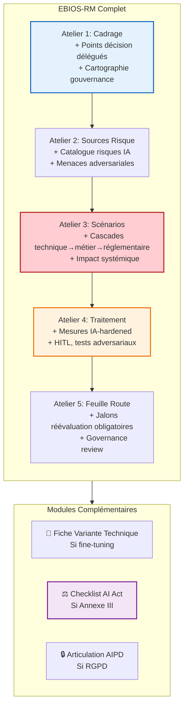
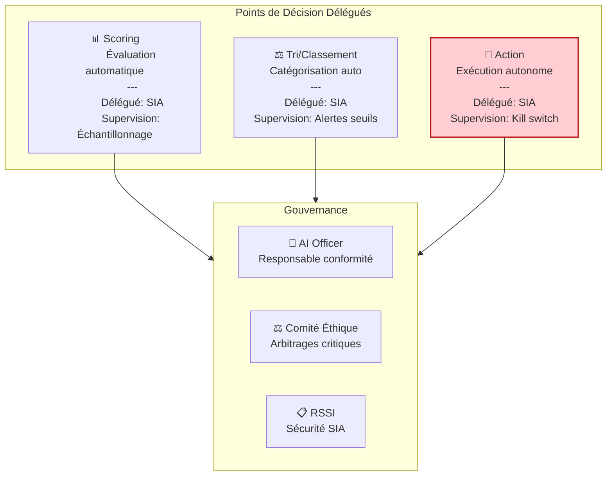
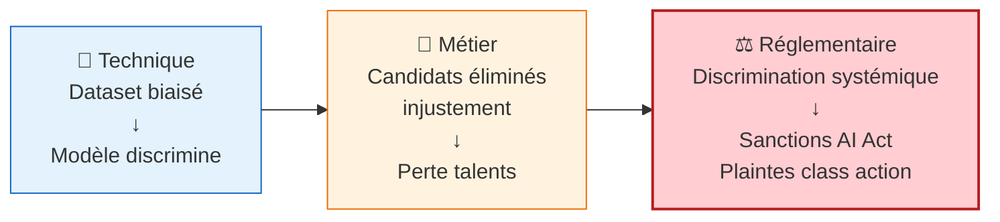
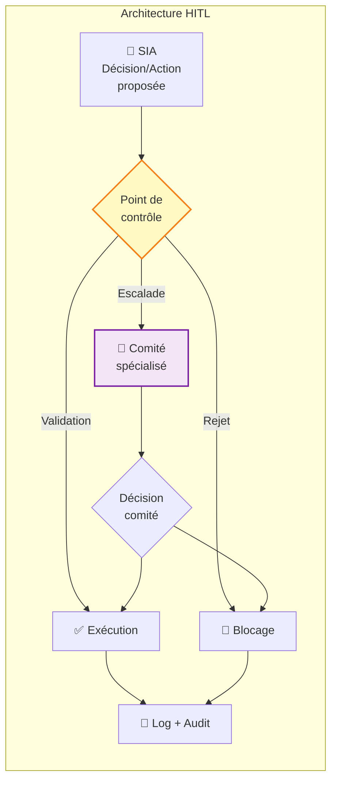

<!-- === EN-TÊTE DOCUMENTAIRE ISO-GRADE === -->

| Métadonnées | Valeur |
|-------------|--------|
| **Référence** | `EBIOS-RENFORCE-001` |
| **Titre** | EBIOS-RM Renforcé - Niveau Agentique/Décisionnel |
| **Version** | `1.0` |
| **Date** | `06/03/2026` |
| **Propriétaire** | `Direction Conformité / AI Officer` |
| **Classification** | `Confidentiel` |

---

# EBIOS-RM Renforcé - Niveau Agentique/Décisionnel

**Référence** : EBIOS-RENFORCE-001 | 🔴 Usage agentique / décisionnel / réglementaire

---

## 🎯 Objectif

> "Garantir la maîtrise des risques critiques et la conformité"

Pour les usages **critiques** où l'IA prend des décisions ou agit autonomement : tri automatique, scoring, actions autonomes, impact réglementaire.

---

## 📋 Processus Renforcé (EBIOS Complet + Modules)



---

## 🏢 Atelier 1+ : Cadrage Renforcé

### Cartographie des Points de Décision Délégués



### Matrice de Délégation Détaillée

| Processus | Décision | Délégué à IA ? | Supervision | Responsable final |
|:----------|:---------|:---------------|:------------|:------------------|
| Scoring candidat | Note/Classement | ✅ Oui | Échantillonnage + seuils | DRH |
| Rejet candidat | Élimination | ❌ Non | Systématique | Recruteur |
| Priorisation dossier | Urgence | ✅ Oui | Monitoring | Chef de service |
| Notification client | Envoi auto | ⚠️ Partiel | Validation si critique | Service client |

### Biens Essentiels (Agentique)

| ID | Bien | Valeur | Enjeu |
|:---|:-----|:-------|:------|
| BE-001 | Intégrité décisions | Critique | Non-discrimination, équité |
| BE-002 | Traçabilité | Critique | Conformité réglementaire |
| BE-003 | Supervision humaine | Critique | Droit de regard, recours |
| BE-004 | Sécurité SIA | Critique | Protection contre manipulations |
| BE-005 | Continuité service | Élevée | Disponibilité critique |

---

## ⚔️ Atelier 2+ : Sources de Risque Renforcées

### Catalogue Risques IA (Adversarial, Drift, Biais Systémique)

#### Risques Adversariaux

| Risque | Description | Source | Probabilité |
|:-------|:------------|:-------|:------------|
| **Poisoning données** | Injection données malveillantes dans training | Attaquant interne/externe | Moyenne |
| **Evasion** | Contournement par inputs spécialement conçus | Attaquant externe | Élevée |
| **Extraction modèle** | Vol du modèle via requêtes API | Concurrent, État | Moyenne |
| **Prompt injection** | Détournement objectif via manipulation | Utilisateur malveillant | Élevée |
| **Backdoor** | Activation comportement caché par trigger | Supply chain | Faible |

#### Risques de Drift

| Risque | Description | Détection | Impact |
|:-------|:------------|:----------|:-------|
| **Data drift** | Changement distribution données entrée | Monitoring stats | Dégradation performance |
| **Concept drift** | Évolution relation input/output | Métriques métier | Obsolescence modèle |
| **Model drift** | Dérive interne du modèle | Tests réguliers | Erreurs croissantes |

#### Risques de Biais Systémique

| Risque | Description | Exemple | Impact |
|:-------|:------------|:--------|:-------|
| **Biais historique** | Reproduction discriminations passées | Scoring défavorable femmes | Discrimination |
| **Biais représentation** | Sous-représentation populations | Dataset ethnique non diversifié | Exclusion |
| **Biais de mesure** | Features proxy pour variables protégées | Code postal comme revenu | Discrimination indirecte |
| **Biais feedback loop** | Amplification par boucle rétroaction | Système crédit auto-renforçant | Exclusion systémique |

---

## 🎭 Atelier 3+ : Scénarios en Cascade

### Scénarios "Cascades" : Technique → Métier → Réglementaire

#### SC-REN-001 : Biais de Scoring en Recrutement (Cascade Complète)



| Niveau | Impact | Description |
|:-------|:-------|:------------|
| **Technique** | Dataset d'entraînement biaisé historiquement | [4] |
| **Métier** | Élimination systématique candidats profilé | [4] |
| **Réglementaire** | Violation AI Act Art. 10, sanctions 35M€ | [4] |
| **Vraisemblance** | Élevée (biais fréquents) | [4] |
| **Niveau global** | 🔴 **CRITIQUE** |

#### SC-REN-002 : Manipulation Agent Autonome Financier

| Niveau | Impact | Description |
|:-------|:-------|:------------|
| **Technique** | Prompt injection + goal hijacking | [4] |
| **Métier** | Transactions non autorisées, pertes financières | [4] |
| **Réglementaire** | Violation MiFID II, sanctions AMF | [3] |
| **Vraisemblance** | Moyenne (attaques émergentes) | [3] |
| **Niveau global** | 🔴 **CRITIQUE** |

---

## 🛡️ Atelier 4+ : Mesures IA-Hardened

### Human-in-the-Loop (HITL) Détaillé



### Tests Adversariaux

| Type de Test | Fréquence | Responsable | Livrable |
|:-------------|:----------|:------------|:---------|
| **Red teaming** | Semestrielle | Équipe externe | Rapport vulnérabilités |
| **Adversarial testing** | Mensuelle | Équipe interne | Métriques robustesse |
| **Prompt injection tests** | Continue | Automatisé | Alertes détection |
| **Bias audits** | Trimestrielle | Expert externe | Rapport fairness |

### Explicabilité (XAI)

| Exigence | Implémentation | Niveau |
|:---------|:---------------|:-------|
| **Feature importance** | Variables influençant la décision | Obligatoire |
| **Counterfactuals** | "Que fallait-il changer pour autre décision ?" | Recommandé |
| **SHAP/LIME** | Explications locales par décision | Recommandé |
| **Model cards** | Documentation capacités/limites | Obligatoire |

---

## 🗓️ Atelier 5+ : Feuille de Route avec Jalons Obligatoires

### Jalons de Réévaluation

| Jalon | Délai | Action | Participants |
|:------|:------|:-------|:-------------|
| **Mise en prod** | J0 | Validation conformité complète | Tous |
| **Bilan M+1** | 1 mois | Anomalies, ajustements | Métier + RSSI |
| **Audit T+3** | 3 mois | Audit interne conformité | Conformité + RSSI |
| **Révision T+6** | 6 mois | Revue complète risques | Tous + Comité éthique |
| **Audit externe** | 12 mois | Audit tiers indépendant | Auditeur externe |
| **Révision annuelle** | 12 mois | Ou après incident critique | Tous |

### Governance Review

| Fréquence | Instance | Ordre du jour |
|:----------|:---------|:--------------|
| **Mensuelle** | AI Officer + Métier | Métriques, incidents, ajustements |
| **Trimestrielle** | Comité Éthique IA | Cas litigieux, évolutions, biais |
| **Semestrielle** | Direction | Stratégie, risques majeurs, budget |

---

## 📎 Modules Complémentaires

### Module 1 : Fiche Variante Technique (si fine-tuning)

À compléter si l'organisation fine-tune un modèle existant :

| Section | Contenu |
|:--------|:--------|
| **Dataset fine-tuning** | Origine, qualité, droits, biais connus |
| **Architecture** | Modèle base, couches ajoutées, hyperparamètres |
| **Évaluation** | Métriques performance, tests robustesse |
| **Déploiement** | Pipeline CI/CD, rollback, monitoring |

### Module 2 : Checklist Conformité AI Act (si Annexe III)

| Article | Exigence | Statut | Preuve |
|:--------|:---------|:-------|:-------|
| Art. 8 | Classification correcte | ☐ | Document classification |
| Art. 9 | Système qualité | ☐ | Procédures SMIA |
| Art. 10 | Data governance | ☐ | DPIA, traçabilité |
| Art. 11 | Documentation technique | ☐ | Model card, specs |
| Art. 12 | Traçabilité logs | ☐ | Système logging |
| Art. 13 | Transparence | ☐ | Informations utilisateurs |
| Art. 14 | Supervision humaine | ☐ | Procédures HITL |
| Art. 27a | FRIA | ☐ | Évaluation impact droits |

### Module 3 : Articulation AIPD (si RGPD)

| Étape | EBIOS | AIPD | Synergie |
|:------|:------|:-----|:---------|
| Identification risques | Atelier 2 | Analyse risques privacy | Sources communes |
| Évaluation impact | Atelier 3 | Mesures protection | Scénarios croisés |
| Mesures | Atelier 4 | Sécurité données | Mesures convergentes |
| Documentation | Dossier EBIOS | AIPD | Références croisées |

---

## 📄 Livrable : Dossier EBIOS-RM IA Renforcé

```
DOSSIER_EBIOS_IA_RENFORCE_[REF]/
├── 00-Synthese/
│   ├── Resume-executif.md (2 pages)
│   └── Matrice-decisions-deleguees.md
├── 01-Cadrage/
│   ├── Perimetre.md
│   ├── Biens-essentiels.md
│   ├── Points-decision-delegues.md
│   └── Gouvernance.md
├── 02-Sources-risque/
│   ├── Catalogue-risques-IA.md
│   ├── Menaces-adversariales.md
│   └── Biais-systemiques.md
├── 03-Scenarios/
│   ├── Scenarios-cascade.md
│   └── Evaluation-risques.md
├── 04-Traitement/
│   ├── Mesures-IA-hardened.md
│   ├── Plan-HITL.md
│   ├── Tests-adversariaux.md
│   └── Explicabilite.md
├── 05-Feuille-route/
│   ├── Plan-action.md
│   ├── Jalons-reevaluation.md
│   └── Governance-review.md
├── Modules/
│   ├── Fiche-variante-technique.md (si applicable)
│   ├── Checklist-AI-Act.md (si Annexe III)
│   └── Articulation-AIPD.md (si RGPD)
└── Annexes/
    ├── Comptes-rendus-ateliers/
    ├── Preuves-conformite/
    └── Registre-decisions.md
```

---

## ⏱️ Organisation

| Aspect | Recommandation |
|:-------|:---------------|
| **Durée totale** | 1-2 jours en itératif |
| **Format** | 5 ateliers sur 1-2 semaines |
| **Participants** | 6-10 personnes |
| **Profils** | Métier + RSSI + DPO + Juridique + IT + Direction |
| **Livrable** | Dossier 5-10 pages + registre |

---

## 7. RÉVISION

| Version | Date | Auteur | Modifications |
|:--------|:-----|:-------|:--------------|
| 1.0 | 06/03/2026 | Direction Conformité | Création EBIOS-RM Renforcé |

---

**Document approuvé par :**
- [ ] AI Officer
- [ ] RSSI
- [ ] DPO
- [ ] Direction

**Date d'approbation :** _______________

---

*EBIOS-RM Renforcé — Version 1.0 ISO-Grade*  
*Réf. EBIOS-RENFORCE-001*

---

## 💡 Focus Gouvernance de la Délégation

> **Qui reste responsable de quoi ?**

| Niveau | Délégation | Responsabilité finale |
|:-------|:-----------|:----------------------|
| **Technique** | SIA exécute | RSSI (sécurité) |
| **Métier** | SIA recommande | Direction métier (décisions) |
| **Éthique** | Comité arbitre | Direction générale (stratégie) |
| **Réglementaire** | Conformité supervise | AI Officer (conformité) |
