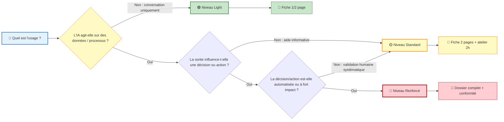
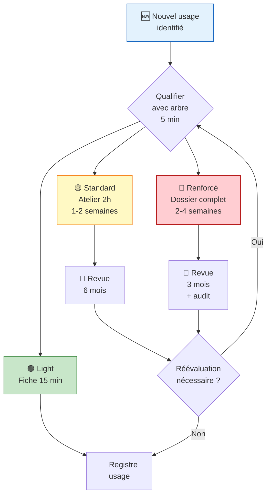

<!-- === EN-TÊTE DOCUMENTAIRE ISO-GRADE === -->

| Métadonnées | Valeur |
|-------------|--------|
| **Référence** | `EBIOS-ARBORESCENCE-001` |
| **Titre** | Arbre de Décision Usage-First EBIOS-RM IA |
| **Version** | `1.0` |
| **Date** | `06/03/2026` |
| **Propriétaire** | `Direction Conformité` |
| **Classification** | `Interne` |

---

# Arbre de Décision Usage-First

**Référence** : EBIOS-ARBORESCENCE-001 | Ultra-simplifié

---

## 🗺 Arbre de Décision Visuel



---

## 🔍 Questions Clés par Nœud

### Nœud 1 : L'IA agit-elle sur des données/processus ?

| Critère | 🟢 Light (Non) | 🟡/🔴 Standard/Renforcé (Oui) |
|:--------|:---------------|:-----------------------------|
| **Action** | Copier/coller uniquement | Traitement automatique |
| **Données** | Lecture seule | Modification, stockage |
| **Processus** | Aucun impact | Déclenche workflow |
| **Exemples** | Chat, rédaction, brainstorming | RAG, tri, scoring |

### Nœud 2 : La sortie influence-t-elle une décision ?

| Critère | 🟢/🟡 Light/Standard (Non) | 🔴 Renforcé (Oui) |
|:--------|:---------------------------|:------------------|
| **Usage** | Information, aide | Décision/action |
| **Conséquence** | Réversible, corrigible | Impact définitif |
| **Responsabilité** | Humain total | Partagée IA/humain |
| **Exemples** | Veille, brouillon | Scoring, validation |

### Nœud 3 : Automatisée ou fort impact ?

| Critère | 🟡 Standard (Non) | 🔴 Renforcé (Oui) |
|:--------|:------------------|:------------------|
| **Validation** | Systématique humaine | Échantillonnage ou a posteriori |
| **Impact** | Opérationnel | Réglementaire, légal |
| **Secteur** | Générique | HR, Justice, Finance, Santé |
| **Exemples** | RAG avec validation | Tri auto, scoring, décision auto |

---

## 📋 Tableau de Décision Rapide

| Usage | Nœud 1 | Nœud 2 | Nœud 3 | Niveau | Délai |
|:------|:-------|:-------|:-------|:-------|:------|
| ChatGPT rédaction emails | Non | - | - | 🟢 Light | 15 min |
| RAG recherche jurisprudence | Oui | Non | - | 🟡 Standard | 2h |
| RAG avec synthèse décisionnelle | Oui | Oui | Non | 🟡 Standard | 2h |
| Scoring candidats recrutement | Oui | Oui | Oui | 🔴 Renforcé | 1-2j |
| Tri automatique dossiers | Oui | Oui | Oui | 🔴 Renforcé | 1-2j |
| Assistant médical diagnostic | Oui | Oui | Oui | 🔴 Renforcé | 1-2j |

---

## 🎯 Points de Contrôle

### Avant de Classifier

| ☐ | Vérification |
|:--|:-------------|
| ☐ | J'ai bien compris l'usage CONCRET (pas l'outil générique) |
| ☐ | J'ai identifié qui utilise l'output et comment |
| ☐ | J'ai évalué l'impact en cas d'erreur |
| ☐ | J'ai vérifié s'il y a validation humaine |

### Si Doute entre Deux Niveaux

| Règle | Application |
|:------|:------------|
| **Principe de précaution** | Si doute → Niveau supérieur |
| **Usage évolutif** | Prévoir montée en charge |
| **Documentation** | Noter la justification du choix |
| **Revue** | Planifier réévaluation |

---

## 🔄 Processus Complet



---

## 💡 Règles d'Or

### 1. Un usage = une qualification

> Ne pas qualifier le modèle, ni l'équipe, mais **l'usage concret**.

Un même LLM peut avoir 3 qualifications différentes :
- ChatGPT pour brainstorming → 🟢 Light
- ChatGPT pour rédaction contrats → 🟡 Standard  
- ChatGPT intégré ATS scoring → 🔴 Renforcé

### 2. La traçabilité suit l'impact, pas la technologie

> Pas besoin de logger chaque prompt de brainstorming.
> Par contre, toute sortie qui déclenche une action métier doit être traçable.

| Niveau | Traçabilité |
|:-------|:------------|
| 🟢 Light | Aucune ou minimale |
| 🟡 Standard | Logs prompts/sorties |
| 🔴 Renforcé | Traçabilité complète + supervision |

### 3. La supervision humaine n'est pas binaire

> Documenter **comment** l'humain intervient :
- Validation systématique ?
- Échantillonnage ?
- Alerte sur seuil ?
- A posteriori ?

C'est ce critère qui fait souvent basculer de 🟡 à 🔴.

### 4. Itérer, ne pas parfaire

> Mieux vaut une qualification 🟡 appliquée qu'une qualification 🔴 théorique.

On peut toujours **monter de niveau** si l'usage évolue.

---

## 📁 Intégration dans le Corpus

```
corpus-ebios-rm/
├── 00-METHODOLOGIE/
│   ├── 00.1-methodologie-de-base.md
│   ├── 00.2-usage-first-qualifier.md
│   ├── 01-EBIOS-LIGHT.md          ← 🟢 Niveau Light
│   ├── 02-EBIOS-STANDARD.md       ← 🟡 Niveau Standard
│   ├── 03-EBIOS-RENFORCE.md       ← 🔴 Niveau Renforcé
│   └── 04-arbre-decision.md       ← 📊 Cet arbre
├── 11-SIA/
│   └── [applications SIA]
└── 20-OUTILS/
    └── templates/
        ├── fiche-light.md
        ├── fiche-standard.md
        └── dossier-renforce.md
```

---

## 7. RÉVISION

| Version | Date | Auteur | Modifications |
|:--------|:-----|:-------|:--------------|
| 1.0 | 06/03/2026 | Direction Conformité | Création arbre de décision |

---

**Document approuvé par :**
- [ ] AI Officer
- [ ] RSSI

**Date d'approbation :** _______________

---

*Arbre de Décision Usage-First — Version 1.0 ISO-Grade*  
*Réf. EBIOS-ARBORESCENCE-001*

---

## 📌 Conclusion

> **L'approche "Usage-First" est la bonne.**

Elle est :
- ✅ Alignée avec l'AI Act (risk-based approach)
- ✅ Compatible avec EBIOS-RM
- ✅ **Opérationnelle** et proportionnée

En qualifiant d'abord l'usage (conversationnel / workflow / agentique), on applique la bonne dose de méthodologie sans surcharge inutile.
