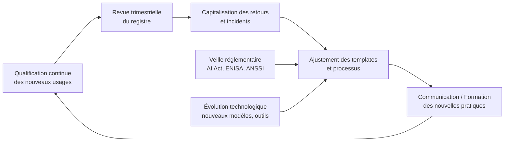

<!-- === EN-TÊTE DOCUMENTAIRE ISO-GRADE === -->

| Métadonnées | Valeur |
|-------------|--------|
| **Référence** | `EBIOS-DEPLOY-001` |
| **Titre** | Guide de Déploiement Progressif — Roadmap 30-60-90 jours |
| **Version** | `1.0` |
| **Date** | `06/03/2026` |
| **Propriétaire** | `Direction Conformité / AI Officer` |
| **Classification** | `Interne` |

---

# 🚀 Guide de Déploiement Progressif — EBIOS-RM IA "Usage-First"

**Référence** : EBIOS-DEPLOY-001 | Roadmap 30-60-90 jours

---

## 📋 Pré-requis & Facteurs de Succès

### Avant de commencer

| Pré-requis | Description |
|:-----------|:------------|
| **Sponsor exécutif** | Un dirigeant qui porte la démarche (RSSI, DPO, DSI ou DRH) |
| **Équipe pilote** | 3-5 personnes : métier + technique + conformité |
| **Périmètre initial** | Un domaine métier limité (ex: RH, Support, Marketing) |
| **Outils minimaux** | Git + Markdown + un tableur pour le registre (au début) |

### Facteurs Clés de Succès

✅ **Commencer petit** : Mieux vaut 3 usages bien qualifiés que 30 mal documentés  
✅ **Impliquer les utilisateurs finaux** dès la qualification : ils voient les risques réels  
✅ **Documenter les choix d'allègement** : La proportionnalité doit être justifiée  
✅ **Itérer, ne pas parfaire** : Livrer une v1 utile, améliorer en v2  
✅ **Capitaliser sur l'existant** : Réutiliser AIPD, audits, retours d'incident

### Pièges à Éviter

❌ **Vouloir tout qualifier en mode 🔴** dès le départ → surcharge et rejet  
❌ **Dissocier qualification technique de métier** → incohérences  
❌ **Oublier de planifier les révisions** → registre obsolète  
❌ **Négliger la communication** → perçu comme une contrainte

---

## 🗓 PHASE 1 : Jours 1-30 — Fondation & Pilote

> 🎯 **Objectif** : Valider l'approche sur 3-5 usages concrets, produire les premiers livrables, ajuster les templates.

### Semaine 1 : Cadrage & Outillage

#### Livrables

- [ ] Valider le sponsor et l'équipe pilote (3-5 personnes)
- [ ] Cloner/adapater le corpus `11-SIA/` dans votre dépôt interne
- [ ] Configurer le registre minimal (`registre-sia.yaml` ou tableur temporaire)
- [ ] Former l'équipe pilote à la grille `USAGE-QUALIFIER` (1h)

#### Réunion de Cadrage

| Durée | Ordre du jour |
|:------|:--------------|
| 15 min | Présentation de l'approche "Usage-First" |
| 15 min | Démonstration : qualification d'un usage exemple |
| 30 min | Sélection des 3-5 usages pilotes |
| 30 min | Planning des ateliers de qualification |

#### Critères de Sélection des Pilotes

| Niveau | Exemple | Pourquoi |
|:-------|:--------|:---------|
| 🟢 **Conversationnel** | Rédaction assistée | Simple, rapide à qualifier |
| 🟡 **Workflow** | RAG documentaire | Moyen, teste les processus |
| 🔴 **Borderline** | Tri semi-auto | Complexe, valide la méthode |

> ⚠️ **Éviter** : usages trop critiques ou trop flous pour le pilote

---

### Semaines 2-3 : Qualification & Analyse Pilote

#### Pour chaque usage pilote

```yaml
étape_1_qualification:
  - "Animer la grille USAGE-QUALIFIER (30 min max)"
  - "Documenter la justification du niveau choisi"
  - "Ajouter l'entrée au registre (statut: 'En qualification')"

étape_2_analyse:
  - "Télécharger le template correspondant (🟢/🟡/🔴)"
  - "Animer l'atelier EBIOS-RM adapté (timeboxé)"
  - "Produire la fiche/dossier avec les risques prioritaires"
  - "Lier la fiche au registre (champ fiche_reference)"

étape_3_validation:
  - "Revue croisée : métier + technique + conformité"
  - "Ajustements mineurs si besoin"
  - "Changer statut registre: 'Actif'"
  - "Planifier la prochaine revue (3/6/12 mois selon niveau)"
```

#### Output Phase 1

| Livrable | Description |
|:---------|:------------|
| **3-5 usages qualifiés** | Analysés et documentés |
| **Registre SIA peuplé** | Avec entrées réelles |
| **Retours d'expérience** | Sur les templates (ce qui marche/coince) |
| **Templates v1.1** | Version ajustée intégrée au corpus |

---

### Semaine 4 : Retour d'Expérience & Ajustements

#### Atelier de REX

| Durée | Activité |
|:------|:---------|
| 30 min | Retour sur les 3-5 qualifications réalisées |
| 30 min | Identification des points de friction |
| 30 min | Propositions d'amélioration des templates |
| 30 min | Priorisation des ajustements pour Phase 2 |

#### Questions Clés (REX)

- La grille de qualification était-elle claire et rapide ?
- Les templates étaient-ils adaptés au temps disponible ?
- Quelles sections ont été difficiles à remplir ? Pourquoi ?
- Qu'est-ce qui a manqué pour prendre une décision ?

#### Ajustements Typiques

| Problème | Solution |
|:---------|:---------|
| Templates trop lourds | Simplifier encore certaines sections 🟡/🔴 |
| Manque de contexte | Ajouter des exemples concrets dans les références |
| Frontières floues | Préciser les critères de basculement entre niveaux |
| Facilitation difficile | Créer un 'cheat sheet' facilitateur pour les ateliers |

#### Livrable Fin Phase 1

- [ ] **Rapport de pilote** (2 pages max) : résultats, apprentissages, recommandations
- [ ] **Corpus v1.1** avec templates ajustés
- [ ] **Feuille de route validée** pour la Phase 2

---

## 🗓 PHASE 2 : Jours 31-60 — Scale & Formalisation

> 🎯 **Objectif** : Étendre à 15-20 usages, formaliser les processus de gouvernance, intégrer les articulations réglementaires.

### Semaines 5-6 : Extension Contrôlée

#### Stratégie d'Extension

| Approche | Description |
|:---------|:------------|
| **Par domaine métier** | Pas par volume |
| **Exemple** | Si le pilote RH a fonctionné → étendre à Marketing, puis Support |

#### Pour chaque nouveau domaine

1. **Identifier un "champion métier"** qui porte la démarche localement
2. **Former le champion** à la qualification (1h) + animation atelier (2h)
3. **Lui fournir** les templates + exemples du domaine pilote
4. **Prévoir un point de support** avec l'équipe centrale (30 min / usage)

#### Cible Phase 2

- **15-20 usages qualifiés** au total
- **Au moins 2 domaines métier** couverts
- **100% des usages 🔴** (haut risque) identifiés et analysés
- **Registre SIA** utilisé comme source de vérité par les champions

---

### Semaine 7 : Articulations Réglementaires

#### Intégrations à Formaliser

**RGPD / AIPD**
- Créer un mapping champ par champ : EBIOS-RM IA ↔️ AIPD
- Dans les templates 🟡/🔴 : champ obligatoire `aipd_reference`
- Former les DPO / référents RGPD à la lecture du registre

**AI Act**
- Enrichir `AI-ACT-ANNEX-III-MAPPING.md` avec des exemples métier
- Ajouter une checklist "Deployer Art. 26" dans le template 🟡
- Documenter la procédure de basculement Deployer → Provider

**ISO 42001**
- Mapper les sections EBIOS-RM IA vers les clauses ISO 42001
- Utiliser le registre SIA comme entrée du clause 8.2 (modifications)
- Préparer un argumentaire pour l'audit de certification

#### Livrable

- **Guide d'articulation réglementaire** (3 pages) : "Un seul effort, plusieurs conformités"
- **Templates mis à jour** avec champs conformité obligatoires
- **Session de formation croisée** : équipe IA + DPO + Conformité

---

### Semaine 8 : Gouvernance & Cadence de Revue

#### Mettre en Place la Boucle PDCA

**Revue Trimestrielle du Registre**

| Élément | Description |
|:--------|:------------|
| **Responsable** | Équipe centrale EBIOS-RM IA |
| **Ordre du jour type** | Lister entrées avec prochaine_revue < aujourd'hui |
| | Valider les mises à jour proposées par les champions |
| | Archiver les usages obsolètes ou remplacés |
| | Exporter un rapport direction (format audit) |

**Indicateurs de Suivi**

| KPI | Description |
|:----|:------------|
| Taux de qualification | usages qualifiés / usages identifiés |
| Délai moyen de qualification | de l'identification à l'analyse |
| Taux de conformité | fiches avec toutes les validations requises |
| Incidents IA détectés | via le monitoring défini |

**Communication**

- **Newsletter interne trimestrielle** : "Point sur les usages IA"
- **Page Confluence / Wiki** : "Comment qualifier mon usage IA ?"
- **Session Q&R mensuelle ouverte** (30 min, sans préparation)

#### Livrable

- **Charte de gouvernance EBIOS-RM IA** (2 pages) : rôles, cadences, escalade
- **Tableau de bord minimal** (tableur ou dashboard simple)
- **Calendrier partagé** des revues et formations

---

### Fin Phase 2 : Bilan à 60 jours

#### KPIs

| Métrique | Objectif |
|:---------|:---------|
| Usages qualifiés | ≥ 15 |
| Référents formés | ≥ 5 |
| Temps moyen qualification | 🟢: 15min, 🟡: 2h, 🔴: 1j |
| Satisfaction référents | ≥ 7/10 |

---

## 🗓 PHASE 3 : Jours 61-90 — Institutionnalisation & Automatisation

> 🎯 **Objectif** : Ancrer la démarche dans les processus métier, automatiser les tâches répétitives, préparer l'audit.

### Semaines 9-10 : Intégration aux Processus Métier

#### Ancrage Opérationnel

**Dans le Cycle de Vie Projet**
- Ajouter une étape "Qualification usage IA" dans le gate de démarrage
- Rendre obligatoire la référence au registre SIA pour tout déploiement IA
- Intégrer la fiche EBIOS-RM IA aux livrables de recette / MEP

**Dans la Gestion des Risques Entreprise**
- Mapper les risques IA prioritaires vers le registre des risques corporate
- Prévoir un point "Risques IA" dans les comités risques trimestriels
- Former les risk managers à la lecture des fiches 🔴

**Dans la Formation et Onboarding**
- Créer un module e-learning "Qualification usage IA" (15 min)
- Ajouter un chapitre "IA responsable" dans l'onboarding nouveaux arrivants
- Prévoir un atelier "Cas pratiques" pour les nouveaux champions

#### Livrable

- **Procédures mises à jour** : Gestion de projet, Gestion des risques, Formation
- **Module e-learning** "Qualification usage IA" (script + quiz)
- **Kit d'onboarding** : "Mon premier usage IA en 3 étapes"

---

### Semaine 11 : Automatisation & Outillage

#### Automatisations Prioritaires

**Validation Registre**
- Script Python pour vérifier la complétude des entrées (champs obligatoires)
- Alerte automatique 30 jours avant prochaine_revue (email / Slack)
- Export automatique mensuel vers CSV pour reporting direction

**Liaison Fiches ↔️ Registre**
- Script qui vérifie que fiche_reference pointe vers un fichier existant
- Génération automatique d'un sommaire lié depuis le registre

**Monitoring Simple**
- Dashboard basique : nombre d'usages par niveau, par domaine, par statut
- Alerte si un usage 🔴 n'a pas de mesures de monitoring documentées

#### Outillage Recommandé

| Niveau | Outils |
|:-------|:-------|
| **Minimal** | Git + Python + tableur (déjà suffisant pour démarrer) |
| **Intermédiaire** | Wiki (Confluence/BookStack) + notifications Slack |
| **Avancé** | Intégration GRC (ServiceNow, OneTrust) via API |

#### Livrable

- **Scripts d'automatisation** dans /scripts/ du corpus
- **Documentation** "Outillage minimal pour démarrer"
- **POC d'intégration** avec l'outil GRC / wiki de l'entreprise (si pertinent)

---

### Semaine 12 : Préparation Audit & Capitalisation

#### Préparer l'Audit

**Checklist Audit-Ready**

- [ ] Registre SIA à jour avec toutes les entrées 'Actif' qualifiées
- [ ] Fiches EBIOS-RM liées, validées, avec historique des versions
- [ ] Preuves de formation des champions et utilisateurs clés
- [ ] Procédures de gouvernance documentées et appliquées
- [ ] Rapports de revue trimestrielle disponibles
- [ ] Mapping des obligations AI Act / RGPD / ISO 42001 explicité

**Simulation d'Audit**
- Organiser un "audit blanc" avec un pair externe ou un auditeur interne
- Tester la traçabilité : retrouver en < 5 min la fiche d'un usage donné
- Vérifier la cohérence : un usage 🔴 a-t-il bien toutes les mesures requises ?

#### Capitaliser pour la V2

**Retex Global 90 Jours**
- Qu'est-ce qui a le plus apporté de valeur ?
- Quels freins organisationnels ont émergé ?
- Quelles évolutions réglementaires anticiper pour la v2 ?

**Roadmap V2 Esquisse**
- Étendre à d'autres domaines métier (ex: Production, R&D)
- Intégrer la gestion des variants techniques (LoRA, RAG) de façon plus fine
- Préparer l'articulation avec l'AI Liability Directive (en cours)
- Explorer l'automatisation de la qualification (NLP sur les descriptions d'usage)

#### Livrable Fin Phase 3

- **Dossier "Audit Ready"** : tous les artefacts organisés et référencés
- **Rapport de capitalisation 90 jours** (5 pages) : succès, apprentissages, v2
- **Présentation direction** : "EBIOS-RM IA : bilan et perspectives"

---

## 📊 Tableau de Bord de Suivi (Template Minimal)

*À maintenir dans un tableur ou dashboard simple*

```yaml
# registre-dashboard.yaml (ou .csv)
metadata:
  date_extraction: "YYYY-MM-DD"
  periode_couverte: "T1 2026"

kpi_globaux:
  total_usages_identifies: 42
  total_usages_qualifies: 38  # → Taux: 90%
  
  repartition_niveaux:
    light: 18
    standard: 15
    renforce: 5
    non_qualifie: 4
  
  repartition_statut:
    actif: 32
    en_test: 4
    en_developpement: 2
    archive: 4

conformite:
  usages_annex_iii: 7
  usages_rgpd_concernes: 21
  fiches_avec_validation_complete: 35/38  # → Taux: 92%

activite_trimestre:
  nouvelles_qualifications: 12
  fiches_mises_a_jour: 8
  incidents_ia_signales: 2  # → Tous traités via mesures correctives
  revues_realisees_dans_les_temps: 14/16  # → Taux: 88%

alertes_action:
  - "4 usages non qualifiés : prioriser la qualification"
  - "2 revues en retard : relancer les responsables"
  - "1 usage 🔴 sans mesure de monitoring : compléter la fiche"
```

### Vue d'Ensemble Visuelle

```
┌─────────────────────────────────────────────────────────────┐
│  ROADMAP EBIOS-RM IA - Suivi 30-60-90 jours                │
├─────────────────────────────────────────────────────────────┤
│                                                             │
│  PHASE 1 (J1-30)     ████████░░░░░░░░░░  [En cours]        │
│  ├─ Usages qualifiés: 3/5                                  │
│  ├─ Templates validés: ✅                                   │
│  └─ Prochaine étape: Formation référents                   │
│                                                             │
│  PHASE 2 (J31-60)    ░░░░░░░░░░░░░░░░░░  [À venir]         │
│  ├─ Objectif: 15 usages                                    │
│  ├─ Référents: 5 à former                                  │
│  └─ Automatisation: Export CSV                             │
│                                                             │
│  PHASE 3 (J61-90)    ░░░░░░░░░░░░░░░░░░  [À venir]         │
│  ├─ Gouvernance: Comité IA                                 │
│  ├─ Documentation: Procédure qualité                       │
│  └─ Optimisation: Templates v2                             │
│                                                             │
└─────────────────────────────────────────────────────────────┘
```

### KPIs Clés

| KPI | J30 | J60 | J90 | Cible |
|:----|:----|:----|:----|:------|
| Usages qualifiés | 5 | 15 | 25 | 30+ |
| Référents actifs | 3 | 5 | 8 | 10 |
| Temps qualif. 🟡 | 4h | 2h | 1h30 | 1h30 |
| Satisfaction | - | 7/10 | 8/10 | 8/10 |

---

## 🎯 Critères de Succès par Phase (Go/No-Go)

| Phase | Critère de succès "Go/No-Go" pour passer à la suite |
|:------|:----------------------------------------------------|
| **Phase 1 (J30)** | ✅ 3 usages pilotes qualifiés + analysés + validés<br>✅ Retex documenté avec ajustements appliqués<br>✅ Sponsor confirme l'extension |
| **Phase 2 (J60)** | ✅ 15+ usages qualifiés, dont 100% des 🔴<br>✅ Articulations RGPD/AI Act formalisées<br>✅ Gouvernance trimestrielle opérationnelle |
| **Phase 3 (J90)** | ✅ Démarche intégrée aux processus projet / risques<br>✅ Automations minimales en place<br>✅ Organisation "audit-ready" sur les usages IA |

---

## 🎯 Checklist de Validation par Phase

### Phase 1 (J30) ✅

- [ ] Sponsor identifié et engagé
- [ ] Équipe pilote formée
- [ ] 3-5 usages qualifiés et documentés
- [ ] Registre initial peuplé
- [ ] Templates testés et ajustés
- [ ] REX réalisé et actions identifiées

### Phase 2 (J60) ✅

- [ ] 5-10 référents formés
- [ ] 15-20 usages qualifiés
- [ ] Processus de qualification fluide
- [ ] Exports automatisés opérationnels
- [ ] Support référents en place

### Phase 3 (J90) ✅

- [ ] Comité IA instauré
- [ ] Procédure qualité publiée
- [ ] 25+ usages qualifiés
- [ ] Documentation complète
- [ ] Plan 90-180 jours défini

---

## 📎 Ressources et Templates

### Documents à Préparer

| Document | Phase | Template |
|:---------|:------|:---------|
| Présentation sponsor | J1 | `templates/presentation-sponsor.pptx` |
| Formation équipe pilote | J1 | `templates/formation-pilote.md` |
| Guide référent | J60 | `templates/guide-referent.md` |
| Procédure qualité | J90 | `templates/procedure-qualite.md` |
| FAQ usagers | J90 | `templates/faq-usagers.md` |

### Outils Recommandés

| Usage | Outil | Alternative |
|:------|:------|:------------|
| Registre | YAML + Git | Excel → Notion → Airtable |
| Collaboration | Git + Markdown | Confluence, SharePoint |
| Dashboard | Python + Streamlit | Google Data Studio, Tableau |
| Formation | Markdown + Mermaid | PowerPoint, Miro |

---

## 💡 Conseils pour l'Animation du Changement

### Communication

| Élément | Recommandation |
|:--------|:---------------|
| **Message clé** | "Qualifier l'usage, pas juger la technologie" |
| **Ton** | Pragmatique, proportionné, orienté solution |
| **Canal** | Court + visuel : checklist A4, vidéo 2 min, exemple concret |

### Implication

- **Champions métier** : Leur donner de la visibilité — "Expert qualification IA"
- **Retours utilisateurs** : Créer un canal simple de feedback (Slack, formulaire)
- **Reconnaissance** : Célébrer les premières fiches validées, les bonnes pratiques

### Gestion des Résistances

| Obstacle | Réponse |
|:---------|:--------|
| "C'est trop lourd" | Montrer le template 🟢 : 15 min, 1 page |
| "On n'est pas concernés" | Qualifier 1 usage de l'équipe en live → déclic |
| "Ça va changer tout le temps" | Expliquer la révision planifiée, pas l'urgence permanente |
| "C'est le job de la conformité" | Rappeler : la qualification métier est indispensable |

---

## 🔄 Boucle d'Amélioration Continue (Post-90 jours)



> 📌 **Principe** : La méthodologie elle-même est soumise au PDCA.  
> Ce que vous apprenez en l'appliquant doit nourrir son amélioration.

---

## 📦 Livrables Totaux de la Roadmap

```
corpus-ebios-rm/
├── 11-SIA/
│   ├── 00-METHODOLOGIE/
│   │   ├── 10-PROCESSUS/
│   │   │   ├── 00-USAGE-QUALIFIER.md
│   │   │   ├── 01-EBIOS-LIGHT.md
│   │   │   ├── 02-EBIOS-STANDARD.md
│   │   │   └── 03-EBIOS-RENFORCE.md
│   │   ├── 20-OUTILS/
│   │   │   ├── templates/
│   │   │   │   ├── fiche-light.md
│   │   │   │   ├── fiche-workflow.md
│   │   │   │   ├── dossier-decisionnel.md
│   │   │   │   └── README-templates.md
│   │   │   └── decision-tree-usage.png
│   │   ├── 30-REFERENCES/
│   │   │   └── AI-ACT-ANNEX-III-MAPPING.md
│   │   └── 90-DEPLOYMENT/              ⭐
│   │       ├── ROADMAP-30-60-90.md     ← Ce document
│   │       ├── CHARTER-GOUVERNANCE.md  ← Rôles, cadences, escalade
│   │       └── CHANGE-MANAGEMENT-TIPS.md ← Animation, communication
│   └── 99-REGISTRE/
│       ├── registre-sia.yaml
│       ├── dashboard-template.csv
│       └── archives/
└── scripts/
    ├── export-registre.py
    └── validate-registre.py
```

---

## 💡 Conseils de Facilitation

### Pour Animer les Ateliers

1. **Timeboxer** : Respecter les durées annoncées
2. **Concret** : Toujours partir d'exemples réels
3. **Inclusif** : Faire parler métier ET technique
4. **Documenter** : Noter les décisions immédiatement
5. **Itérer** : Mieux vaut une v1 rapide qu'une v3 jamais finie

### Pour Gérer la Résistance

| Obstacle | Réponse |
|:---------|:--------|
| "Trop complexe" | Commencer par un usage 🟢 simple |
| "Pas le temps" | 15 min pour 🟢, on peut trouver 15 min |
| "On le fait déjà" | Super ! Documentons-le proprement |
| "L'IA change trop vite" | D'où l'intérêt des revues planifiées |
| "C'est du contrôle" | C'est de la protection (responsabilité, réputation) |

---

## 7. RÉVISION

| Version | Date | Auteur | Modifications |
|:--------|:-----|:-------|:--------------|
| 1.0 | 06/03/2026 | Direction Conformité | Création roadmap 30-60-90 |

---

**Document approuvé par :**
- [ ] Sponsor exécutif
- [ ] AI Officer
- [ ] RSSI

**Date d'approbation :** _______________

---

*Guide de Déploiement Progressif — Version 1.0 ISO-Grade*  
*Réf. EBIOS-DEPLOY-001*

---

> 📌 **Conclusion** : Cette roadmap 30-60-90 transforme la méthodologie "Usage-First" en un **changement organisationnel concret et mesurable**.
>
> En 3 mois, on passe de :
> *"On a une idée méthodologique"* → *"On a un système de gouvernance IA opérationnel, audit-ready et améliorable"*.
>
> L'approche progressive, l'ancrage métier et la boucle PDCA garantissent que la démarche crée de la valeur dès le premier mois, tout en construisant une base solide pour la maturité à long terme.
