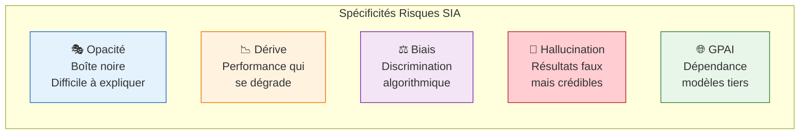
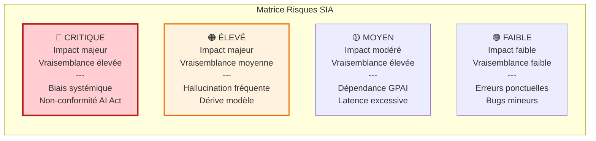
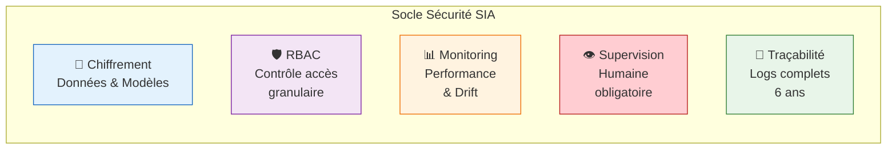
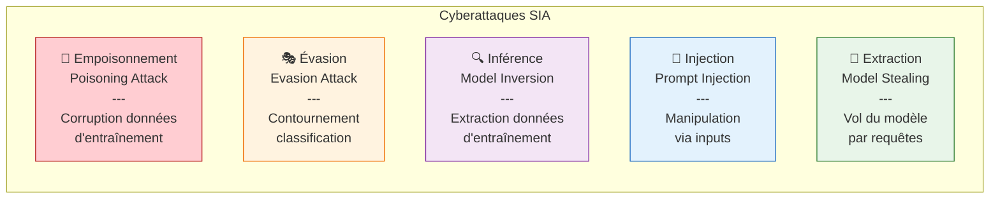
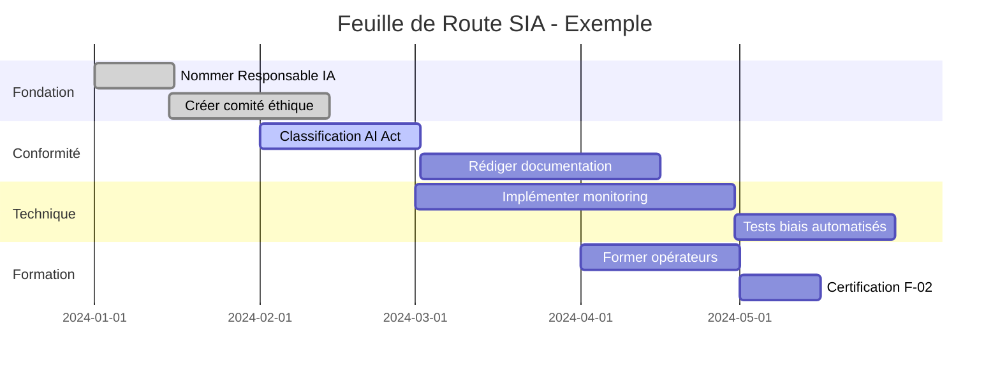

<!-- === EN-TÊTE DOCUMENTAIRE ISO-GRADE === -->

| Métadonnées | Valeur |
|-------------|--------|
| **Référence** | `EBIOS-SIA-001` |
| **Titre** | EBIOS RM - Application aux Systèmes d'Intelligence Artificielle |
| **Version** | `1.0` |
| **Date** | `05/03/2026` |
| **Propriétaire** | `Direction Conformité / AI Officer` |
| **Classification** | `Confidentiel` |

---

# EBIOS RM - Application aux Systèmes d'Intelligence Artificielle

**Référence** : EBIOS-SIA-001 | Spécifique SIA

---

## 1. INTRODUCTION

### 1.1 Objectif

Ce document adapte la méthodologie EBIOS RM aux spécificités des **Systèmes d'Intelligence Artificielle (SIA)**. Il complète la méthodologie de base avec des éléments propres aux risques de l'IA.

### 1.2 Pourquoi une adaptation SIA ?

Les systèmes d'IA présentent des risques spécifiques qui ne sont pas couverts par l'analyse de risques classique :

---

## 2. CARTOGRAPHIE DES RISQUES SIA

### 2.1 Taxonomie des Risques SIA

| Catégorie | Risque | Description | Exemple |
|:----------|:-------|:------------|:--------|
| **Technique** | Dérive de modèle | Perte de performance dans le temps | Précision chute de 95% à 80% |
| **Technique** | Hallucination | Génération d'informations fausses | Références juridiques inventées |
| **Éthique** | Biais algorithmique | Discrimination systématique | SIA RH défavorable aux femmes |
| **Éthique** | Manque d'explicabilité | Impossibilité d'expliquer une décision | Refus crédit sans justification |
| **Juridique** | Non-conformité AI Act | Violation obligations réglementaires | Absence supervision humaine |
| **Opérationnel** | Dépendance GPAI | Rupture service modèle tiers | API OpenAI indisponible |
| **Sécurité** | Empoisonnement données | Injection données malveillantes | Fichiers d'entraînement corrompus |
| **Sécurité** | Extraction modèle | Vol du modèle entraîné | Attaque par inférence |

### 2.2 Matrice de Risques SIA

---

## 3. ADAPTATION DES 5 ATELIERS

### 3.1 Atelier 1 - Cadrage SIA

#### Biens Essentiels Spécifiques SIA

| Bien | Description | Valeur Métier |
|:-----|:------------|:--------------|
| **Modèle entraîné** | Cerveau du SIA, résultat de l'apprentissage | Critique |
| **Données d'entraînement** | Dataset utilisé pour le training | Critique |
| **Données d'inférence** | Inputs utilisateurs en production | Élevée |
| **API/Interfaces** | Points d'accès au SIA | Élevée |
| **Documentation technique** | Dossier AI Act, traçabilité | Élevée |
| **Supervision humaine** | Capacité de contrôle opérateur | Critique |

#### Socle de Sécurité SIA

### 3.2 Atelier 2 - Sources de Risque SIA

#### Attaquants Spécifiques

| Profil | Motivation | Capacité | Cible |
|:-------|:-----------|:---------|:------|
| **Attaquant compétition** | Vol IP, avantage concurrentiel | Élevée | Modèle, données |
| **Hacktiviste** | Dénigrement, biais | Moyenne | Intégrité modèle |
| **Cybercriminel** | Rançon, fraude | Élevée | Données, accès |
| **État-nation** | Espionnage, influence | Très élevée | Infra, modèles |
| **Insider** | Vengeance, profit | Variable | Tout accès |

#### Cyberattaques Spécifiques SIA

### 3.3 Atelier 3 - Scénarios de Risque SIA

#### Exemples de Scénarios

| ID | Scénario | Impact | Vraisemblance | Niveau |
|:---|:---------|:-------|:--------------|:-------|
| **SIA-001** | Biais de recrutement discriminant | Réputation, juridique | Moyenne | 🔴 Critique |
| **SIA-002** | Hallucination médicale | Santé, vie humaine | Moyenne | 🔴 Critique |
| **SIA-003** | Fuite données entraînement | RGPD, sanction | Élevée | 🟠 Élevé |
| **SIA-004** | Dérive modèle crédit | Erreurs financières | Élevée | 🟠 Élevé |
| **SIA-005** | Rupture API GPAI | Indisponibilité | Élevée | 🟡 Moyen |
| **SIA-006** | Empoisonnement modèle | Décisions erronées | Faible | 🟡 Moyen |

#### Grille d'Évaluation Spécifique SIA

| Critère | Échelle | Description |
|:--------|:--------|:------------|
| **Impact Éthique** | 1-4 | Atteinte aux droits fondamentaux |
| **Impact Réglementaire** | 1-4 | Sanctions AI Act, RGPD |
| **Impact Opérationnel** | 1-4 | Perte de confiance, arrêt |
| **Vraisemblance Technique** | 1-4 | Facilité technique de l'attaque |
| **Vraisemblance Motivation** | 1-4 | Intérêt pour l'attaquant |

### 3.4 Atelier 4 - Traitement du Risque SIA

#### Mesures de Sécurité Spécifiques

| Domaine | Mesure | Priorité | Référence |
|:--------|:-------|:---------|:----------|
| **Gouvernance** | Comité éthique IA | 🔴 Haute | AI Act Art. 14 |
| **Gouvernance** | Responsable IA désigné | 🔴 Haute | ISO 42001 |
| **Technique** | Tests biais réguliers | 🔴 Haute | AI Act Art. 10 |
| **Technique** | Monitoring drift | 🔴 Haute | MLOps |
| **Technique** | Explainability (XAI) | 🟠 Moyenne | AI Act Art. 13 |
| **Opérationnel** | Supervision humaine | 🔴 Haute | AI Act Art. 14 |
| **Opérationnel** | Formation opérateurs | 🔴 Haute | ISO 42001 |
| **Juridique** | DPA spécifique IA | 🔴 Haute | RGPD |
| **Juridique** | Veille réglementaire | 🟠 Moyenne | AI Act |

### 3.5 Atelier 5 - Feuille de Route SIA

#### Plan d'Action Type

---

## 4. ALIGNEMENT AI ACT / ISO 42001

### 4.1 Mapping EBIOS ↔️ AI Act

| Atelier EBIOS | Article AI Act | Exigence |
|:--------------|:---------------|:---------|
| Atelier 1 | Art. 8-9 | Classification, documentation |
| Atelier 2 | Art. 10 | Gestion risques systèmes HR |
| Atelier 3 | Art. 14 | Supervision humaine |
| Atelier 4 | Art. 11-13 | Mesures, transparence |
| Atelier 5 | Art. 15-17 | Système qualité, logs |

### 4.2 Mapping EBIOS ↔️ ISO 42001

| Atelier EBIOS | Clause ISO 42001 | Exigence |
|:--------------|:-----------------|:---------|
| Atelier 1 | 4.1, 4.2, 4.3 | Contexte, parties, périmètre |
| Atelier 2 | 6.1 | Actions risques opportunités |
| Atelier 3 | 6.1.2 | Évaluation risques IA |
| Atelier 4 | 6.1.3, 8.1 | Traitement risques, contrôles |
| Atelier 5 | 9.1, 9.2, 10.1 | Suivi, audit, amélioration |

---

## 5. RÉFÉRENCES

| Référence | Description |
|:----------|:------------|
| **EBIOS-METH-001** | Méthodologie EBIOS RM de base |
| **AI Act** | Règlement (UE) 2024/1689 |
| **ISO 42001** | Système de management IA |
| **ISO 27005** | Management risques sécurité |
| **ANSSI** | Guide EBIOS RM v1.0 |

---

## 6. RÉVISION

| Version | Date | Auteur | Modifications |
|:--------|:-----|:-------|:--------------|
| 1.0 | 05/03/2026 | Direction Conformité | Création application SIA |

---

**Document approuvé par :**
- [ ] AI Officer
- [ ] RSSI
- [ ] Direction Conformité

**Date d'approbation :** _______________

---

*EBIOS RM Application SIA — Version 1.0 ISO-Grade*  
*Réf. EBIOS-SIA-001*
