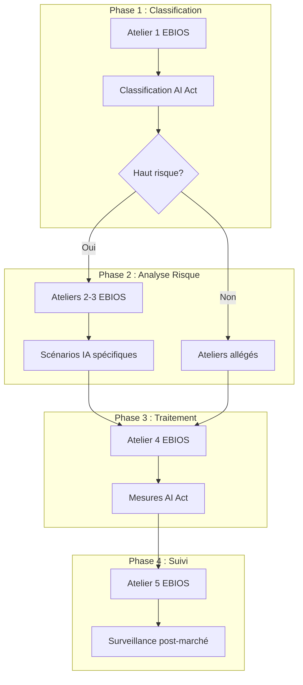

# Mapping EBIOS RM ↔ AI Act / ISO 42001

**Référence**: 09_integration_ai_act_iso42001/mapping_ebios_aiact.md  
**Version**: 1.0  
**Date**: 2026-03-02

---

## 🎯 Vue d'ensemble

Ce document établit la correspondance entre la méthodologie EBIOS RM (ANSSI) et les exigences de l'AI Act (UE) ainsi que la norme ISO 42001.

---

## 📊 Tableau de correspondance

| EBIOS RM (ANSSI) | AI Act (UE) | ISO 42001 | Intégration |
|:-----------------|:------------|:----------|:------------|
| **Atelier 1** - Cadre et périmètre | Article 6 - Classification | Clause 4 - Contexte | Classification risque AI Act dans le périmètre |
| **Atelier 2** - Sources de menace | Article 9 - Gestion risques | Clause 6 - Planification | Sources IA: biais, drift, attaques |
| **Atelier 3** - Scénarios de risque | Article 15 - Robustesse | Clause 8 - Opération | Scénarios spécifiques IA |
| **Atelier 4** - Traitement du risque | Articles 10-14 - Mesures | Clause 8 - Contrôles | Mesures AI Act dans EBIOS |
| **Atelier 5** - Feuille de route | Article 72 - Surveillance | Clause 9 - Évaluation | Plan de surveillance post-marché |

---

## 🔗 Intégration par Atelier

### Atelier 1 : Cadre et Périmètre

**EBIOS RM** : Définition du périmètre, biens essentiels, écosystème

**Enrichissement AI Act** :
- Classification du système (Article 6)
- Détermination haut risque / non haut risque
- Vérification exemption Article 6(3)

**Enrichissement ISO 42001** :
- Contexte organisationnel (Clause 4.1)
- Parties prenantes (Clause 4.2)
- Champ d'application SMIA (Clause 4.3)

**Livrable combiné** :
```
Atelier 1 EBIOS RM
├── Périmètre technique
├── Biens essentiels
├── Écosystème
├── [+] Classification AI Act (Annexe III)
├── [+] Justification haut risque / exemption
└── [+] Mapping ISO 42001 Clause 4
```

---

### Atelier 2 : Sources de Menace

**EBIOS RM** : Attaquants, pannes, erreurs humaines, catastrophes

**Sources de menace spécifiques IA** :

| Source | Description | Référence |
|:-------|:------------|:----------|
| **Biais algorithmique** | Discrimination par sous-groupes | AI Act Art. 10 |
| **Dérive de modèle** | Concept drift, data drift | AI Act Art. 15 |
| **Attaques adversariales** | Prompt injection, jailbreak | AI Act Art. 15 |
| **Inférence de données** | Extraction données training | RGPD + AI Act |
| **Opacité du modèle** | Boîte noire inexplicable | AI Act Art. 13 |
| **Dépendance fournisseur** | GPAI, API externes | AI Act Art. 52 |

---

### Atelier 3 : Scénarios de Risque

Voir [template_scenario_ia.md](template_scenario_ia.md) pour les scénarios complets.

**Scénarios IA à ajouter** :
- SR-IA-01 : Dérive des performances (concept drift)
- SR-IA-02 : Biais discriminatoire
- SR-IA-03 : Prompt injection / jailbreak
- SR-IA-04 : Inférence de données d'entraînement
- SR-IA-05 : Manipulation par roleplay

---

### Atelier 4 : Traitement du Risque

**Mesures EBIOS RM** + **Mesures AI Act** :

| Risque IA | Mesure EBIOS | Mesure AI Act | ISO 42001 |
|:----------|:-------------|:--------------|:----------|
| Biais | Tests équité | Art. 10 - Gouvernance données | A.8.2 |
| Drift | Monitoring | Art. 15 - Robustesse | A.8.3 |
| Jailbreak | Tests pénétration | Art. 15 - Cybersécurité | A.8.4 |
| Opacité | Documentation | Art. 13 - Transparence | A.7.4 |
| Décision auto | Supervision | Art. 14 - Supervision humaine | A.8.5 |

---

### Atelier 5 : Feuille de Route

**EBIOS RM** : Plan de traitement du risque

**Enrichissement AI Act** :
- Surveillance post-marché (Article 72)
- Signalement des incidents
- Mises à jour correctrices

**Enrichissement ISO 42001** :
- Programme d'audit interne
- Revue de direction
- Amélioration continue

---

## 📝 Processus d'intégration

### Étape 1 : Avant l'atelier EBIOS

1. **Classifier le système** selon AI Act Article 6
2. **Identifier** si Annexe III applicable
3. **Vérifier** exemption Article 6(3) possible
4. **Documenter** dans le périmètre EBIOS

### Étape 2 : Pendant les ateliers

1. **Atelier 1** : Intégrer classification AI Act
2. **Atelier 2** : Ajouter sources menace IA
3. **Atelier 3** : Utiliser scénarios IA spécifiques
4. **Atelier 4** : Intégrer mesures AI Act
5. **Atelier 5** : Planifier surveillance post-marché

### Étape 3 : Après les ateliers

1. **Produire** documentation technique AI Act (Annexe IV)
2. **Établir** déclaration UE conformité
3. **Préparer** registre UE (Article 49)
4. **Aligner** avec ISO 42001 si certification visée

---

## 🎓 Exemple : Workflow Combiné



---

## 📚 Références

- Guide EBIOS RM v1.0 (ANSSI)
- AI Act (Règlement UE 2024/1689)
- ISO/IEC 42001:2023

---

**Document mis à jour**: 2026-03-02
