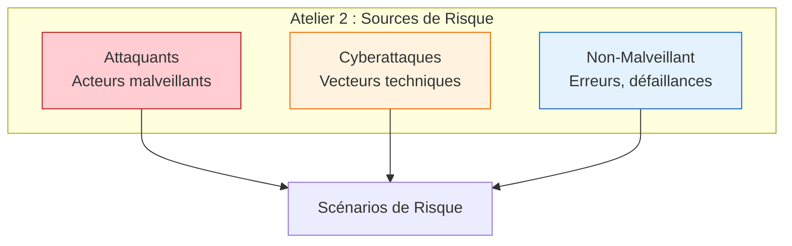
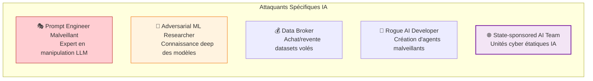
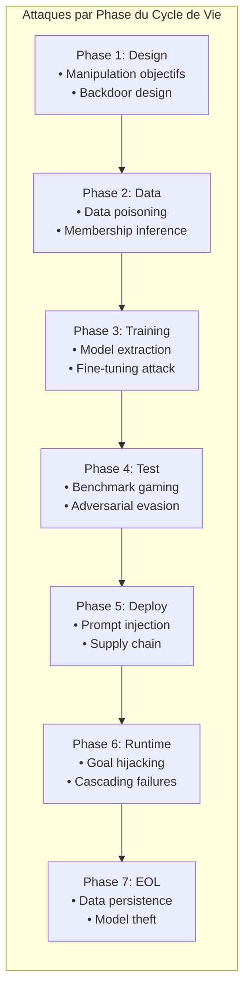

<!-- === EN-TÊTE DOCUMENTAIRE ISO-GRADE === -->

| Métadonnées | Valeur |
|-------------|--------|
| **Référence** | `EBIOS-SIA-002` |
| **Titre** | Sources de Risque IA - Atelier 2 EBIOS RM |
| **Version** | `1.0` |
| **Date** | `06/03/2026` |
| **Propriétaire** | `Direction Conformité / AI Safety Officer` |
| **Classification** | `Confidentiel` |

---

# Sources de Risque IA - Atelier 2 EBIOS RM

**Référence** : EBIOS-SIA-002 | Atelier 2 : Sources de Risque

---

## 1. INTRODUCTION

Ce document identifie les **sources de risque** spécifiques aux Systèmes d'Intelligence Artificielle (SIA) pour l'**Atelier 2** de la méthodologie EBIOS RM.

### 1.1 Structure EBIOS RM Atelier 2



---

## 2. ATTAQUANTS (ACTEURS MALVEILLANTS)

### 2.1 Profils d'Attaquants SIA

| Profil | Capacité | Opportunité | Motivation | Cibles Privilégiées |
|:-------|:--------:|:-----------:|:-----------|:--------------------|
| **État-nation** | ⭐⭐⭐⭐⭐ | ⭐⭐⭐ | Espionnage, influence | Modèles stratégiques, données sensibles |
| **Cybercriminel organisé** | ⭐⭐⭐⭐ | ⭐⭐⭐⭐⭐ | Profit financier | Données clients, ransomware SIA |
| **Concurrent** | ⭐⭐⭐⭐ | ⭐⭐⭐ | Avantage compétitif | IP, modèles entraînés |
| **Hacktiviste** | ⭐⭐⭐ | ⭐⭐⭐⭐ | Dénigrement, cause | Biais, intégrité modèle |
| **Insider (malveillant)** | ⭐⭐⭐⭐ | ⭐⭐⭐⭐⭐ | Vengeance, profit | Accès privilégié, données internes |
| **Script Kiddie** | ⭐⭐ | ⭐⭐⭐⭐⭐ | Opportunisme | SIA mal sécurisés, prompts injection |
| **Chercheur (grey hat)** | ⭐⭐⭐⭐ | ⭐⭐⭐⭐ | Reputation, bug bounty | Vulnérabilités, adversarial examples |

### 2.2 Attaquants Spécifiques IA



---

## 3. CYBERATTAQUES (VECTEURS TECHNIQUES)

### 3.1 Taxonomie des Attaques SIA

#### A. Attaques sur les Données (Data-Centric)

| Attaque | Description | Impact | Mitigation |
|:--------|:------------|:-------|:-----------|
| **Data Poisoning** | Injection données malveillantes dans le dataset d'entraînement | Modèle biaisé, backdoor | Provenance tracking, validation multi-niveaux |
| **Label Flipping** | Altération des étiquettes pour induire erreurs d'apprentissage | Performance dégradée, erreurs systématiques | Multi-annotateurs, audits de labels |
| **Membership Inference** | Détermination si une donnée spécifique était dans le training set | Violation privacy, RGPD | Differential privacy, output constraints |
| **Model Inversion** | Reconstruction de données d'entraînement via les outputs | Fuite données sensibles | Gradient masking, output sanitization |

#### B. Attaques sur le Modèle (Model-Centric)

| Attaque | Description | Impact | Mitigation |
|:--------|:------------|:-------|:-----------|
| **Model Extraction** | Vol du modèle via requêtes API (model stealing) | Perte IP, concurrence déloyale | Rate limiting, watermarking, query monitoring |
| **Adversarial Examples** | Inputs perturbés pour tromper le modèle | Évasion, mauvaises classifications | Adversarial training, input validation |
| **Backdoor Injection** | Déclenchement comportement malveillant via trigger spécifique | Activation conditionnelle de comportements dangereux | Model scanning, behavioral testing |
| **Fine-tuning Attack** | Modification du modèle via fine-tuning malveillant | Dérive des capacités, bypass safety | Access controls, fine-tuning monitoring |

#### C. Attaques sur l'Inférence (Inference-Centric)

| Attaque | Description | Impact | Mitigation |
|:--------|:------------|:-------|:-----------|
| **Prompt Injection** | Détournement du comportement via manipulation du prompt | Goal hijacking, data exfiltration | Input sanitization, privilege separation |
| **Jailbreaking** | Bypass des guardrails de sécurité | Accès à contenu interdit, actions non autorisées | Multi-layer defense, output filtering |
| **Denial of Service** | Surcharge du système pour indisponibilité | Service interruption, pertes financières | Rate limiting, resource quotas |
| **Timing Attack** | Analyse temps de réponse pour inférer informations | Fuite informations sensibles | Constant-time operations, noise injection |

#### D. Attaques Agentic AI (2026)

| Attaque | Description | Impact | Mitigation |
|:--------|:------------|:-------|:-----------|
| **Goal Hijacking** (ASI01) | Redirection des objectifs de l'agent | Actions non alignées, harms | Goal verification, human checkpoints |
| **Tool Misuse** (ASI02) | Utilisation abusive des outils par l'agent | Privilege escalation, unauthorized actions | Tool whitelisting, permission scoping |
| **Memory Poisoning** (ASI03) | Corruption de la mémoire/agent state | Persistance d'informations malveillantes | Memory sanitization, state verification |
| **Cascading Failures** (ASI08) | Propagation d'erreurs entre agents | Systemic failure, amplification | Circuit breakers, agent isolation |
| **Rogue Agent** (ASI10) | Dérive autonome vers comportements non alignés | Loss of control, autonomous harms | Kill switches, behavioral monitoring |

### 3.2 Matrice des Attaques par Phase



---

## 4. ÉVÉNEMENTS NON-MALVEILLANTS

### 4.1 Défaillances Techniques

| Risque | Description | Exemple | Impact |
|:-------|:------------|:--------|:-------|
| **Hallucination** | Génération d'informations fausses mais plausibles | Références juridiques inventées, diagnostics erronés | Décisions erronées, harms |
| **Dérive de Modèle (Model Drift)** | Perte de performance dans le temps | Précision chute de 95% à 80% en production | Erreurs croissantes, perte confiance |
| **Biais de Données** | Sous-représentation certaines populations | Dataset entraîné majoritairement sur population masculine | Discrimination systémique |
| **Catastrophic Forgetting** | Perte de capacités lors du fine-tuning | Modèle oublie tâches précédentes après adaptation | Dégradation fonctionnelle |
| **Emergent Behavior** | Comportements imprévus à grande échelle | Capacités non anticipées en production | Risques imprévus |

### 4.2 Erreurs Humaines

| Risque | Description | Contexte | Impact |
|:-------|:------------|:---------|:-------|
| **Automation Bias** | Sur-confiance dans les recommandations AI | Médecin valide diagnostic AI sans vérification | Erreurs médicales |
| **Deskilling** | Perte de compétences due à la dépendance AI | Analystes financiers perdent capacité d'analyse manuelle | Vulnérabilité organisationnelle |
| **Mauvaise Configuration** | Paramétrage inadéquat du SIA | Seuils de confiance mal calibrés | Faux positifs/négatifs excessifs |
| **Training Inadéquat** | Utilisateurs non formés aux limites du SIA | Opérateurs ignorant les cas hors périmètre | Usage inapproprié |

### 4.3 Facteurs Environnementaux

| Risque | Description | Exemple | Impact |
|:-------|:------------|:--------|:-------|
| **Dépendance Fournisseur** | Rupture service API tierce | Indisponibilité OpenAI API | Arrêt production |
| **Évolution Réglementaire** | Nouvelles contraintes légales | AI Act enforcement 2026 | Non-conformité soudaine |
| **Obsolescence Technique** | Fin de support infrastructure | Framework ML obsolète non patché | Vulnérabilités non corrigées |

---

## 5. CATALOGUE SOURCES DE RISQUE POUR ATELIER EBIOS

### 5.1 Template de Documentation

Pour chaque source de risque identifiée en atelier :

```
ID Source : SR-IA-XXX
Nom : [Nom clair]
Type : ☐ Attaquant ☐ Cyberattaque ☐ Non-malveillant
Description : [Description détaillée]
Capacité : ⭐ (1-5)
Opportunité : ⭐ (1-5)
Motivation/Contexte : [Description]
Exemples concrets : [Cas réels ou fictifs]
Biens essentiels visés : [Référence BE-XXX]
Scénarios potentiels : [Liens vers scénarios]
```

### 5.2 Exemples de Sources Documentées

#### SR-IA-001 : Cybercriminel Organisé (Attaquant)

| Attribut | Valeur |
|:---------|:-------|
| **Type** | Attaquant |
| **Description** | Groupes structurés cherchant profit financier via ransomware, vol de données, ou fraude |
| **Capacité** | ⭐⭐⭐⭐ |
| **Opportunité** | ⭐⭐⭐⭐⭐ |
| **Motivation** | Profit financier, extorsion |
| **Exemples** | Revil, LockBit, groupes APT financiers |
| **Cibles SIA** | Données clients, modèles propriétaires, API de paiement |
| **Scénarios** | Ransomware SIA, vol dataset entraînement, fraude par deepfake |

#### SR-IA-002 : Prompt Injection (Cyberattaque)

| Attribut | Valeur |
|:---------|:-------|
| **Type** | Cyberattaque |
| **Description** | Manipulation du comportement du SIA via injection d'instructions malveillantes dans les inputs |
| **Capacité requise** | ⭐⭐ |
| **Opportunité** | ⭐⭐⭐⭐⭐ (SIA exposés publiquement) |
| **Impact potentiel** | Goal hijacking, data exfiltration, unauthorized actions |
| **Exemples** | "Ignore previous instructions", indirect prompt injection via RAG |
| **Mitigations** | Input sanitization, privilege separation, output filtering |
| **Références** | OWASP LLM01, OWASP ASI01 |

#### SR-IA-003 : Hallucination (Non-Malveillant)

| Attribut | Valeur |
|:---------|:-------|
| **Type** | Non-malveillant |
| **Description** | Génération de contenu factuellement incorrect mais plausible par le SIA |
| **Fréquence** | Variable selon domaine (élevée en juridique/médical) |
| **Impact** | Décisions erronées, harms, perte confiance |
| **Exemples** | Fausses citations juridiques, diagnostics inventés, données patients inexistantes |
| **Facteurs aggravants** | Domaines à forte expertise, manque de supervision humaine |
| **Mitigations** | RAG vérifié, human-in-the-loop, grounding facts |
| **Références** | ECRI 2026, Hallucination Leaderboard |

---

## 6. RÉFÉRENCES

| Source | Description |
|:-------|:------------|
| **OWASP LLM Top 10** | Top 10 des vulnérabilités LLM |
| **OWASP ASI Top 10** | Top 10 des risques Agentic AI 2026 |
| **MITRE ATLAS** | Tactiques et techniques attaques ML |
| **NIST AI RMF** | Framework de gestion des risques AI |
| **ENISA AI Threat Landscape** | Panorama des menaces AI européennes |
| **Microsoft AI Red Team** | Méthodologies red teaming IA |

---

## 7. RÉVISION

| Version | Date | Auteur | Modifications |
|:--------|:-----|:-------|:--------------|
| 1.0 | 06/03/2026 | Direction Conformité | Création catalogue sources de risque IA |

---

**Document approuvé par :**
- [ ] AI Safety Officer
- [ ] RSSI
- [ ] Direction Conformité

**Date d'approbation :** _______________

---

*Sources de Risque IA — Version 1.0 ISO-Grade*  
*Réf. EBIOS-SIA-002*
