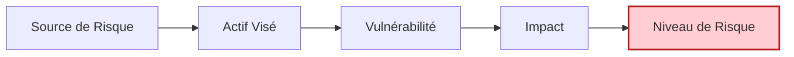
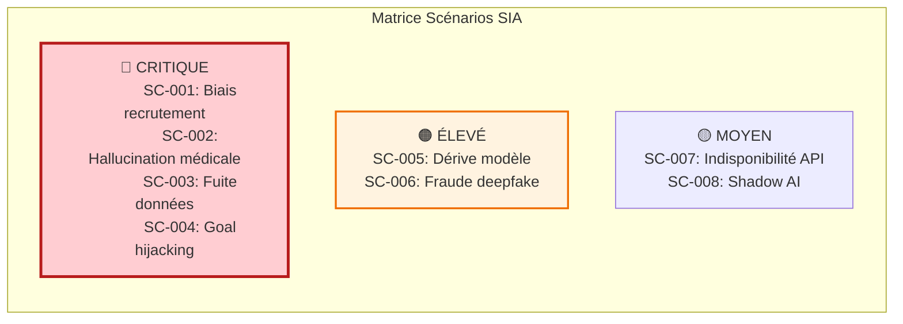

<!-- === EN-TÊTE DOCUMENTAIRE ISO-GRADE === -->

| Métadonnées | Valeur |
|-------------|--------|
| **Référence** | `EBIOS-SIA-003` |
| **Titre** | Scénarios de Risque IA - Atelier 3 EBIOS RM |
| **Version** | `1.0` |
| **Date** | `06/03/2026` |
| **Propriétaire** | `Direction Conformité / AI Safety Officer` |
| **Classification** | `Confidentiel` |

---

# Scénarios de Risque IA - Atelier 3 EBIOS RM

**Référence** : EBIOS-SIA-003 | Atelier 3 : Scénarios de Risque

---

## 1. INTRODUCTION

Ce document fournit des **scénarios de risque** types pour les Systèmes d'Intelligence Artificielle, prêts à être utilisés dans l'**Atelier 3** de la méthodologie EBIOS RM.

### 1.1 Structure d'un Scénario EBIOS



**Formule** : Risque = Source de risque × Actif × Vulnérabilité → Impact

---

## 2. SCÉNARIOS DE RISQUE SIA

### 2.1 Scénarios Critiques (🔴)

#### SC-IA-001 : Biais Discriminant en Recrutement Automatisé

| Attribut | Description |
|:---------|:------------|
| **ID** | SC-IA-001 |
| **Nom** | Biais discriminant systémique dans outil de recrutement |
| **Source** | Biais historiques dans données d'entraînement + manque d'audit |
| **Actif visé** | Processus de recrutement, réputation, conformité légale |
| **Vulnérabilité** | Dataset non diversifié, absence de fairness testing |
| **Description** | Le SIA de screening CV reproduit et amplifie les biais historiques de l'entreprise, discriminant systématiquement les candidats de certains genres, origines ethniques ou âges |
| **Impact** | |
| - Éthique | Discrimination systémique, atteinte aux droits fondamentaux [4] |
| - Juridique | Sanctions AI Act (35M€), plaintes EEOC, class actions [4] |
| - Réputation | Scandale médiatique, perte attractivité employeur [3] |
| - Financier | Amendes, coûts litiges, perte talents divers [3] |
| **Vraisemblance** | Élevée (biais documentés dans datasets standards) [3] |
| **Niveau de risque** | 🔴 **CRITIQUE** |
| **Mitigations** | Audits biais réguliers, datasets diversifiés, human-in-the-loop obligatoire, testing fairness |
| **Mappings** | AI Act Art. 10, ISO 42001 A.5, EEOC 2026 |

---

#### SC-IA-002 : Hallucination Médicale Grave

| Attribut | Description |
|:---------|:------------|
| **ID** | SC-IA-002 |
| **Nom** | Faux diagnostic recommandé par SIA médical |
| **Source** | Hallucination du modèle + sur-confiance utilisateur |
| **Actif visé** | Santé des patients, responsabilité médicale |
| **Vulnérabilité** | Absence de grounding médical, manque supervision humaine |
| **Description** | Le SIA d'aide au diagnostic suggère un traitement inapproprié ou un faux diagnostic pour un patient, et le clinicien valide sans vérification suffisante |
| **Impact** | |
| - Santé | Préjudice patient, potentiel décès [4] |
| - Juridique | Faute médicale, procès, suspension [4] |
| - Réputation | Perte confiance institution, médiatisation [3] |
| - Financier | Indemnisations, coûts procès [3] |
| **Vraisemblance** | Moyenne (hallucinations fréquentes en médical) [3] |
| **Niveau de risque** | 🔴 **CRITIQUE** |
| **Mitigations** | Double validation obligatoire, RAG sur sources médicales vérifiées, alertes score confiance |
| **Mappings** | AI Act Art. 14, ECRI 2026, FDA guidance |

---

#### SC-IA-003 : Fuite Données Entraînement par Model Inversion

| Attribut | Description |
|:---------|:------------|
| **ID** | SC-IA-003 |
| **Nom** | Extraction de données sensibles via attaque model inversion |
| **Source** | Attaquant externe avec expertise ML |
| **Actif visé** | Dataset d'entraînement contenant PII/PHI |
| **Vulnérabilité** | Absence differential privacy, outputs non contraints |
| **Description** | Un attaquant reconstruit des données d'entraînement sensibles (données patients, informations personnelles) en analysant les outputs du modèle déployé |
| **Impact** | |
| - Privacy | Violation RGPD/HIPAA, fuite PII [4] |
| - Juridique | Sanctions CNIL (4% CA), plaintes [4] |
| - Réputation | Perte confiance, scandale données [3] |
| - Financier | Amendes, coûts notification, crédit monitoring [3] |
| **Vraisemblance** | Élevée (attaques documentées, outils disponibles) [4] |
| **Niveau de risque** | 🔴 **CRITIQUE** |
| **Mitigations** | Differential privacy, output constraints, model cards, auditing régulier |
| **Mappings** | RGPD Art. 32, AI Act Art. 10, NIST Privacy |

---

#### SC-IA-004 : Goal Hijacking d'Agent Autonome Financier

| Attribut | Description |
|:---------|:------------|
| **ID** | SC-IA-004 |
| **Nom** | Détournement d'objectif d'agent trading autonome |
| **Source** | Prompt injection + excessive agency |
| **Actif visé** | Portefeuilles clients, fonds propres |
| **Vulnérabilité** | Autonomie excessive, contrôles insuffisants |
| **Description** | Un agent de trading autonome est manipulé via injection de contexte malveillant, le poussant à exécuter des transactions non autorisées ou à détourner des fonds |
| **Impact** | |
| - Financier | Pertes massives, vol de fonds [4] |
| - Juridique | Violations réglementaires, sanctions AMF [4] |
| - Réputation | Perte confiance clients, retrait fonds [3] |
| - Opérationnel | Arrêt activité trading [3] |
| **Vraisemblance** | Moyenne (attaques agentic émergentes) [3] |
| **Niveau de risque** | 🔴 **CRITIQUE** |
| **Mitigations** | Goal verification, checkpoints humains, circuit breakers, scope limitation |
| **Mappings** | OWASP ASI01, AI Act Art. 14, MiFID II |

---

### 2.2 Scénarios Élevés (🟠)

#### SC-IA-005 : Dérive de Modèle en Production

| Attribut | Description |
|:---------|:------------|
| **ID** | SC-IA-005 |
| **Nom** | Dégradation performance SIA dans le temps |
| **Source** | Data drift + absence de monitoring |
| **Actif visé** | Qualité des prédictions, décisions métier |
| **Vulnérabilité** | Pas de monitoring drift, retraining manuel |
| **Description** | Les performances du SIA se dégradent progressivement en production suite à des changements dans la distribution des données d'entrée, sans détection ni correction |
| **Impact** | |
| - Opérationnel | Erreurs croissantes, décisions erronées [3] |
| - Financier | Pertes opportunité, coûts erreurs [3] |
| - Réputation | Perte confiance utilisateurs [2] |
| **Vraisemblance** | Élevée (drift inévitable) [4] |
| **Niveau de risque** | 🟠 **ÉLEVÉ** |
| **Mitigations** | Monitoring drift continu, retraining automatisé, alerting performance |
| **Mappings** | MLOps best practices, ISO 42001 A.8 |

---

#### SC-IA-006 : Fraude par Deepfake en Vérification Identité

| Attribut | Description |
|:---------|:------------|
| **ID** | SC-IA-006 |
| **Nom** | Contournement KYC par deepfake vidéo/voix |
| **Source** | Attaquant avec accès à outils deepfake |
| **Actif visé** | Processus KYC, comptes clients |
| **Vulnérabilité** | Système biométrie non robuste aux deepfakes |
| **Description** | Un attaquant utilise un deepfake vidéo ou vocal pour usurper l'identité d'une personne et ouvrir un compte ou effectuer une transaction à son insu |
| **Impact** | |
| - Financier | Fraude, pertes financières [3] |
| - Juridique | Non-conformité KYC/AML [3] |
| - Réputation | Perte confiance processus [2] |
| **Vraisemblance** | Élevée (outils deepfake accessibles) [4] |
| **Niveau de risque** | 🟠 **ÉLEVÉ** |
| **Mitigations** | Détection deepfake, liveness detection, multi-factor verification |
| **Mappings** | AML5, eIDAS, NIST 800-63 |

---

### 2.3 Scénarios Moyens (🟡)

#### SC-IA-007 : Indisponibilité Service par Dépendance API

| Attribut | Description |
|:---------|:------------|
| **ID** | SC-IA-007 |
| **Nom** | Rupture service API tierce critique |
| **Source** | Défaillance fournisseur cloud AI |
| **Actif visé** | Disponibilité SIA, continuité métier |
| **Vulnérabilité** | Single point of failure, pas de fallback |
| **Description** | Le SIA devient indisponible suite à une panne ou interruption de service du fournisseur d'API AI externe (OpenAI, Anthropic, etc.) |
| **Impact** | |
| - Opérationnel | Arrêt service dépendant [2] |
| - Financier | Pertes revenus, pénalités SLA [2] |
| - Réputation | Mécontentement clients [2] |
| **Vraisemblance** | Moyenne (pannes documentées) [3] |
| **Niveau de risque** | 🟡 **MOYEN** |
| **Mitigations** | Multi-provider strategy, fallback local, caching, contrats SLA |
| **Mappings** | BCP, DORA, ISO 27001 |

---

## 3. MATRICE DES SCÉNARIOS

### 3.1 Vue d'Ensemble



### 3.2 Tableau Récapitulatif

| ID | Scénario | Impact | Vraisemblance | Niveau | Priorité |
|:---|:---------|:------:|:-------------:|:------:|:--------:|
| SC-001 | Biais discriminant recrutement | 4 | 3 | 🔴 | P1 |
| SC-002 | Hallucination médicale | 4 | 3 | 🔴 | P1 |
| SC-003 | Fuite données model inversion | 4 | 4 | 🔴 | P1 |
| SC-004 | Goal hijacking agent financier | 4 | 3 | 🔴 | P1 |
| SC-005 | Dérive modèle production | 3 | 4 | 🟠 | P2 |
| SC-006 | Fraude deepfake KYC | 3 | 4 | 🟠 | P2 |
| SC-007 | Indisponibilité API tierce | 2 | 3 | 🟡 | P3 |

---

## 4. TEMPLATE POUR ATELIER EBIOS

### 4.1 Fiche Scénario à Compléter

```markdown
## SC-XXX : [Nom du scénario]

### Identification
- **ID** : SC-XXX
- **Nom** : 
- **Source de risque** : [Référence SR-XXX]
- **Biens essentiels visés** : [Référence BE-XXX]

### Description
[Description narrative du scénario]

### Évaluation de l'Impact (1-4)
| Dimension | Score | Justification |
|:----------|:-----:|:--------------|
| Santé/Sécurité | | |
| Financier | | |
| Juridique/Réglementaire | | |
| Réputation | | |
| Opérationnel | | |
| **IMPACT GLOBAL** | **X** | |

### Évaluation de la Vraisemblance (1-4)
| Facteur | Score | Justification |
|:--------|:-----:|:--------------|
| Capacité attaquant | | |
| Opportunité | | |
| Motivation | | |
| **VRAISEMBLANCE GLOBALE** | **X** | |

### Niveau de Risque
- **Niveau** : ☐ Critique ☐ Élevé ☐ Moyen ☐ Faible
- **Justification** :

### Traitement Proposé
| Mesure | Priorité | Échéance | Budget |
|:-------|:---------|:---------|:-------|
| | | | |

### Mappings
- AI Act : 
- ISO 42001 : 
- Autres : 
```

---

## 5. RÉVISION

| Version | Date | Auteur | Modifications |
|:--------|:-----|:-------|:--------------|
| 1.0 | 06/03/2026 | Direction Conformité | Création scénarios de risque IA |

---

**Document approuvé par :**
- [ ] AI Safety Officer
- [ ] RSSI
- [ ] Direction Conformité

**Date d'approbation :** _______________

---

*Scénarios de Risque IA — Version 1.0 ISO-Grade*  
*Réf. EBIOS-SIA-003*
