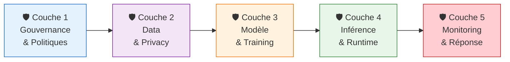
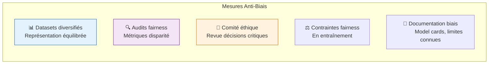
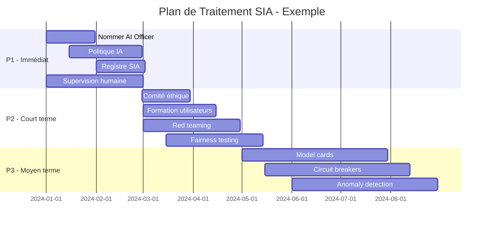

<!-- === EN-TÊTE DOCUMENTAIRE ISO-GRADE === -->

| Métadonnées | Valeur |
|-------------|--------|
| **Référence** | `EBIOS-SIA-004` |
| **Titre** | Mesures de Sécurité IA - Atelier 4 EBIOS RM |
| **Version** | `1.0` |
| **Date** | `06/03/2026` |
| **Propriétaire** | `Direction Conformité / AI Safety Officer` |
| **Classification** | `Confidentiel` |

---

# Mesures de Sécurité IA - Atelier 4 EBIOS RM

**Référence** : EBIOS-SIA-004 | Atelier 4 : Traitement du Risque

---

## 1. INTRODUCTION

Ce document catalogue les **mesures de sécurité** spécifiques aux Systèmes d'Intelligence Artificielle pour l'**Atelier 4** de la méthodologie EBIOS RM.

### 1.1 Principe de Défense en Profondeur

---

## 2. MESURES PAR DOMAINE

### 2.1 Gouvernance et Organisation

| ID | Mesure | Description | Priorité | Mappings |
|:---|:-------|:------------|:--------:|:---------|
| **GOV-001** | Nomination AI Officer | Désignation d'un responsable IA avec autorité et expertise | 🔴 Haute | AI Act Art. 9, ISO 42001 5.1 |
| **GOV-002** | Comité d'Éthique IA | Instance pluridisciplinaire pour arbitrages éthiques | 🔴 Haute | AI Act Art. 14, HLEG Ethics |
| **GOV-003** | Politique IA documentée | Cadre d'utilisation, interdictions, procédures | 🔴 Haute | ISO 42001 A.5, NIST Govern |
| **GOV-004** | Registre des SIA | Inventaire complet des systèmes, classification, statut | 🔴 Haute | AI Act Art. 60, ISO 42001 A.6 |
| **GOV-005** | Formation utilisateurs | Programme de sensibilisation et habilitation | 🔴 Haute | AI Act Art. 14, ISO 42001 7.2 |
| **GOV-006** | Veille réglementaire | Processus de suivi évolutions légales et normatives | 🟠 Moyenne | AI Act, ISO 42001 9.3 |

### 2.2 Données et Privacy

| ID | Mesure | Description | Priorité | Mappings |
|:---|:-------|:------------|:--------:|:---------|
| **DATA-001** | DPIA systématique | Data Protection Impact Assessment pour tout SIA traitant PII | 🔴 Haute | RGPD Art. 35, AI Act Art. 10 |
| **DATA-002** | Anonymisation/Differential Privacy | Techniques de protection des données d'entraînement | 🔴 Haute | RGPD Art. 25, NIST Privacy |
| **DATA-003** | Provenance des données | Traçabilité complète des datasets (lineage) | 🔴 Haute | AI Act Art. 10, ISO 42001 A.7 |
| **DATA-004** | Contrôle qualité data | Validation, nettoyage, détection biais avant entraînement | 🔴 Haute | ISO 42001 A.7, NIST Map |
| **DATA-005** | Gestion consentements | Tracking et respect des consentements pour utilisation données | 🔴 Haute | RGPD Art. 7, AI Act Art. 5 |
| **DATA-006** | Minimisation des données | Collecte limitée aux données strictement nécessaires | 🟠 Moyenne | RGPD Art. 5, Privacy by Design |

### 2.3 Modèle et Entraînement

| ID | Mesure | Description | Priorité | Mappings |
|:---|:-------|:------------|:--------:|:---------|
| **MODEL-001** | Red teaming | Équipe dédiée pour attaques adversariales sur le modèle | 🔴 Haute | NIST Measure, AI Act Art. 15 |
| **MODEL-002** | Fairness testing | Tests systématiques de biais et discrimination | 🔴 Haute | AI Act Art. 10, ISO 42001 A.5 |
| **MODEL-003** | Adversarial training | Entraînement avec exemples contradictoires | 🟠 Moyenne | NIST Measure, Robust ML |
| **MODEL-004** | Model cards | Documentation standardisée des capacités et limites | 🟠 Moyenne | Google Model Cards, AI Act Art. 11 |
| **MODEL-005** | Watermarking | Marquage invisible des modèles pour traçabilité | 🟠 Moyenne | NIST Measure, IP protection |
| **MODEL-006** | Secure enclaves | Environnements d'entraînement isolés et sécurisés | 🔴 Haute | Confidential Computing, ISO 27001 |

### 2.4 Inférence et Runtime

| ID | Mesure | Description | Priorité | Mappings |
|:---|:-------|:------------|:--------:|:---------|
| **INF-001** | Input validation | Sanitization et validation des entrées utilisateur | 🔴 Haute | OWASP LLM01, ASI01 |
| **INF-002** | Output filtering | Filtrage des sorties pour détecter contenu problématique | 🔴 Haute | OWASP LLM02, Content Safety |
| **INF-003** | Rate limiting | Limitation du nombre de requêtes par utilisateur/IP | 🔴 Haute | OWASP LLM04, API Security |
| **INF-004** | Human-in-the-loop | Validation humaine obligatoire pour décisions critiques | 🔴 Haute | AI Act Art. 14, ISO 42001 8.1 |
| **INF-005** | Circuit breakers | Arrêt automatique en cas de comportement anormal | 🟠 Moyenne | OWASP ASI08, Safety Systems |
| **INF-006** | Tool whitelisting | Limitation stricte des outils/actions accessibles aux agents | 🔴 Haute | OWASP ASI02, Least Privilege |
| **INF-007** | Kill switches | Mécanismes d'arrêt d'urgence pour agents autonomes | 🔴 Haute | OWASP ASI10, Safety Engineering |

### 2.5 Monitoring et Réponse

| ID | Mesure | Description | Priorité | Mappings |
|:---|:-------|:------------|:--------:|:---------|
| **MON-001** | Monitoring drift | Détection continue de dérive des données et du modèle | 🔴 Haute | MLOps, ISO 42001 A.8 |
| **MON-002** | Anomaly detection | Alertes sur comportements atypiques du SIA | 🔴 Haute | NIST Detect, SIEM |
| **MON-003** | Audit logs complets | Journalisation de toutes les décisions et requêtes (6 ans) | 🔴 Haute | AI Act Art. 12, RGPD Art. 30 |
| **MON-004** | Tableau de bord sécurité | Visualisation temps réel des métriques critiques | 🟠 Moyenne | SOC, ISO 27001 |
| **MON-005** | Plan de réponse incidents | Procédures spécifiques IA (rollback, isolation) | 🔴 Haute | NIST Respond, ISO 27035 |
| **MON-006** | Red teaming continu | Tests réguliers par équipe externe | 🟠 Moyenne | NIST, Bug Bounty |

---

## 3. MESURES PAR TYPE DE RISQUE

### 3.1 Contre les Biais et Discriminations

| Risque | Mesures Prioritaires |
|:-------|:---------------------|
| Biais recrutement | GOV-002, DATA-004, MODEL-002, INF-004 |
| Biais crédit | MODEL-002, INF-004, MON-001, GOV-002 |
| Biais santé | DATA-002, MODEL-002, INF-004, MON-002 |

### 3.2 Contre les Hallucinations

| Risque | Mesures Prioritaires |
|:-------|:---------------------|
| Hallucinations médicales | INF-004, INF-002, DATA-003, GOV-005 |
| Hallucinations juridiques | INF-004, MODEL-004, GOV-005, MON-003 |
| Hallucinations financières | INF-004, INF-002, MON-001, GOV-005 |

### 3.3 Contre les Attaques Agentic AI

| Risque | Mesures Prioritaires |
|:-------|:---------------------|
| Goal hijacking | INF-001, INF-006, INF-007, MON-002 |
| Cascading failures | INF-005, INF-006, MON-002, MON-005 |
| Rogue agents | INF-007, MON-002, INF-006, GOV-001 |

---

## 4. MAPPING AI ACT / ISO 42001

### 4.1 Exigences AI Act Couvertes

| Article AI Act | Mesures Associées |
|:---------------|:------------------|
| Art. 9 - Système qualité | GOV-001, GOV-003, GOV-004 |
| Art. 10 - Data governance | DATA-001 à DATA-006 |
| Art. 11 - Documentation technique | MODEL-004, GOV-004 |
| Art. 12 - Traçabilité | MON-003, DATA-003 |
| Art. 13 - Transparence | MODEL-004, GOV-005 |
| Art. 14 - Supervision humaine | INF-004, GOV-002, GOV-005 |
| Art. 15 - Robustesse | MODEL-001, MODEL-003, INF-005 |

### 4.2 Clauses ISO 42001 Couvertes

| Clause ISO 42001 | Mesures Associées |
|:-----------------|:------------------|
| A.5 - Politique IA | GOV-001 à GOV-006 |
| A.6 - Ressources | GOV-001, GOV-005 |
| A.7 - Cycle de vie SIA | DATA-001 à DATA-006, MODEL-001 à MODEL-006 |
| A.8 - Opérations | INF-001 à INF-007, MON-001 à MON-006 |
| A.10 - Fournisseurs | DATA-003, MODEL-006 |

---

## 5. PRIORISATION ET BUDGETS

### 5.1 Matrice de Priorité

| Priorité | Mesures | Budget Indicatif | Délai |
|:---------|:--------|:-----------------|:------|
| 🔴 **P1 - Immédiat** | GOV-001, GOV-003, GOV-004, DATA-001, INF-004, MON-003 | 200-500K€ | 0-3 mois |
| 🟠 **P2 - Court terme** | GOV-002, GOV-005, DATA-002, DATA-003, MODEL-001, MODEL-002, INF-001, INF-002, MON-001, MON-002 | 300-800K€ | 3-6 mois |
| 🟡 **P3 - Moyen terme** | DATA-004, DATA-005, MODEL-003, MODEL-004, MODEL-005, INF-003, INF-005, INF-006, INF-007, MON-004, MON-005, MON-006 | 400-1000K€ | 6-12 mois |

### 5.2 Plan de Traitement Type

---

## 6. RÉVISION

| Version | Date | Auteur | Modifications |
|:--------|:-----|:-------|:--------------|
| 1.0 | 06/03/2026 | Direction Conformité | Création catalogue mesures sécurité IA |

---

**Document approuvé par :**
- [ ] AI Safety Officer
- [ ] RSSI
- [ ] Direction Conformité

**Date d'approbation :** _______________

---

*Mesures de Sécurité IA — Version 1.0 ISO-Grade*  
*Réf. EBIOS-SIA-004*
