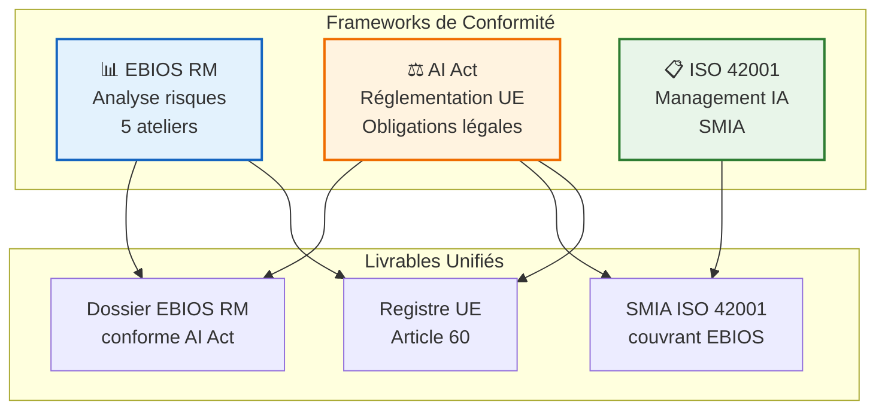
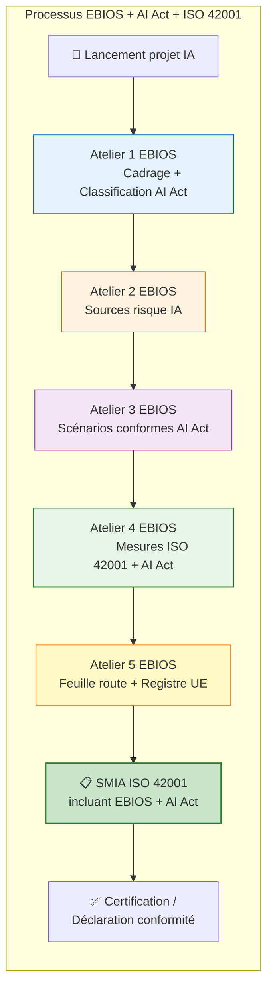

<!-- === EN-TÊTE DOCUMENTAIRE ISO-GRADE === -->

| Métadonnées | Valeur |
|-------------|--------|
| **Référence** | `EBIOS-SIA-005` |
| **Titre** | Mapping EBIOS RM / AI Act / ISO 42001 |
| **Version** | `1.0` |
| **Date** | `06/03/2026` |
| **Propriétaire** | `Direction Conformité / AI Officer` |
| **Classification** | `Confidentiel` |

---

# Mapping EBIOS RM / AI Act / ISO 42001

**Référence** : EBIOS-SIA-005 | Alignement normatif et réglementaire

---

## 1. INTRODUCTION

Ce document établit les **correspondances** entre :
- La méthodologie **EBIOS RM** (ANSSI)
- Le **Règlement Européen sur l'IA** (AI Act)
- La norme **ISO/IEC 42001** (Système de Management IA)

### 1.1 Objectif

Permettre une **conformité simultanée** aux trois référentiels en maximisant les synergies et en évitant les redondances.

---

## 2. MAPPING GLOBAL

### 2.1 Vue d'Ensemble



---

## 3. MAPPING DÉTAILLÉ PAR ATELIER EBIOS

### 3.1 Atelier 1 : Cadrage et Socle de Sécurité

| EBIOS RM | AI Act | ISO 42001 | Livrable Unifié |
|:---------|:-------|:----------|:----------------|
| Identification périmètre | Art. 8-9 : Classification système | 4.1 : Contexte organisation | **Fiche SIA** avec classification AI Act |
| Biens essentiels | Art. 9 : Biens à protéger | 4.2 : Partie prenantes | **Registre biens essentiels** |
| Socle de sécurité | Art. 9 : Mesures existantes | 6.1 : Actions risques | **État des lieux conformité** |

**Synergies clés :**
- La classification AI Act (Haut Risque/Limité/Minimal) guide la profondeur de l'analyse EBIOS
- L'identification des biens essentiels EBIOS inclut les exigences AI Act (données d'entraînement, modèles)

---

### 3.2 Atelier 2 : Sources de Risque

| EBIOS RM | AI Act | ISO 42001 | Livrable Unifié |
|:---------|:-------|:----------|:----------------|
| Attaquants | Art. 52-55 : GPAI risks | A.7 : Sécurité cycle de vie | **Catalogue menaces IA** |
| Cyberattaques | Art. 15 : Robustesse | A.8 : Sécurité opérationnelle | **Matrice attaques IA** |
| Non-malveillant | Art. 10 : Gestion risques | 6.1.2 : Évaluation risques | **Registre risques SIA** |

**Sources de risque spécifiques couvertes :**
- Data poisoning → AI Act Art. 10 + ISO 42001 A.7
- Prompt injection → AI Act Art. 15 + ISO 42001 A.8
- Biais → AI Act Art. 10 + ISO 42001 A.5

---

### 3.3 Atelier 3 : Scénarios de Risque

| EBIOS RM | AI Act | ISO 42001 | Livrable Unifié |
|:---------|:-------|:----------|:----------------|
| Scénarios de risque | Art. 9 : Scénarios obligatoires HR | 6.1.2 : Évaluation risques | **Scénarios EBIOS conformes AI Act** |
| Évaluation G×P | Art. 9 : Niveau risque acceptable | 6.1.3 : Traitement risques | **Matrice risques unifiée** |

**Mapping scénarios types :**

| Scénario EBIOS | Exigence AI Act | Clause ISO 42001 |
|:---------------|:----------------|:-----------------|
| Biais discriminant | Art. 10 : Biais systémiques | A.5 : Politique IA |
| Hallucination médicale | Art. 14 : Supervision humaine | 8.1 : Opérations planifiées |
| Fuite données | Art. 10 : Gouvernance data | A.7 : Cycle de vie |
| Goal hijacking agent | Art. 14 : Oversight humain | A.8 : Sécurité opérationnelle |

---

### 3.4 Atelier 4 : Traitement du Risque

| EBIOS RM | AI Act | ISO 42001 | Livrable Unifié |
|:---------|:-------|:----------|:----------------|
| Mesures de sécurité | Art. 9, 13, 14, 15 | 6.1.3 : Traitement | **Plan de traitement unifié** |
| Risque résiduel | Art. 9 : Acceptation risque | 6.1.3 : Risque résiduel | **Déclaration risques résiduels** |

**Mapping mesures / exigences :**

| Mesure EBIOS | Article AI Act | Clause ISO 42001 |
|:-------------|:---------------|:-----------------|
| Nomination AI Officer | Art. 9 | 5.1 : Leadership |
| Comité éthique IA | Art. 14 | 5.2 : Politique SMIA |
| Supervision humaine | Art. 14 | 8.1 : Opérations |
| Documentation technique | Art. 11 | A.7 : Cycle de vie |
| Traçabilité logs | Art. 12 | A.8 : Sécurité |
| Robustesse / Red teaming | Art. 15 | 6.1.3 : Traitement |

---

### 3.5 Atelier 5 : Feuille de Route

| EBIOS RM | AI Act | ISO 42001 | Livrable Unifié |
|:---------|:-------|:----------|:----------------|
| Plan d'action | Art. 9 : Mise en conformité | 6.2 : Objectifs SMIA | **Feuille de route conformité** |
| Suivi annuel | Art. 9 : Surveillance continue | 9.1 : Surveillance | **Programme audit interne** |

---

## 4. MAPPING DÉTAILLÉ AI ACT ↔️ ISO 42001

### 4.1 Tableau de Correspondance Complet

| Article AI Act | Description | Clause ISO 42001 | Implémentation |
|:---------------|:------------|:-----------------|:---------------|
| **Art. 8** | Classification systèmes IA | 4.3 : Périmètre SMIA | Processus classification intégré |
| **Art. 9** | Système qualité et gestion risques | 5.1, 6.1, 9.1 | SMIA avec focus risques IA |
| **Art. 10** | Data et documentation | A.7, 7.5 | Gouvernance données cycle vie |
| **Art. 11** | Documentation technique | A.7, 7.5 | Model cards + documentation SMIA |
| **Art. 12** | Traçabilité | A.8, 8.1 | Logging EBIOS + registre UE |
| **Art. 13** | Transparence | 7.4, 8.2 | Communication + informations utilisateurs |
| **Art. 14** | Supervision humaine | 8.1, A.8 | Contrôles opérationnels + HITL |
| **Art. 15** | Robustesse, précision, cybersécurité | 6.1.3, A.8 | Mesures EBIOS + tests red team |
| **Art. 60** | Registre UE | 7.5, 9.1 | Registre SIA intégré au SMIA |

---

## 5. SYNTHÈSE DES LIVRABLES UNIFIÉS

### 5.1 Dossier EBIOS RM Conforme AI Act

```
DOSSIER_EBIOS_RM_AI_ACT/
├── 01-Cadrage/
│   ├── Classification-AI-Act.md          ← Art. 8
│   ├── Biens-essentiels-IA.md            ← Art. 9
│   └── Socle-securite-initial.md
├── 02-Sources-risque/
│   ├── Menaces-IA-specifiques.md         ← Art. 52-55 (GPAI)
│   └── Registre-risques-IA.md
├── 03-Scenarios/
│   ├── Scenarios-haut-risque.md          ← Art. 9 (HR)
│   └── Evaluation-gravite-probabilite.md
├── 04-Traitement/
│   ├── Plan-mesures-AI-Act.md            ← Arts. 9-15
│   └── Mesures-ISO-42001.md              ← SMIA
├── 05-Feuille-route/
│   ├── Plan-action-conformite.md
│   └── Registre-UE-Art-60.md             ← Art. 60
└── Annexes/
    ├── Mapping-EBIOS-AIAct-ISO42001.md   ← Ce document
    └── Declarations-conformite/
```

### 5.2 Registre UE Article 60 (Intégré EBIOS)

| Champ Registre UE | Source EBIOS | Source ISO 42001 |
|:------------------|:-------------|:-----------------|
| Identification SIA | Atelier 1 : Périmètre | Registre SIA (A.6) |
| Classification risque | Atelier 1 : Classification | Évaluation risques (6.1.2) |
| Mesures de mitigation | Atelier 4 : Plan traitement | Plan traitement risques |
| État conformité | Atelier 5 : Suivi | Audits internes (9.2) |

---

## 6. PROCESSUS INTÉGRÉ

### 6.1 Flux de Conformité Unifié



---

## 7. CHECKLIST CONFORMITÉ INTÉGRÉE

### 7.1 Avant Déploiement SIA

| ☐ | Vérification | Référence |
|:--|:-------------|:----------|
| ☐ | Classification AI Act effectuée et documentée | Art. 8 |
| ☐ | Évaluation risques EBIOS complète (5 ateliers) | Méthode ANSSI |
| ☐ | DPIA réalisée si traitement données personnelles | RGPD |
| ☐ | Documentation technique conforme Art. 11 | Art. 11 |
| ☐ | Mesures supervision humaine implémentées | Art. 14 |
| ☐ | Tests robustesse et red teaming effectués | Art. 15 |
| ☐ | Registre SIA à jour dans SMIA | ISO 42001 A.6 |
| ☐ | Formation utilisateurs réalisée | Art. 14, ISO 42001 7.2 |

### 7.2 Maintenance Continue

| ☐ | Vérification | Fréquence |
|:--|:-------------|:----------|
| ☐ | Revue risques EBIOS | Annuelle |
| ☐ | Audit interne SMIA | Annuelle (ISO 42001) |
| ☐ | Mise à jour registre UE | Continue |
| ☐ | Surveillance drift modèle | Continue |
| ☐ | Red teaming périodique | Semestrielle |

---

## 8. RÉVISION

| Version | Date | Auteur | Modifications |
|:--------|:-----|:-------|:--------------|
| 1.0 | 06/03/2026 | Direction Conformité | Création mapping triple référentiel |

---

**Document approuvé par :**
- [ ] AI Officer
- [ ] RSSI
- [ ] Direction Conformité

**Date d'approbation :** _______________

---

*Mapping EBIOS / AI Act / ISO 42001 — Version 1.0 ISO-Grade*  
*Réf. EBIOS-SIA-005*

---

## 📚 RÉFÉRENCES

- Règlement (UE) 2024/1689 (AI Act)
- ISO/IEC 42001:2023 (Système de management IA)
- Méthode EBIOS RM v1.0 (ANSSI)
- RGPD (Règlement 2016/679)
- NIST AI Risk Management Framework
