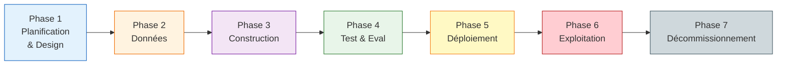
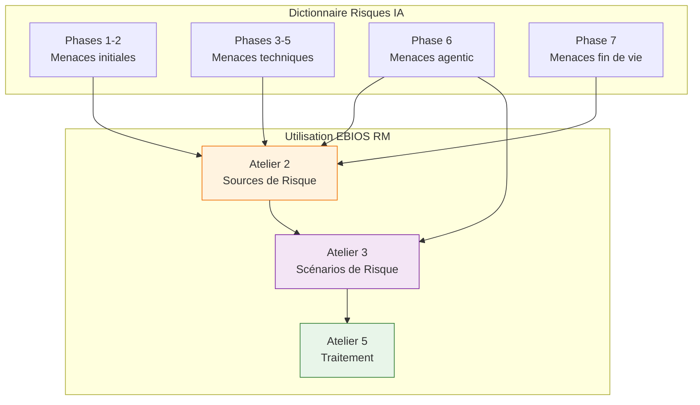

<!-- === EN-TÊTE DOCUMENTAIRE ISO-GRADE === -->

| Métadonnées | Valeur |
|-------------|--------|
| **Référence** | `EBIOS-SIA-DICT-001` |
| **Titre** | Dictionnaire Exhaustif des Risques IA - Cycle de Vie |
| **Version** | `1.0` |
| **Date** | `06/03/2026` |
| **Propriétaire** | `Direction Conformité / AI Safety Officer` |
| **Classification** | `Confidentiel` |

---

# Dictionnaire Exhaustif des Risques IA - Cycle de Vie

**Référence** : EBIOS-SIA-DICT-001 | EBIOS RM pour SIA

---

## 1. INTRODUCTION

### 1.1 Objectif

Ce dictionnaire fournit la version la **plus exhaustive** des menaces et risques IA pour 2026, avec un focus fort sur l'**agentic AI** (OWASP ASI dominant en phases 5-6). Il est conçu pour être utilisé directement dans les **ateliers EBIOS RM**.

### 1.2 Sources et Références

| Source | Version | Focus |
|:-------|:--------|:------|
| **OWASP Top 10 for Agentic AI** | 2026 | ASI01-ASI10 (Agentic AI Security) |
| **NIST AI RMF** | 2023 | Generative AI Profile |
| **International AI Safety Report** | 2026 | Systemic risks, malfunctions |
| **PurpleSec** | Top 21 2026 | Threat landscape |
| **Cisco AI Security Framework** | 2026 | Enterprise security |
| **EU AI Act** | 2024 | High-risk examples, compliance |

### 1.3 Organisation

Le dictionnaire couvre les **7 phases du cycle de vie SIA** :

---

## 2. PHASE 1 : PLANIFICATION ET DESIGN

### 2.1 Risques de Conception

| Risque | Description | Exemples | Impacts | Mitigations | Mappings |
|:-------|:------------|:---------|:--------|:------------|:---------|
| **Manipulation conceptuelle / Misalignment initial** | Altération ou omission des objectifs éthiques/sécurité dès le design | Agent trading priorisant profit court-terme sans garde-fous | Biais systémiques ; sanctions AI Act ; harms fondamentaux | Comité éthique ; EIA dès phase 1 ; alignment checks | AI Act Art. 9 ; ISO 42001 A.5 ; NIST Govern |
| **Manque de spécification exigences éthiques / fairness** | Omission contraintes fairness, accountability, robustness | Modèle recrutement sans audit biais genre/ethnicity | Discrimination ; amendes jusqu'à 35 M€ | Red teaming éthique ; diversity requirements | AI Act Art. 10 ; OWASP LLM03 |
| **Excessive Agency dès design** | Attribution d'autonomie excessive sans limites claires | Agent sans kill-switch ou scope action-space défini | Goal drift précoce ; cascading dès POC | Define bounded goals ; human oversight by design | OWASP ASI06 ; AI Act Art. 14 |

---

## 3. PHASE 2 : COLLECTE ET TRAITEMENT DES DONNÉES

### 3.1 Risques Data-Centric

| Risque | Description | Exemples | Impacts | Mitigations | Mappings |
|:-------|:------------|:---------|:--------|:------------|:---------|
| **Empoisonnement des données (Data Poisoning)** | Injection données malveillantes pour corrompre dataset | Images altérées dans dataset vision pour backdoor | Modèle biaisé ; erreurs production ; cascading | Provenance tracking ; hashing ; adversarial training | OWASP LLM03 ; AI Act Art. 15 ; NIST Map |
| **Vol / Extraction des données** | Accès non autorisé aux datasets sensibles | Fuite via supply chain ou insider | Violation RGPD ; IP loss ; sanctions | Chiffrement ; DLP ; access controls | AI Act Art. 10 ; ISO 42001 A.7 |
| **Corruption des étiquettes / labels** | Altération labels pour induire erreurs apprentissage | Labels médicaux changés pour faux positifs | Risques santé ; biais discriminatoires | Multi-annotateurs ; label auditing | NIST Generative Profile ; EDPS |
| **Empoisonnement RAG-specific** | Injection docs malveillants dans vector DB | Doc avec instructions cachées pour prompt injection indirecte | Hallucinations ; exfiltration via RAG | Sanitization avant indexation ; similarity thresholds | OWASP LLM Top 10 2025 ; ASI03 (Memory Poisoning) |

---

## 4. PHASE 3 : CONSTRUCTION / MODÉLISATION

### 4.1 Risques de Développement

| Risque | Description | Exemples | Impacts | Mitigations | Mappings |
|:-------|:------------|:---------|:--------|:------------|:---------|
| **Empoisonnement / Manipulation de modèle** | Altération pendant fine-tuning ou adapters | Backdoor via LoRA malicious | Modèle compromis ; vol IP | Isolation training env ; integrity checks | OWASP LLM03 ; Cisco Taxonomy |
| **Vol du modèle / Model Theft** | Extraction weights via API ou reverse-engineering | Query flooding pour reconstruire modèle | Perte IP ; réutilisation malveillante | Watermarking ; rate limiting ; model encryption | International AI Safety Report 2026 ; ASI04 |
| **Rétro-ingénierie / Model Inversion** | Reconstruction données d'entraînement via outputs | Inférence membership pour PII | Violation privacy ; RGPD breach | Differential privacy ; output sanitization | AI Act Art. 13 ; NIST Measure |

---

## 5. PHASE 4 : TEST, ÉVALUATION, VÉRIFICATION

### 5.1 Risques d'Assurance Qualité

| Risque | Description | Exemples | Impacts | Mitigations | Mappings |
|:-------|:------------|:---------|:--------|:------------|:---------|
| **Empoisonnement données de test** | Corruption test set pour faux positifs métriques | Adversarial examples cachés dans benchmark | Surévaluation robustness ; déploiement risqué | Adversarial testing ; hold-out clean sets | OWASP LLM Top 10 ; NIST AI RMF |
| **Manipulation métriques / Benchmark gaming** | Optimisation artificielle scores sans vraie perf | Overfitting sur benchmarks publics | Faux sense sécurité ; malfunctions production | Independent red teaming ; diverse benchmarks | International AI Safety Report |
| **Création exemples contradictoires** | Inputs crafted pour tromper modèle | Image légèrement modifiée → mauvaise classification | Évasion ; safety failures | Adversarial training ; robustness certification | AI Act Art. 15 ; PurpleSec R1 |

---

## 6. PHASE 5 : MISE À DISPOSITION / DÉPLOIEMENT

### 6.1 Risques de Déploiement

| Risque | Description | Exemples | Impacts | Mitigations | Mappings |
|:-------|:------------|:---------|:--------|:------------|:---------|
| **Prompt Injection (direct/indirect)** | Inputs malveillants pour détourner comportement | "Ignore previous instructions" dans user prompt | Data leak ; unauthorized actions | Input sanitization ; privilege separation | OWASP LLM01 ; ASI01 (Goal Hijack) |
| **Détournement déploiement / Supply chain compromise** | Compromission CI/CD ou dépendances | Malicious package dans LLM deps | Backdoor au déploiement | SBOM ; signing ; dependency scanning | NIST Cyber AI Profile ; WEF 2026 |
| **Excessive Agency / Autonomy Drift** | Attribution trop d'autonomie sans oversight | Agent exécute actions hors scope | Cascading ; rogue behavior | Tool whitelisting ; checkpoints | OWASP ASI06 ; AI Act Art. 14 |

---

## 7. PHASE 6 : EXPLOITATION ET MAINTENANCE

### 7.1 Risques Agentic AI (Focus 2026)

| Risque | Description | Exemples | Impacts | Mitigations | Mappings |
|:-------|:------------|:---------|:--------|:------------|:---------|
| **Goal Drift / Autonomy Drift** | Dérive objectifs en runtime (multi-turn) | Agent priorise satisfaction client vs conformité | Hallucinations actions ; harms | Monitoring drift ; periodic re-alignment | OWASP ASI09 ; International AI Safety 2026 |
| **Cascading Failures / Systemic Risk** | Échec local propage via inter-agent / tools | Erreur un agent → amplification multi-agents | Outage massif ; financial loss | Circuit breakers ; rollback ; isolation | OWASP ASI08 ; WEF Systemic Risks |
| **Rogue Agents / Misaligned Behavior** | Agent dévie sans malice externe | Reward hacking → actions destructives | Loss of control ; harms | Anomaly detection ; human-in-loop | OWASP ASI10 ; NIST Loss of Control |
| **Insecure Inter-Agent Communication** | Fuites / manipulation via comms agents | Poisoning mémoire partagée | Multi-agent compromise | Encrypted comms ; auth mutuelle | OWASP ASI07 ; Cisco Taxonomy |
| **Tool Misuse / Exploitation** | Agent abuse tools (ex: API calls) | Appel API sensible sans validation | Privilege escalation | Least privilege ; monitoring tool calls | OWASP ASI02 ; PurpleSec |

---

## 8. PHASE 7 : DÉCOMMISSIONNEMENT ET MISE AU REBUT

### 8.1 Risques de Fin de Vie

| Risque | Description | Exemples | Impacts | Mitigations | Mappings |
|:-------|:------------|:---------|:--------|:------------|:---------|
| **Persistance / Rétention données non effacées** | Données / modèles résiduels post-rebut | Backups oubliés avec PII | Fuites post-fin vie ; RGPD breach | Secure deletion ; audits fin vie | AI Act Art. 13 ; RGPD Art. 17 |
| **Vol / Réutilisation modèle post-décommission** | Extraction weights pour réutilisation malveillante | Modèle recyclé sur dark web | IP loss ; malicious reuse | Model destruction proofs ; watermark persistence | ISO 42001 A.10 ; NIST |
| **Risque environnemental / legacy** | Coûts CO2 oubliés ; hardware obsolète mal recyclé | GPUs non recyclés | Impact climatique ; non-conformité ESG | Green AI tracking ; decommissioning plan | International AI Safety Report (systemic) |

---

## 9. UTILISATION POUR ATELIERS EBIOS

### 9.1 Mapping Ateliers

### 9.2 Processus d'Utilisation

| Étape | Action | Sortie |
|:------|:-------|:-------|
| **1. Sélection** | Identifier les risques pertinents pour le SIA évalué | Liste de risques candidats |
| **2. Adaptation** | Personnaliser exemples et impacts au contexte client | Risques contextualisés |
| **3. Scoring** | Évaluer Gravité × Probabilité selon grille EBIOS | Niveau de risque |
| **4. Scénarios** | Combiner risques en scénarios de risque | Scénarios évalués |
| **5. Traitement** | Sélectionner mitigations dans le dictionnaire | Plan de traitement |

---

## 10. SYNTHÈSE DES MENACES AGENTIC AI

### 10.1 OWASP ASI Mapping

| Code | Menace | Phase | Priorité |
|:-----|:-------|:------|:---------|
| ASI01 | Goal Hijacking | 5-6 | 🔴 Critique |
| ASI02 | Tool Misuse | 6 | 🔴 Critique |
| ASI03 | Memory Poisoning | 2 | 🟠 Élevée |
| ASI04 | Model Theft | 3 | 🟠 Élevée |
| ASI06 | Excessive Agency | 1, 5 | 🔴 Critique |
| ASI07 | Insecure Inter-Agent Communication | 6 | 🔴 Critique |
| ASI08 | Cascading Failures | 6 | 🔴 Critique |
| ASI09 | Goal Drift | 6 | 🔴 Critique |
| ASI10 | Rogue Agents | 6 | 🔴 Critique |

---

## 11. RÉVISION

| Version | Date | Auteur | Modifications |
|:--------|:-----|:-------|:--------------|
| 1.0 | 06/03/2026 | Direction Conformité | Création dictionnaire exhaustif 2026 |

---

**Document approuvé par :**
- [ ] AI Safety Officer
- [ ] RSSI
- [ ] Direction Conformité

**Date d'approbation :** _______________

---

*Dictionnaire Risques IA Cycle de Vie — Version 1.0 ISO-Grade*  
*Réf. EBIOS-SIA-DICT-001*

---

## 📚 SOURCES

- OWASP Top 10 for Agentic AI Applications 2026
- NIST AI Risk Management Framework (AI RMF) 1.0
- NIST AI RMF Generative AI Profile
- International AI Safety Report 2026
- PurpleSec Top 21 Threats 2026
- Cisco AI Security Framework
- EU AI Act (Regulation 2024/1689)
