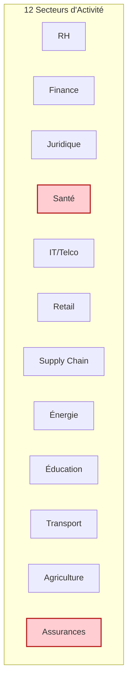
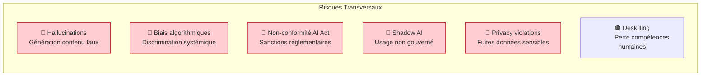

<!-- === EN-TÊTE DOCUMENTAIRE ISO-GRADE === -->

| Métadonnées | Valeur |
|-------------|--------|
| **Référence** | `EBIOS-SIA-DICT-002` |
| **Titre** | Dictionnaire des Risques IA par Métier (2026) |
| **Version** | `1.0` |
| **Date** | `06/03/2026` |
| **Propriétaire** | `Direction Conformité / AI Safety Officer` |
| **Classification** | `Confidentiel` |

---

# Dictionnaire des Risques IA par Métier (2026)

**Référence** : EBIOS-SIA-DICT-002 | EBIOS RM pour SIA - Contextualisation sectorielle

---

## 1. INTRODUCTION

### 1.1 Objectif

Ce dictionnaire étend l'analyse des risques IA en se focalisant sur les **métiers et secteurs d'activité**. Il est basé sur des recherches récentes (février 2026) incluant Harvard Business Review, ECRI, WEF, EY, NIST, et des rapports sectoriels.

### 1.2 Méthodologie

Pour chaque métier, les risques sont évalués selon la **matrice EBIOS RM** :
- **Gravité** : Impact potentiel sur l'organisation
- **Probabilité** : Vraisemblance d'occurrence
- **Niveau de risque** : Combinaison Gravité × Probabilité

### 1.3 Secteurs Couverts

> 🔴 **Secteurs Haut Risque** : Santé, Assurances (usage systématique AI high-risk)

---

## 2. RESSOURCES HUMAINES (RH)

### 2.1 Risques Identifiés

| Risque | Description | Exemples | Impacts | Mitigations | Gravité | Probabilité | Niveau |
|:-------|:------------|:---------|:--------|:------------|:-------:|:-----------:|:------:|
| **Biais dans le recrutement** | Algorithmes perpétuent biais historiques dans screening CV ou scoring candidats | Système rejette candidats basés sur genre/ethnicity via data biaisée | Discrimination, amendes EEOC/AI Act (35M€), perte talents divers | Audits biais, datasets diversifiés, human override | 🔴 Critique | 🟠 Élevée | ⚫ Très élevé |
| **Hallucinations dans évaluations** | AI génère faux feedbacks ou scores performance | Outil performance invente métriques basées sur données incomplètes | Décisions injustes, litiges employés, perte confiance | Vérification humaine, outils validés | 🟠 Majeur | 🟡 Moyenne | 🔴 Élevé |
| **Perte emplois / Deskilling** | AI automatise tâches RH, érode compétences humaines | Chatbots remplacent onboarding, réduisent interactions | Chômage, morale basse, turnover | Upskilling programmes, AI comme assistant | 🟠 Majeur | 🟠 Élevée | ⚫ Très élevé |
| **Violation privacy données employés** | AI traite PII sans consentement clair | Outils surveillance AI collectent données santé/sentiment sans DPA | RGPD breaches, sanctions CNIL | DPIA, anonymisation, consent opt-in | 🔴 Critique | 🟠 Élevée | ⚫ Très élevé |
| **Automation Bias dans décisions** | RH valide aveuglément suggestions AI | Manager approuve licenciement basé sur AI sans vérif | Erreurs éthiques, litiges | Formation bias, multi-checks | 🟠 Majeur | 🟡 Moyenne | 🔴 Élevé |
| **Deepfakes en formation/recrutement** | AI crée faux contenus pour tromper processus | Vidéo deepfake candidat simule compétences | Fraude embauche, sécurité interne | Vérification biométrique, outils détection | 🟠 Majeur | 🟡 Moyenne | 🔴 Élevé |
| **Manque transparence AI** | "Black box" decisions impossibles à expliquer | AI rejette candidat sans raison claire | Litiges accountability, perte confiance | Explainable AI, audits internes | 🟠 Majeur | 🟠 Élevée | ⚫ Très élevé |
| **Shadow AI non gouverné** | Employés utilisent AI non approuvés | ChatGPT pour rédaction contrats sans contrôle | Fuites données, erreurs non détectées | Politiques interdiction, monitoring | 🟠 Majeur | ⚫ Très élevée | ⚫ Très élevé |

### 2.2 Synthèse RH

| Priorité | Risque | Budget indicatif traitement |
|:---------|:-------|:----------------------------|
| 1 | Biais recrutement | 150K€ (audits, outils) |
| 2 | Shadow AI | 80K€ (gouvernance, DLP) |
| 3 | Privacy employés | 120K€ (DPIA, anonymisation) |

---

## 3. FINANCE / COMPTABILITÉ

### 3.1 Risques Identifiés

| Risque | Description | Exemples | Impacts | Mitigations | Gravité | Probabilité | Niveau |
|:-------|:------------|:---------|:--------|:------------|:-------:|:-----------:|:------:|
| **Hallucinations dans reporting** | AI génère faux états financiers ou audits | Modèle invente chiffres dans rapports fiscaux | Erreurs comptables, sanctions AMF/ACPR | Vérification humaine, outils certifiés | 🔴 Critique | 🟡 Moyenne | ⚫ Très élevé |
| **Biais dans scoring crédit/prêts** | Algorithmes perpétuent biais historiques | Système discrimine basés sur données passées | Discrimination, litiges fair lending | Audits biais, datasets inclusifs | 🔴 Critique | 🟠 Élevée | ⚫ Très élevé |
| **Cybervulnérabilités AI** | AI amplifie attaques (deepfakes fraud) | Voice spoofing pour virements frauduleux | Pertes financières, reputation damage | Détection deepfake, multi-factor auth | 🔴 Critique | ⚫ Très élevée | ⚫ Très élevé |
| **Disruption rôles comptables** | AI automatise tâches, deskilling pros | AI remplace variance analysis manuelle | Perte emplois, erreurs stratégiques | Upskilling, AI comme outil augmentatif | 🟠 Majeur | 🟠 Élevée | ⚫ Très élevé |
| **Non-conformité réglementaire** | Non-respect lois AI pour finance (high-risk) | Pas d'assessments pour outils risque | Sanctions Solvency II, amendes | Gouvernance AI, impact assessments | 🔴 Critique | 🟡 Moyenne | ⚫ Très élevé |
| **IP Theft / Model Theft** | Extraction modèles via reverse-engineering | Vol weights AI pour scoring | Perte IP, concurrence déloyale | Watermarking, encryption modèles | 🟠 Majeur | 🟡 Moyenne | 🔴 Élevé |
| **Shadow AI non contrôlé** | Usage AI non approuvés pour finances | ChatGPT pour forecasts sans vérif | Erreurs, fuites données | Politiques, monitoring | 🟠 Majeur | 🟠 Élevée | ⚫ Très élevé |
| **Supply Chain AI Compromise** | Compromission tiers AI (vendors) | Malware dans deps AI comptables | Disruptions, data breaches | SBOM, vendor audits | 🔴 Critique | 🟡 Moyenne | ⚫ Très élevé |

---

## 4. JURIDIQUE

### 4.1 Risques Identifiés

| Risque | Description | Exemples | Impacts | Mitigations | Gravité | Probabilité | Niveau |
|:-------|:------------|:---------|:--------|:------------|:-------:|:-----------:|:------:|
| **Hallucinations dans conseils légaux** | AI génère citations/cas faux | Outil cite jurisprudence inventée | Sanctions cour, malpractice | Vérification humaine, outils légaux dédiés | 🔴 Critique | 🟠 Élevée | ⚫ Très élevé |
| **Biais dans décisions judiciaires** | AI perpétue biais historiques | Système scoring risque discrimine | Injustices, litiges droits fondamentaux | Audits biais, explainable AI | 🔴 Critique | 🟡 Moyenne | ⚫ Très élevé |
| **Violation confidentialité** | AI traite données sensibles sans garde-fous | Fuites via chatbots non sécurisés | RGPD breaches, sanctions | DPIA, anonymisation | 🔴 Critique | 🟠 Élevée | ⚫ Très élevé |
| **Liability pour erreurs AI** | Qui responsable si AI autonome erroné ? | Agent négocie contrat défectueux | Litiges, pertes clients | Indemnification contrats, oversight | 🟠 Majeur | 🟡 Moyenne | 🔴 Élevé |
| **Non-conformité AI Act** | Classé high-risk sans assessments | Pas de transparence pour outils légaux | Interdictions, amendes 35M€ | Gouvernance AI, audits | 🔴 Critique | 🟠 Élevée | ⚫ Très élevé |
| **Shadow AI non gouverné** | Usage AI non approuvés par avocats | ChatGPT pour drafts sans contrôle | Erreurs, fuites | Politiques, training | 🟠 Majeur | ⚫ Très élevée | ⚫ Très élevé |
| **Deepfakes en preuves/cour** | AI crée faux témoignages/vidéos | Deepfake altère preuves | Injustices judiciaires | Détection deepfake tools | 🟠 Majeur | 🟡 Moyenne | 🔴 Élevé |
| **IP Infringement par AI** | AI génère contenu violant copyrights | Modèle entraîné sur docs légaux protégés | Litiges IP | Contrats tiers, audits data | 🟠 Majeur | 🟡 Moyenne | 🔴 Élevé |

---

## 5. SANTÉ / MÉDICAL

### 5.1 Risques Identifiés (🔴 Secteur Haut Risque)

| Risque | Description | Exemples | Impacts | Mitigations | Gravité | Probabilité | Niveau |
|:-------|:------------|:---------|:--------|:------------|:-------:|:-----------:|:------:|
| **Misdiagnosis par chatbots** | Hallucinations donnent faux conseils médicaux | ChatGPT suggère mauvais diagnostic | Harm patient, décès potentiels | Outils médicaux FDA-approved, oversight | 🔴 Critique | ⚫ Très élevée | ⚫ Très élevé |
| **Biais dans diagnostics** | AI perpétue biais datasets (race/genre) | Modèle sous-performe pour minorités | Inégalités santé, misclassification | Datasets diversifiés, audits biais | 🔴 Critique | 🟠 Élevée | ⚫ Très élevé |
| **Violation privacy données patients** | AI traite PHI sans sécurisation | Fuites via models non anonymisés | RGPD/HIPAA breaches, sanctions | DPIA, differential privacy | 🔴 Critique | 🟠 Élevée | ⚫ Très élevé |
| **Deskilling cliniciens** | Sur-dépendance AI érode compétences | Médecins ignorent vérif AI outputs | Erreurs cliniques, perte expertise | Formation, human-in-loop | 🟠 Majeur | 🟡 Moyenne | 🔴 Élevé |
| **Non-conformité réglementaire** | AI high-risk sans assessments (FDA/EU) | Pas d'impact pour outils diagnostics | Interdictions, rappels produits | Gouvernance AI, conformity assessments | 🔴 Critique | 🟡 Moyenne | ⚫ Très élevé |
| **Cyberattaques AI-enhanced** | AI amplifie poisoning ou adversarial attacks | Data poisoning dans modèles médicaux | Compromis soins, fuites PHI | Secure-by-design, anomaly detection | 🔴 Critique | 🟠 Élevée | ⚫ Très élevé |
| **Deepfakes en télémédecine** | AI crée faux patients/médecins | Voice spoofing pour ordonnances frauduleuses | Fraude, harms patients | Biométrie, détection deepfake | 🟠 Majeur | 🟡 Moyenne | 🔴 Élevé |
| **Systemic Exclusion** | AI entraîné sur data HIC exclut Global South | Modèles ignorent maladies tropicales | Inégalités globales, 5B exclus | Datasets inclusifs, localisation | 🔴 Critique | 🟠 Élevée | ⚫ Très élevé |
| **Agentic AI Autonomy Drift** | Agents dérivent en soins autonomes | Agent prescrit sans oversight | Erreurs médicales, liability | Checkpoints, kill-switches | 🔴 Critique | 🟡 Moyenne | ⚫ Très élevé |

---

## 6. IT / TELCO

### 6.1 Risques Identifiés

| Risque | Description | Exemples | Impacts | Mitigations | Gravité | Probabilité | Niveau |
|:-------|:------------|:---------|:--------|:------------|:-------:|:-----------:|:------:|
| **Cybervulnérabilités AI-enhanced** | AI amplifie attaques (phishing, malware) | AI-powered phishing cible telco networks | Outages, data breaches | AI defense tools, monitoring | 🔴 Critique | ⚫ Très élevée | ⚫ Très élevé |
| **Biais dans network optimization** | AI perpétue inégalités (couverture rurale) | Modèles biaisés priorisent zones urbaines | Digital divide, litiges | Inclusive datasets, audits | 🟠 Majeur | 🟡 Moyenne | 🔴 Élevé |
| **Privacy / Data Leaks** | AI traite données utilisateurs sans garde-fous | Fuites via AI analytics | RGPD breaches, sanctions | Anonymisation, consent management | 🔴 Critique | 🟠 Élevée | ⚫ Très élevé |
| **Supply Chain Compromise** | Compromission tiers AI (chips, software) | Malware in AI deps for telco | Disruptions networks | SBOM, vendor vetting | 🔴 Critique | 🟡 Moyenne | ⚫ Très élevé |
| **Non-conformité réglementaire** | Divergence lois AI (EU vs US) | Non-compliance EU AI Act pour telco AI | Interdictions, amendes | Governance AI, localisation | 🔴 Critique | 🟠 Élevée | ⚫ Très élevé |
| **Agentic AI Drift in Operations** | Agents dérivent en gestion réseaux | AI agent optimise mal, cause outage | Service disruptions | Oversight, anomaly detection | 🟠 Majeur | 🟡 Moyenne | 🔴 Élevé |
| **Deepfakes in Customer Service** | AI crée faux appels pour fraude | Voice cloning pour bypass auth | Fraude financière | Biometric verification | 🟠 Majeur | 🟠 Élevée | ⚫ Très élevé |
| **Systemic Risks / Interop Failures** | AI agents mal interop causent failures | Multi-vendor AI comms insecure | Network collapses | Standards (GSMA, ETSI), encrypted comms | 🔴 Critique | 🟡 Moyenne | ⚫ Très élevé |

---

## 7. RETAIL

### 7.1 Risques Identifiés

| Risque | Description | Exemples | Impacts | Mitigations | Gravité | Probabilité | Niveau |
|:-------|:------------|:---------|:--------|:------------|:-------:|:-----------:|:------:|
| **Fraude AI-generated (Deepfakes)** | AI crée faux retours/commandes | Deepfake pour refund attacks | Pertes financières, fraude massive | Détection AI fraud, multi-verif | 🔴 Critique | 🟠 Élevée | ⚫ Très élevé |
| **Biais dans personnalisation** | AI perpétue biais dans recommendations | Système discrimine basés sur data historique | Perte clients, litiges discrimination | Audits biais, inclusive data | 🟠 Majeur | 🟡 Moyenne | 🔴 Élevé |
| **Privacy Risks in AI Commerce** | AI agents collectent data sans consent | Agent shopping leaks PII | RGPD breaches, amendes | Opt-in, anonymisation | 🔴 Critique | ⚫ Très élevée | ⚫ Très élevé |
| **Disintermediation par Agents** | AI agents bypass marketplaces | Agent achète sans site retailer | Perte data clients, loyauté | Direct integrations, own agents | 🟠 Majeur | 🟠 Élevée | ⚫ Très élevé |
| **Hallucinations in Service** | AI chatbots donnent faux infos produits | Bot invente specs, cause retours | Reputation damage, pertes | Validated tools, human escalation | 🟠 Majeur | 🟡 Moyenne | 🔴 Élevé |
| **Shadow AI non contrôlé** | Employés utilisent AI non approuvés | ChatGPT pour pricing sans vérif | Erreurs ops, fuites | Politiques, training | 🟠 Majeur | 🟠 Élevée | ⚫ Très élevé |
| **Supply Chain AI Disruptions** | AI forecasting biaisé cause stockouts | Modèle ignore disruptions géopolitiques | Ventes perdues, coûts | Hybrid models, scenario planning | 🟠 Majeur | 🟡 Moyenne | 🔴 Élevé |

---

## 8. SUPPLY CHAIN

### 8.1 Risques Identifiés

| Risque | Description | Exemples | Impacts | Mitigations | Gravité | Probabilité | Niveau |
|:-------|:------------|:---------|:--------|:------------|:-------:|:-----------:|:------:|
| **Disruptions AI-induced** | AI forecasting erroné cause chaînes breaks | Modèle ignore weather, stockouts | Outages, pertes revenus | Scenario testing, human override | 🔴 Critique | 🟡 Moyenne | ⚫ Très élevé |
| **Biais dans optimisation** | AI perpétue inégalités supply (géographiques) | Modèle priorise routes biaisées | Inefficiencies, inégalités | Diverse data, audits | 🟠 Majeur | 🟡 Moyenne | 🔴 Élevé |
| **Cybervulnérabilités Supply AI** | Poisoning data dans AI supply tools | Malware tiers compromise forecasts | Disruptions globales | Secure-by-design, SBOM | 🔴 Critique | 🟠 Élevée | ⚫ Très élevé |
| **Geopolitical / Mineral Risks** | AI dépend chips/minerals rares, chokepoints | Shortages HBM pour AI models | Delays buildout, coûts | Diversification suppliers, stockpiling | 🔴 Critique | 🟠 Élevée | ⚫ Très élevé |
| **Non-conformité Réglementaire** | Divergence lois AI supply (EU/US) | Pas d'assessments pour AI high-risk | Amendes, interdictions | Governance globale, localisation | 🔴 Critique | 🟡 Moyenne | ⚫ Très élevé |
| **Agentic AI Drift in Logistics** | Agents dérivent en routing autonome | Agent optimise mal, cause delays | Inefficiencies, pertes | Checkpoints, monitoring | 🟠 Majeur | 🟡 Moyenne | 🔴 Élevé |
| **Data Darkness / Visibility Loss** | AI masque risks tiers non trackés | Données opaques en multi-tier | Disruptions cachées | AI fusion private/satellite data | 🟠 Majeur | 🟡 Moyenne | 🔴 Élevé |

---

## 9. ÉNERGIE

### 9.1 Risques Identifiés

| Risque | Description | Exemples | Impacts | Mitigations | Gravité | Probabilité | Niveau |
|:-------|:------------|:---------|:--------|:------------|:-------:|:-----------:|:------:|
| **AI-Induced Grid Instability** | AI optimization défaillant cause déséquilibres réseaux | Modèle prédictif ignore pics demande, outage | Blackouts massifs, pertes économiques | Simulations, human oversight | 🔴 Critique | 🟡 Moyenne | ⚫ Très élevé |
| **Biais dans Energy Allocation** | AI perpétue inégalités (accès énergie) | Système priorise zones riches vs rurales | Inégalités sociales, litiges | Inclusive datasets, audits | 🟠 Majeur | 🟡 Moyenne | 🔴 Élevé |
| **Cyberattaques AI-Enhanced** | AI amplifie attacks sur SCADA/OT | Poisoning data pour manipuler turbines | Disruptions critiques, safety hazards | Secure AI, anomaly detection | 🔴 Critique | 🟠 Élevée | ⚫ Très élevé |
| **Environmental Over-Optimization** | AI maximise output au détriment durabilité | Modèle ignore emissions pour max production | Dégradation environnement, non-ESG | Green constraints in models | 🔴 Critique | 🟡 Moyenne | ⚫ Très élevé |
| **Non-Conformité Réglementaire** | AI high-risk sans assessments (e.g., critical infra) | Pas d'impact pour smart grids | Amendes NIS2/AI Act, interdictions | Governance, conformity checks | 🔴 Critique | 🟠 Élevée | ⚫ Très élevé |
| **Systemic Risks / Cascading** | AI failure propage via interconnexions grids | Erreur un agent → blackout régional | Crises nationales | Resilience modeling, isolation | 🔴 Critique | 🟡 Moyenne | ⚫ Très élevé |

---

## 10. ÉDUCATION

### 10.1 Risques Identifiés

| Risque | Description | Exemples | Impacts | Mitigations | Gravité | Probabilité | Niveau |
|:-------|:------------|:---------|:--------|:------------|:-------:|:-----------:|:------:|
| **Biais dans Grading / Assessment** | AI perpétue biais dans évaluations étudiants | Système sous-note basés sur origine linguistique | Inégalités éducatives, litiges | Audits biais, diverse training data | 🔴 Critique | 🟠 Élevée | ⚫ Très élevé |
| **Hallucinations in Content Generation** | AI crée faux faits dans leçons/tutoring | Chatbot invente histoire/science facts | Misinformation, échec apprentissage | Fact-checking tools, human review | 🟠 Majeur | 🟡 Moyenne | 🔴 Élevé |
| **Privacy Violations in EdTech** | AI traite données étudiants sans consent | Outils tracking collectent comportement sans DPA | RGPD breaches, sanctions | DPIA, anonymisation | 🔴 Critique | 🟠 Élevée | ⚫ Très élevé |
| **Deskilling Teachers** | Sur-dépendance AI érode pédagogie skills | AI remplace lesson planning, perte créativité | Qualité éducation basse, burnout | Training AI literacy, hybrid teaching | 🟠 Majeur | 🟠 Élevée | ⚫ Très élevé |
| **Non-Conformité Réglementaire** | AI high-risk sans assessments (e.g., adaptive learning) | Pas d'impact pour outils personnalisés | Interdictions AI Act, amendes | Governance AI, conformity | 🔴 Critique | 🟡 Moyenne | ⚫ Très élevé |
| **Digital Divide / Access Inequality** | AI exclut étudiants sans tech | Outils AI nécessitent haut débit, exclut ruraux | Inégalités globales | Inclusive design, offline alternatives | 🔴 Critique | 🟠 Élevée | ⚫ Très élevé |

---

## 11. TRANSPORT

### 11.1 Risques Identifiés

| Risque | Description | Exemples | Impacts | Mitigations | Gravité | Probabilité | Niveau |
|:-------|:------------|:---------|:--------|:------------|:-------:|:-----------:|:------:|
| **Instabilité des Réseaux causée par l'IA** | Optimisation AI défaillante entraînant des déséquilibres dans les systèmes de transport | Modèle prédictif ignore pics de trafic, provoquant embouteillages massifs ou outages ferroviaires | Disruptions économiques, accidents, pertes humaines | Simulations multi-scénarios, supervision humaine | 🔴 Critique | 🟡 Moyenne | ⚫ Très élevé |
| **Cyberattaques Amplifiées par l'IA** | Utilisation d'AI par les attaquants pour cibler véhicules autonomes ou infrastructures | AI-assisted phishing sur systèmes de flotte, menant à vol de données ou contrôle distant | Outages critiques, breaches de sécurité nationale | AI défense, anomaly detection, robustesse cyber | 🔴 Critique | 🟠 Élevée | ⚫ Très élevé |
| **Incertitudes Réglementaires** | Évolution lente des lois face à AI rapide (véhicules autonomes) | Pas de standards uniformes pour liability AI crashes | Blocages déploiement, amendes | Frameworks adaptatifs, collaboration policymakers | 🔴 Critique | 🟠 Élevée | ⚫ Très élevé |
| **Risques Éthiques et Légaux** | Décisions AI soulèvent questions de responsabilité | AI autonome cause accident, qui est liable ? | Litiges, pertes confiance publique | Transparence AI, insurance spécifique | 🟠 Majeur | 🟡 Moyenne | 🔴 Élevé |
| **Systemic / Cascading Failures** | Échec local AI propage via interconnexions | Erreur AI en un véhicule → chaos trafic connecté | Crises nationales | Isolation systèmes, resilience modeling | 🔴 Critique | 🟡 Moyenne | ⚫ Très élevé |

---

## 12. AGRICULTURE

### 12.1 Risques Identifiés

| Risque | Description | Exemples | Impacts | Mitigations | Gravité | Probabilité | Niveau |
|:-------|:------------|:---------|:--------|:------------|:-------:|:-----------:|:------:|
| **Biais dans les Prédictions Agricoles** | AI perpétue biais datasets, menant à inégalités | Modèle sous-estime yields pour fermes petites/minoritaires | Inégalités, pertes alimentaires | Datasets diversifiés, audits biais | 🔴 Critique | 🟠 Élevée | ⚫ Très élevé |
| **Hallucinations dans Conseils de Culture** | AI génère faux conseils (e.g., pest management) | Outil invente remèdes, causant pertes récoltes | Échecs agricoles, pertes économiques | Vérification humaine, outils validés | 🟠 Majeur | 🟡 Moyenne | 🔴 Élevé |
| **Violations de Confidentialité des Données Fermes** | AI traite données sensibles sans sécurisation | Fuites via cloud analytics, exposant yields/IP | RGPD breaches, amendes | DPIA, anonymisation | 🔴 Critique | 🟠 Élevée | ⚫ Très élevé |
| **Coûts Élevés d'Implémentation** | Barrière financière pour smallholders | AI tools trop chers, exclut petits fermes | Inégalités adoption, compétitivité basse | Subventions, coop models | 🟠 Majeur | 🟠 Élevée | ⚫ Très élevé |
| **Systemic Exclusion / Digital Divide** | AI exclut fermes sans connectivité | Outils nécessitent haut débit, ignore régions remote | Inégalités globales, 20-30% pertes income | Offline alternatives, infrastructure investments | 🔴 Critique | 🟠 Élevée | ⚫ Très élevé |

---

## 13. ASSURANCES & MUTUELLES

### 13.1 Risques Identifiés (🔴 Secteur Haut Risque)

| Risque | Description | Exemples | Impacts | Mitigations | Gravité | Probabilité | Niveau |
|:-------|:------------|:---------|:--------|:------------|:-------:|:-----------:|:------:|
| **Biais dans la tarification / scoring** | Algorithmes perpétuent discriminations via données historiques biaisées | Prime plus élevée pour certains codes postaux / profils ethniques / genres | Discrimination, sanctions ACPR / AI Act (35 M€+), litiges class actions | Audits biais systématiques, datasets anonymisés et diversifiés, fairness constraints | 🔴 Critique | ⚫ Très élevée | ⚫ Très élevé |
| **Hallucinations dans l'évaluation des sinistres** | AI génère faux rapports d'expertise ou estimations erronées | Modèle invente dommages non existants ou sous-estime gravité accident | Sur/sous-indemnisation, fraudes internes, litiges assurés | Vérification humaine obligatoire, outils certifiés, explainable AI | 🔴 Critique | 🟠 Élevée | ⚫ Très élevée |
| **Fraude AI-amplifiée (Deepfakes, synthetic claims)** | Assurés utilisent AI pour créer faux sinistres / preuves | Deepfake vidéo accident, faux devis IA-générés | Explosion sinistres frauduleux, pertes financières massives | Détection deepfake + AI anti-fraude, multi-source verification | 🔴 Critique | ⚫ Très élevée | ⚫ Très élevé |
| **Non-conformité réglementaire (AI Act / Solvency II)** | Outils IA high-risk sans assessments d'impact ou transparence | Pas d'EIA pour tarification dynamique ou scoring santé | Interdiction usage, amendes jusqu'à 7 % CA mondial, retrait agrément | Gouvernance AI dédiée, conformity assessments, registre EU (Art. 60) | 🔴 Critique | 🟠 Élevée | ⚫ Très élevé |
| **Violation confidentialité données assurés** | Traitement excessif de données sensibles (santé, biométrie, localisation) | Modèles comportementaux exposent habitudes intimes via telematics | RGPD / DORA breaches, sanctions CNIL/ACPR, perte confiance | DPIA systématique, anonymisation forte, consent granulaire | 🔴 Critique | ⚫ Très élevée | ⚫ Très élevé |
| **Agentic AI Drift dans l'automatisation sinistres** | Agents autonomes dérivent et prennent décisions non conformes | Agent refuse automatiquement sinistres sans justification légale | Litiges massifs, réputation endommagée, non-respect Code assurances | Checkpoints humains obligatoires, monitoring drift, kill-switches | 🔴 Critique | 🟡 Moyenne | ⚫ Très élevé |
| **Shadow AI non gouverné** | Employés / courtiers utilisent ChatGPT / outils non approuvés | Rédaction clauses ou évaluation risques via LLM public | Fuites données assurés, erreurs non détectées, non-conformité | Politiques strictes, DLP, approved AI tools only | 🟠 Majeur | ⚫ Très élevée | ⚫ Très élevé |
| **Supply Chain & Tiers AI Compromise** | Compromission via fournisseurs AI (scoring, fraud detection) | Malware dans modèle tiers utilisé pour tarification | Data breaches massives, disruptions ops | SBOM, vendor risk assessments, contractual AI clauses | 🔴 Critique | 🟡 Moyenne | ⚫ Très élevé |
| **Risques systémiques / Cascading** | Décisions AI coordonnées causent effets boule de neige | Tarification collective biaisée → exclusion massive d'un segment marché | Crise sectorielle, intervention régulateurs | Stress testing systémique, diversity modèles | 🔴 Critique | 🟡 Moyenne | ⚫ Très élevé |

### 13.2 Synthèse Assurances

> **Risques dominants** : Biais/tarification, fraude AI-amplifiée, non-conformité réglementaire et privacy → tous classés **Très élevé** avec gravité critique et probabilité élevée/très élevée.

> **Spécificités métier** : Le secteur est doublement exposé car beaucoup d'usages sont **high-risk** par défaut (Annex III AI Act) + forte dépendance à des données sensibles (santé, localisation, finances).

> **Priorités EBIOS RM** : Workshop 2 → focus sur biais, fraude, privacy et cascading. Workshop 5 → traitements prioritaires : audits biais systématiques, human-in-the-loop obligatoire, DPIA & EIA, gouvernance AI dédiée.

---

## 14. SYNTHÈSE TRANSVERSALE

### 14.1 Risques Communs à Tous les Secteurs

### 14.2 Matrice de Priorité par Secteur

| Secteur | Risque Critique #1 | Risque Critique #2 | Risque Critique #3 |
|:--------|:-------------------|:-------------------|:-------------------|
| **RH** | Biais recrutement | Shadow AI | Privacy employés |
| **Finance** | Hallucinations reporting | Biais scoring | Cybervulnérabilités |
| **Juridique** | Hallucinations conseils | Shadow AI | Biais décisions |
| **Santé** | Misdiagnosis | Biais diagnostics | Privacy patients |
| **IT/Telco** | Cybervulnérabilités | Privacy leaks | Systemic risks |
| **Retail** | Fraude deepfakes | Privacy commerce | Disintermediation |
| **Supply Chain** | Disruptions AI | Geopolitical risks | Cyberattaques |
| **Énergie** | Grid instability | Cyberattaques SCADA | Systemic cascading |
| **Éducation** | Biais grading | Hallucinations contenu | Privacy étudiants |
| **Transport** | Instabilité réseaux | Cyberattaques | Systemic failures |
| **Agriculture** | Biais prédictions | Privacy fermes | Digital divide |
| **Assurances** | Biais tarification | Fraude deepfakes | Privacy assurés |

---

## 15. RÉVISION

| Version | Date | Auteur | Modifications |
|:--------|:-----|:-------|:--------------|
| 1.0 | 06/03/2026 | Direction Conformité | Création dictionnaire sectoriel 2026 |

---

**Document approuvé par :**
- [ ] AI Safety Officer
- [ ] RSSI
- [ ] Direction Conformité

**Date d'approbation :** _______________

---

*Dictionnaire Risques IA par Métier — Version 1.0 ISO-Grade*  
*Réf. EBIOS-SIA-DICT-002*

---

## 📚 SOURCES

- Harvard Business Review AI Trends 2026
- ECRI Top 10 Health Technology Hazards 2026
- WEF Global Risks Report 2026
- EY AI Risk Management 2026
- NIST AI Risk Management Framework
- EIOPA AI Strategy for Insurance 2026
- UNESCO AI in Education 2026
- WEF AI in Energy 2026
- US DOT AI Strategy for Transportation 2026
- ABI Research AI in Telco 2026
- Deloitte TMT Predictions 2026
- AlixPartners Retail AI 2026
- Interos Supply Chain AI 2026
- BPM Agriculture AI 2026
- Fordham Law AI in Legal 2026
- Thomson Reuters Legal AI 2026
- Global Legal Post AI Regulation 2026
- Moody's AI in Finance 2026
- Journal of Accountancy AI 2026
- WEF Systemic Risks 2026
- International AI Safety Report 2026
