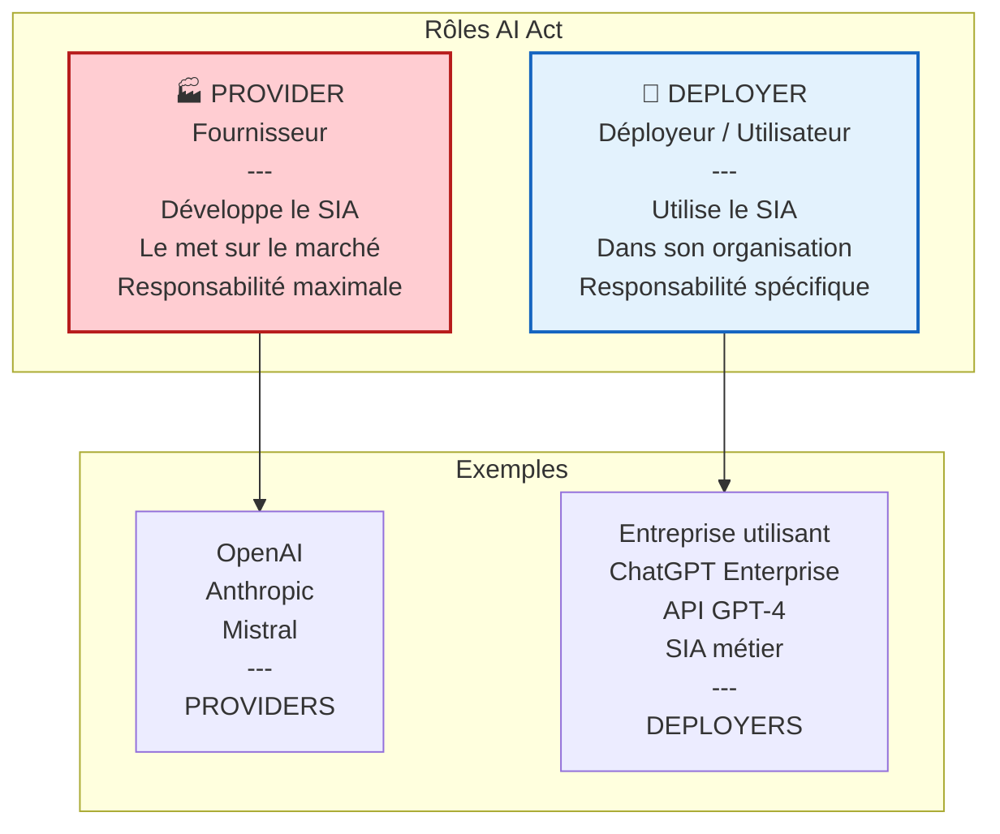
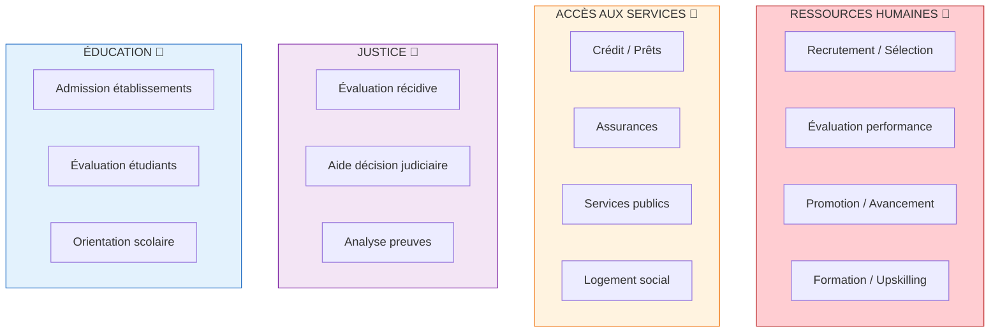
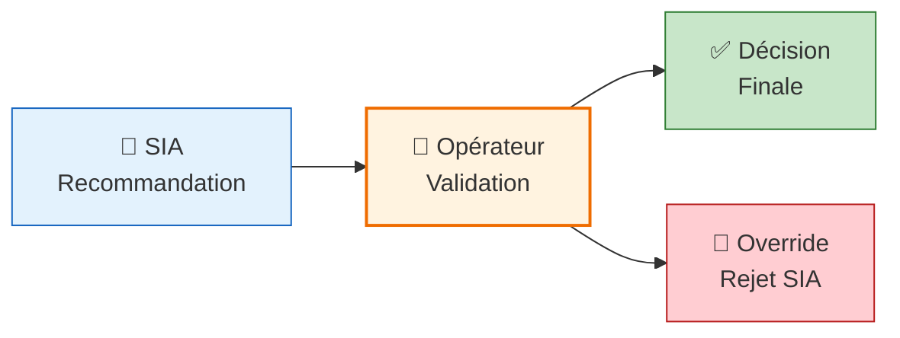

<!-- === EN-TÊTE DOCUMENTAIRE ISO-GRADE === -->

| Métadonnées | Valeur |
|-------------|--------|
| **Référence** | `AI-ACT-DEPLOYER-001` |
| **Titre** | AI Act - Guide du Deployer : Obligations et Cas d'Usage |
| **Version** | `1.0` |
| **Date** | `06/03/2026` |
| **Propriétaire** | `Direction Conformité / AI Officer` |
| **Classification** | `Confidentiel` |

---

# AI Act - Guide du Deployer

**Référence** : AI-ACT-DEPLOYER-001 | Focus : Utilisateurs professionnels de SIA

---

## 1. DISTINCTION PROVIDER / DEPLOYER

### 1.1 Définitions AI Act



### 1.2 Tableau Comparatif des Obligations

| Obligation | Provider | Deployer | Justification |
|:-----------|:--------:|:--------:|:--------------|
| **Documentation technique** | 🔴 Oui | 🟡 Si demandé | Le Provider la crée, le Deployer l'utilise |
| **Évaluation conformité** | 🔴 Oui | ➖ Non | Le Provider réalise l'évaluation |
| **Marquage CE** | 🔴 Oui | ➖ Non | Le Provider applique le marquage |
| **Supervision humaine** | 🟠 Conception | 🔴 Opérationnelle | Le Deployer met en œuvre sur le terrain |
| **Traçabilité logs** | 🟠 Système | 🔴 Utilisation | Le Deployer enregistre l'usage |
| **Formation utilisateurs** | ➖ Non | 🔴 Oui | Le Deployer forme ses équipes |
| **Impact Assessment** | ➖ Non | 🔴 Si HR/Public | Le Deployer évalue l'impact dans son contexte |

---

## 2. CAS D'USAGE DEPLOYER - HIGH-RISK

### 2.1 SIA Métier Haut Risque pour Deployers



### 2.2 Détail par Domaine Métier

#### A. Recrutement et Sélection de Personnel

| Aspect | Obligation Deployer | Exigence AI Act |
|:-------|:--------------------|:----------------|
| **Supervision humaine** | Validation finale par RH | Art. 14 : Décision significative avec oversight |
| **Information candidats** | Mentionner l'usage de l'IA | Art. 13 : Transparence |
| **Droit de contestation** | Permettre la contestation | Art. 14 + RGPD Art. 22 |
| **Impact Assessment** | Évaluer discrimination potentielle | Art. 10 + Annexes |
| **Documentation** | Conserver preuves décisions | Art. 12 : Traçabilité |

**Exemple concret :**
```
Entreprise utilisant un ATS (Applicant Tracking System) avec IA
→ Obligations Deployer :
   • Former les recruteurs aux limites du SIA
   • Vérifier manuellement les décisions d'élimination
   • Informer les candidats du scoring automatique
   • Permettre contestation si rejet
   • Auditer régulièrement les biais
```

#### B. Évaluation de Performance et Promotion

| Aspect | Obligation Deployer | Exigence AI Act |
|:-------|:--------------------|:----------------|
| **Supervision humaine** | Manager valide l'évaluation | Art. 14 |
| **Explicabilité** | Pouvoir expliquer le scoring | Art. 13 + 14 |
| **Données utilisées** | Limiter aux données professionnelles | RGPD + Art. 10 |
| **Recours** | Permettre contestation employé | Art. 14 + droits fondamentaux |
| **Impact Assessment** | Évaluer impact psychologique | Art. 10 |

**Exemple concret :**
```
Entreprise utilisant un outil d'évaluation 360° avec IA
→ Obligations Deployer :
   • L'IA recommande, le manager décide
   • Expliquer les critères d'évaluation
   • Ne pas utiliser données personnelles (santé, vie privée)
   • Permettre discussion sur l'évaluation
   • Documenter la décision finale
```

#### C. Accès à des Services Essentiels (Crédit, Assurance)

| Aspect | Obligation Deployer | Exigence AI Act |
|:-------|:--------------------|:----------------|
| **Supervision humaine** | Validation cas rejet | Art. 14 |
| **Information client** | Mentionner scoring IA | Art. 13 |
| **Droit explication** | Expliquer facteurs décision | Art. 13 + RGPD Art. 22 |
| **Non-discrimination** | Audits biais réguliers | Art. 10 |
| **Impact Assessment** | Évaluation exclusion financière | Art. 10 + Annexes |

---

## 3. OBLIGATIONS SPÉCIFIQUES DU DEPLOYER

### 3.1 Supervision Humaine Opérationnelle (Art. 14)



**Principes clés :**
- L'IA **recommande**, l'humain **décide**
- L'opérateur doit comprendre les **limites** du SIA
- L'opérateur peut **contredire** la recommandation
- La décision finale est **documentée**

### 3.2 Traçabilité d'Utilisation (Art. 12)

| Élément à tracer | Durée | Format |
|:-----------------|:------|:-------|
| Inputs (données fournies au SIA) | 6 ans | Journal automatique |
| Outputs (résultats du SIA) | 6 ans | Journal automatique |
| Décision finale humaine | 6 ans | Journal + justification |
| Contexte de la décision | 6 ans | Métadonnées |

### 3.3 Formation des Utilisateurs (Art. 14)

| Contenu formation | Public | Fréquence |
|:------------------|:-------|:----------|
| Fonctionnement du SIA | Utilisateurs | À l'habilitation |
| Limites et biais connus | Utilisateurs | À l'habilitation + annuelle |
| Supervision humaine | Décideurs | À l'habilitation + annuelle |
| Procédures de contestation | Tous | À l'habilitation |
| Mise à jour réglementaire | Tous | Annuelle |

---

## 4. FUNDAMENTAL RIGHTS IMPACT ASSESSMENT (FRIA)

### 4.1 Quand le Réaliser ?

Le Deployer doit réaliser un FRIA si :
- SIA **High-Risk** (Annexe III)
- Usage par **administration publique**
- Impact sur **droits fondamentaux**

### 4.2 Contenu du FRIA

| Section | Description |
|:--------|:------------|
| **1. Description usage** | Comment le SIA est utilisé dans l'organisation |
| **2. Durée et fréquence** | Période et régularité d'utilisation |
| **3. Personnes concernées** | Catégories de personnes impactées |
| **4. Risques pour droits fondamentaux** | Analyse détaillée des risques |
| **5. Mesures de mitigation** | Comment réduire les risques identifiés |
| **6. Consultation parties prenantes** | Avis des personnes concernées |

### 4.3 Exemple : FRIA pour SIA de Recrutement

```markdown
## FRIA - SIA de Screening CV

### 1. Description
Utilisation d'un SIA pour le tri initial des candidatures
sur les postes à pourvoir dans l'entreprise.

### 2. Durée et Fréquence
- Utilisation permanente
- ~500 candidatures/analysées par mois

### 3. Personnes Concernées
- Candidats aux offres d'emploi
- Tous niveaux de postes

### 4. Risques pour Droits Fondamentaux
| Droit | Risque | Niveau |
|:------|:-------|:-------|
| Non-discrimination | Biais genre/ethnicité | Élevé |
| Vie privée | Traitement données sensibles | Moyen |
| Accès à l'emploi | Exclusion systémique | Élevé |

### 5. Mesures de Mitigation
- Audits biais trimestriels
- Supervision humaine obligatoire
- Droit de contestation
- Dataset diversifié

### 6. Consultation
- Avis CSE
- Retours candidats
- Expert éthique externe
```

---

## 5. CHECKLIST CONFORMITÉ DEPLOYER

### 5.1 Avant Mise en Production

| ☐ | Vérification | Référence |
|:--|:-------------|:----------|
| ☐ | Vérifier classification SIA (High-Risk ?) | Annexe III AI Act |
| ☐ | Obtenir documentation technique du Provider | Art. 11 |
| ☐ | Réaliser FRIA si nécessaire | Art. 27a |
| ☐ | Mettre en place supervision humaine | Art. 14 |
| ☐ | Créer procédures de traçabilité | Art. 12 |
| ☐ | Préparer programme formation | Art. 14 |
| ☐ | Créer mécanisme de contestation | Art. 14 + RGPD |
| ☐ | Informer les personnes concernées | Art. 13 |

### 5.2 En Exploitation

| ☐ | Vérification | Fréquence |
|:--|:-------------|:----------|
| ☐ | Audits supervision humaine | Trimestrielle |
| ☐ | Revue logs traçabilité | Mensuelle |
| ☐ | Formation nouveaux utilisateurs | À l'arrivée |
| ☐ | Recyclage formation | Annuelle |
| ☐ | Mise à jour FRIA | Annuelle |
| ☐ | Revue fournisseur (Provider) | Annuelle |

---

## 6. RÉVISION

| Version | Date | Auteur | Modifications |
|:--------|:-----|:-------|:--------------|
| 1.0 | 06/03/2026 | Direction Conformité | Création guide Deployer AI Act |

---

**Document approuvé par :**
- [ ] AI Officer
- [ ] RSSI
- [ ] Direction Juridique
- [ ] Direction RH

**Date d'approbation :** _______________

---

*Guide Deployer AI Act — Version 1.0 ISO-Grade*  
*Réf. AI-ACT-DEPLOYER-001*

---

## 📚 RÉFÉRENCES

- Règlement (UE) 2024/1689 (AI Act) - Chapitre VI : Obligations des deployers
- Article 14 : Obligations des deployers de systèmes d'IA à haut risque
- Article 27a : Fundamental Rights Impact Assessment
- Annexe III : Liste des systèmes d'IA à haut risque
- Lignes directrices Commission européenne (à paraître)
