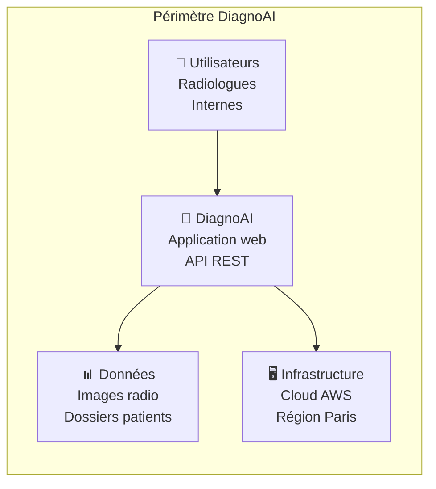
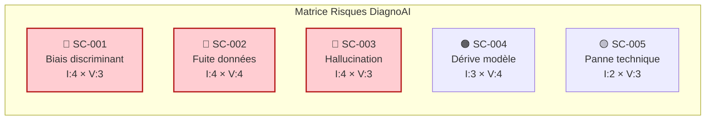
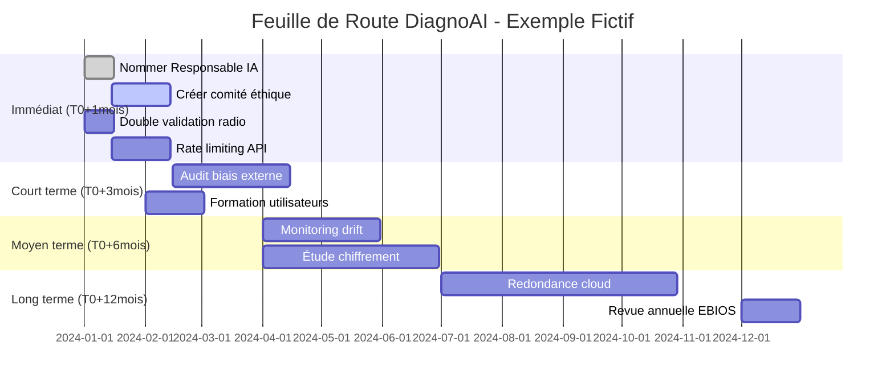

<!-- === EN-TÊTE DOCUMENTAIRE ISO-GRADE === -->

| Métadonnées | Valeur |
|-------------|--------|
| **Référence** | `EBIOS-EXEMPLE-001` |
| **Titre** | Exemple Fictif - Analyse EBIOS RM : SIA Médical "DiagnoAI" |
| **Version** | `1.0` |
| **Date** | `06/03/2026` |
| **Propriétaire** | `Direction Conformité` |
| **Classification** | `Formation - Données Fictives` |

---

# Exemple Fictif : Analyse EBIOS RM SIA Médical

**Référence** : EBIOS-EXEMPLE-001 | Scénario pédagogique

---

## ⚠️ AVERTISSEMENT

> **TOUTES LES DONNÉES DE CET EXEMPLE SONT FICTIVES**
> 
> Ce document sert uniquement à illustrer la méthodologie EBIOS RM.
> Toute ressemblance avec des systèmes réels serait fortuite.

---

## 1. CONTEXTE DU SCÉNARIO

### 1.1 Organisation Fictive

| Attribut | Valeur |
|:---------|:-------|
| **Nom** | Clinique Médicale du Centre (CMC) |
| **Type** | Clinique privée multi-sites |
| **Effectif** | 450 personnes |
| **Localisation** | 3 sites en région parisienne |
| **Activité** | Médecine générale, spécialités, imagerie |

### 1.2 Système d'IA Fictif

| Attribut | Valeur |
|:---------|:-------|
| **Nom** | DiagnoAI |
| **Fonction** | Aide au diagnostic radiologique |
| **Type** | SIA Haut Risque (santé) |
| **Fournisseur** | MedTech Solutions (fictif) |
| **Utilisateurs** | 25 radiologues, 15 internes |

---

## 2. ATELIER 1 - CADRAGE ET SOCLE

### 2.1 Périmètre



### 2.2 Biens Essentiels Identifiés

| ID | Bien | Description | Valeur | criticité |
|:---|:-----|:------------|:-------|:---------:|
| BE-001 | Modèle DiagnoAI | Algorithme de diagnostic | Critique | 🔴 |
| BE-002 | Base d'entraînement | 500K images annotées | Critique | 🔴 |
| BE-003 | Données patients | Dossiers médicaux (RGPD) | Critique | 🔴 |
| BE-004 | API DiagnoAI | Interface système | Élevée | 🟠 |
| BE-005 | Supervision humaine | Capacité contrôle | Critique | 🔴 |

### 2.3 Socle de Sécurité Existant

| Domaine | Mesure | Maturité |
|:--------|:-------|:---------|
| Gouvernance | RSSI nommé | ✅ Mature |
| Gouvernance | Comité éthique IA | ⚠️ En création |
| Technique | Chiffrement données | ✅ Mature |
| Technique | Authentification MFA | ✅ Mature |
| Opérationnel | Supervision humaine | ⚠️ Partielle |
| Opérationnel | Formation utilisateurs | ❌ Absente |

---

## 3. ATELIER 2 - SOURCES DE RISQUE

### 3.1 Attaquants Identifiés

| Profil | Motivation | Capacité | Opportunité |
|:-------|:-----------|:---------|:------------|
| Cybercriminel | Rançon, vol données patients | Élevée | Moyenne |
| Concurrent | Vol IP (modèle entraîné) | Élevée | Faible |
| Hacktiviste | Dénigrement clinique | Moyenne | Élevée |
| Insider | Vengeance, profit | Moyenne | Élevée |
| État-nation | Espionnage santé | Très élevée | Faible |

### 3.2 Cyberattaques SIA Spécifiques

| ID | Attaque | Description | Vraisemblance |
|:---|:--------|:------------|:-------------:|
| CA-001 | Empoisonnement | Injection images corrompues dans le dataset | Moyenne |
| CA-002 | Évasion | Contournement détection par image modifiée | Moyenne |
| CA-003 | Extraction | Vol du modèle via requêtes API | Élevée |
| CA-004 | Prompt Injection | Manipulation via métadonnées images | Faible |

### 3.3 Événements Non-Malveillants

| ID | Événement | Description | Vraisemblance |
|:---|:----------|:------------|:-------------:|
| NM-001 | Erreur diagnostique | Faux négatif sur tumeur | Élevée |
| NM-002 | Dérive modèle | Perte de précision dans le temps | Élevée |
| NM-003 | Biais détection | Moins performant sur certaines populations | Moyenne |
| NM-004 | Panne technique | Indisponibilité service | Moyenne |

---

## 4. ATELIER 3 - SCÉNARIOS DE RISQUE

### 4.1 Scénarios Évalués

#### SC-001 : Biais de Diagnostic Discriminant

```
Description : Le SIA sous-diagnostique certaines pathologies chez 
les patients de certains profils démographiques (genre, origine).

Impact :
- Éthique : Atteinte aux droits fondamentaux [4]
- Juridique : Sanction CNIL, plaintes [4]
- Réputation : Scandale médiatique [3]
- Financier : Perte de patients [2]
→ IMPACT GLOBAL : [4] Majeur

Vraisemblance :
- Technique : Biais dataset connu [3]
- Motivation : Non applicable (non-malveillant) [0]
→ VRAISEMBLANCE : [3] Élevée

NIVEAU DE RISQUE : 🔴 CRITIQUE
```

#### SC-002 : Fuite Données Patients par Extraction

```
Description : Un attaquant récupère les données d'entraînement 
(images + métadonnées) via attaque par inférence sur l'API.

Impact :
- Juridique : Violation RGPD, sanction 4% CA [4]
- Réputation : Perte confiance patients [4]
- Financier : Amende, procès [3]
→ IMPACT GLOBAL : [4] Majeur

Vraisemblance :
- Technique : API exposée, pas de rate limiting [3]
- Motivation : Données médicales valeur élevée [4]
→ VRAISEMBLANCE : [4] Élevée

NIVEAU DE RISQUE : 🔴 CRITIQUE
```

#### SC-003 : Hallucination Médicale Grave

```
Description : Le SIA détecte une pathologie inexistante, 
conduisant à un traitement inutile et dangereux.

Impact :
- Santé : Préjudice patient [4]
- Juridique : Faute médicale, procès [4]
- Réputation : Procès médiatisé [3]
→ IMPACT GLOBAL : [4] Majeur

Vraisemblance :
- Technique : Hallucinations documentées [3]
- Motivation : Non applicable [0]
→ VRAISEMBLANCE : [3] Élevée

NIVEAU DE RISQUE : 🔴 CRITIQUE
```

### 4.2 Matrice des Risques



---

## 5. ATELIER 4 - TRAITEMENT DU RISQUE

### 5.1 Plan de Traitement

| Scénario | Mesure | Priorité | Échéance | Budget |
|:---------|:-------|:---------|:---------|:-------|
| SC-001 | Audit biais externe + dataset rebalancing | 🔴 Haute | T0+3mois | 80K€ |
| SC-001 | Comité éthique IA institutionnel | 🔴 Haute | T0+1mois | 20K€ |
| SC-002 | Rate limiting API + détection anomalie | 🔴 Haute | T0+1mois | 30K€ |
| SC-002 | Chiffrement homomorphe (étude) | 🟠 Moyenne | T0+6mois | 50K€ |
| SC-003 | Double validation radiologue obligatoire | 🔴 Haute | T0+15j | 0€ |
| SC-003 | Alertes score confiance < 90% | 🔴 Haute | T0+1mois | 10K€ |
| SC-004 | Monitoring drift automatique | 🟠 Moyenne | T0+2mois | 40K€ |
| SC-005 | Redondance fournisseur cloud | 🟡 Basse | T0+6mois | 60K€ |

### 5.2 Budget Total

| Priorité | Montant |
|:---------|:--------|
| 🔴 Haute (T0+3mois) | 140K€ |
| 🟠 Moyenne (T0+6mois) | 90K€ |
| 🟡 Basse (T0+12mois) | 60K€ |
| **TOTAL** | **290K€** |

---

## 6. ATELIER 5 - FEUILLE DE ROUTE

### 6.1 Planning d'Actions



### 6.2 KPI de Suivi

| Indicateur | Cible | Fréquence |
|:-----------|:------|:----------|
| Taux de faux positifs | < 5% | Mensuelle |
| Taux de faux négatifs | < 2% | Mensuelle |
| Écarts démographiques | < 3% | Trimestrielle |
| Temps de réponse API | < 500ms | Continue |
| Satisfaction radiologues | > 4/5 | Semestrielle |

---

## 7. SYNTHÈSE POUR LA DIRECTION

### 7.1 Top 3 Risques Critiques

| Rang | Risque | Niveau | Budget |
|:---|:---------|:------:|:-------|
| 1 | Fuite données patients (SC-002) | 🔴 | 80K€ |
| 2 | Biais discriminant (SC-001) | 🔴 | 100K€ |
| 3 | Hallucination médicale (SC-003) | 🔴 | 10K€ |

### 7.2 Décision Requise

**Option A** : Traitement complet (290K€) → Risque résiduel faible  
**Option B** : Traitement partiel (140K€) → Risque résiduel moyen  
**Option C** : Maintien status quo → Risque inacceptable

**Recommandation** : Option A avec priorisation sur les 3 risques critiques.

---

## 8. RÉVISION

| Version | Date | Auteur | Modifications |
|:--------|:-----|:-------|:--------------|
| 1.0 | 06/03/2026 | Direction Conformité | Création exemple fictif |

---

**Document fictif à usage pédagogique uniquement**

---

*Exemple EBIOS RM - DiagnoAI — Version 1.0*  
*Réf. EBIOS-EXEMPLE-001*
