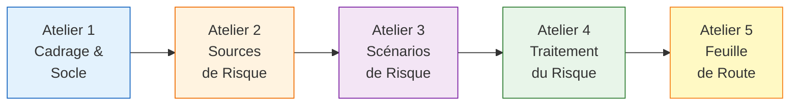
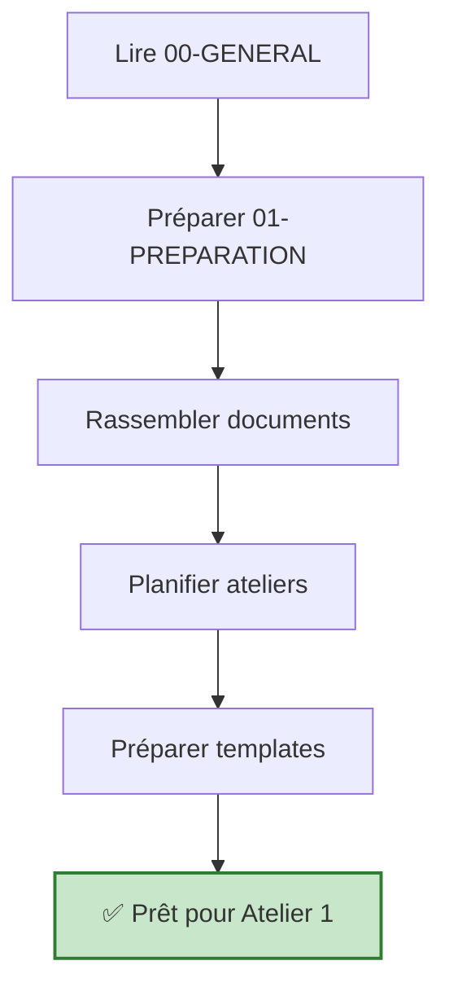

<!-- === EN-TÊTE DOCUMENTAIRE ISO-GRADE === -->

| Métadonnées | Valeur |
|-------------|--------|
| **Référence** | `CORPUS-EBIOS-RM-001` |
| **Titre** | Corpus EBIOS RM - Guide de l'Auditeur |
| **Version** | `1.0` |
| **Date** | `05/03/2026` |
| **Propriétaire** | `Direction Conformité / RSSI` |
| **Classification** | `Confidentiel` |

---

# Corpus EBIOS RM - Guide de l'Auditeur

**Référence** : CORPUS-EBIOS-RM-001 | ANSSI EBIOS RM v1.0 (2021)

---

## 1. OBJECTIF

Ce corpus fournit un guide complet et structuré pour accompagner les auditeurs et consultants dans la réalisation d'analyses de risques cyber selon la méthodologie **EBIOS RM** (Risk Manager) de l'ANSSI.

---

## 2. VUE D'ENSEMBLE

### 2.1 La Méthode EBIOS RM

EBIOS RM est la méthodologie d'analyse de risques cyber de référence en France, éditée par l'ANSSI (Agence Nationale de la Sécurité des Systèmes d'Information).

### 2.2 Les 5 Ateliers



| Atelier | Nom | Durée | Objectif |
|:--------|:----|:------|:---------|
| **1** | Cadrage et Socle de Sécurité | 4-6h | Définir périmètre, biens essentiels, mesures existantes |
| **2** | Sources de Risque | 4-6h | Identifier les menaces (attaquants, cyberattaques, non-malveillant) |
| **3** | Scénarios de Risque | 6-8h | Construire et évaluer les scénarios de risque |
| **4** | Traitement du Risque | 4-6h | Définir les mesures de sécurité et risque résiduel |
| **5** | Feuille de Route | 3-4h | Construire le plan d'action et finaliser le dossier |

### 2.3 Durée Totale Estimée

| Phase | Durée | Détail |
|:------|:------|:-------|
| Préparation | 1-2 jours | Documents, outils, planning |
| 5 ateliers | 3-4 jours | Répartis sur 3-6 semaines |
| Rédaction | 2-3 jours | Dossier EBIOS RM complet |
| **Total mission** | **1 à 2 mois** | |

---

## 3. STRUCTURE DU CORPUS

```
corpus-ebios-rm/
├── 00-GENERAL/                          ← Documentation générale
│   ├── 00.1-guide-utilisation.md
│   ├── 00.2-glossaire-ebios.md
│   └── 00.3-references-normatives.md
│
├── 01-PREPARATION/                      ← Phase préparatoire
│   ├── 1.1-checklist-preparation.md
│   ├── 1.2-documents-a-demander.md
│   └── 1.3-outils-indispensables.md
│
├── 02-ATELIER-1-CADRAGE/                ← Atelier 1 : Cadrage
│   ├── 2.1-guide-atelier-1.md
│   ├── 2.2-template-biens-essentiels.md
│   └── 2.3-template-socle-securite.md
│
├── 03-ATELIER-2-SOURCES/                ← Atelier 2 : Sources de risque
│   ├── 3.1-guide-atelier-2.md
│   ├── 3.2-template-sources-risque.md
│   └── 3.3-catalogue-sources-risque.md
│
├── 04-ATELIER-3-SCENARIOS/              ← Atelier 3 : Scénarios
│   ├── 4.1-guide-atelier-3.md
│   ├── 4.2-template-scenarios.md
│   └── 4.3-grille-evaluation-risque.md
│
├── 05-ATELIER-4-TRAITEMENT/             ← Atelier 4 : Traitement
│   ├── 5.1-guide-atelier-4.md
│   ├── 5.2-template-plan-traitement.md
│   └── 5.3-catalogue-mesures.md
│
├── 06-ATELIER-5-FEUILLE-ROUTE/          ← Atelier 5 : Feuille de route
│   ├── 6.1-guide-atelier-5.md
│   └── 6.2-template-feuille-route.md
│
├── 07-OUTILS-TEMPLATES/                 ← Outils transversaux
│   ├── 7.1-facilitation-ateliers.md
│   ├── 7.2-grille-evaluation-gravite.md
│   └── 7.3-structure-dossier-ebios.md
│
├── 08-LIVRAISON-SUIVI/                  ← Livraison et maintenance
│   ├── 8.1-checklist-livrables.md
│   └── 8.2-guide-suivi-annuel.md
│
├── 09-INTEGRATION-IA/                   ← Spécifique SIA (à venir)
│   └── README.md
│
├── templates/                           ← Templates réutilisables
├── scripts/                             ← Scripts d'automatisation
└── examples/                            ← Exemples de livrables
```

---

## 4. PROCESSUS D'UTILISATION

### 4.1 Avant les Ateliers



### 4.2 Pendant les Ateliers

1. **Suivre le guide** de l'atelier correspondant (02-à-06)
2. **Utiliser les templates** fournis
3. **Prendre des notes** dans les comptes-rendus
4. **Valider** avec le client à chaque étape

### 4.3 Après les Ateliers

1. **Rédiger** le dossier EBIOS RM (structure 7.3)
2. **Préparer** la présentation direction
3. **Établir** la feuille de route (Atelier 5)
4. **Planifier** le suivi annuel (8.2)

---

## 5. RÔLES ET RESPONSABILITÉS

| Rôle | Responsabilité | Livrable |
|:-----|:---------------|:---------|
| **Auditeur EBIOS** | Animer les 5 ateliers | Dossier EBIOS RM complet |
| **RSSI Client** | Fournir informations, valider | Socle de sécurité |
| **Direction Client** | Arbitrer, valider scénarios | Décision traitement risque |
| **Équipe métier** | Participer aux ateliers | Cartographie des biens |

---

## 6. RÉFÉRENCES NORMATIVES

| Référence | Description |
|:----------|:------------|
| **ANSSI** | Méthode EBIOS RM v1.0 (2021) |
| **ISO 27005** | Management du risque en sécurité de l'information |
| **ISO 31000** | Management du risque - Principes et lignes directrices |
| **ISO 27001** | Système de management de la sécurité de l'information |

---

## 7. RÉVISION

| Version | Date | Auteur | Modifications |
|:--------|:-----|:-------|:--------------|
| 1.0 | 05/03/2026 | Direction Conformité | Harmonisation format ISO-Grade |

---

**Document approuvé par :**
- [ ] RSSI
- [ ] Responsable Conformité
- [ ] Direction

**Date d'approbation :** _______________

---

*Corpus EBIOS RM — Version 1.0 ISO-Grade*  
*Réf. CORPUS-EBIOS-RM-001*

---

## ⚠️ NOTE IMPORTANTE

> Ce corpus est un guide d'accompagnement. Il ne remplace pas la 
> **formation officielle EBIOS RM de l'ANSSI**.
> 
> Pour toute certification ou mission critique, suivre la formation 
> officielle dispensée par l'ANSSI ou ses partenaires agréés.
