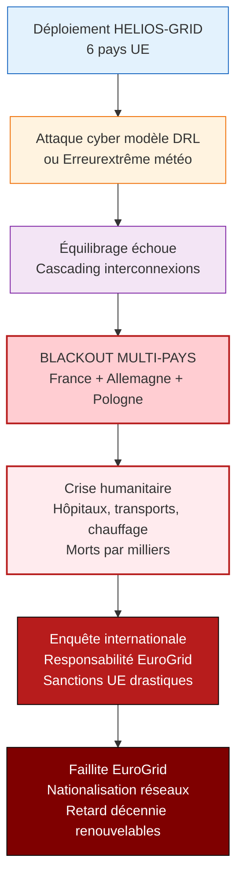

# Analyse EBIOS-RM IA — HELIOS-GRID / Optimisation Réseaux Électriques Critiques

**Référence** : EBIOS-HELIOS-001 | **Date** : Mars 2026 | **Classification** : 🔴 CONFIDENTIEL DÉFENSE — Direction + TSO/DSO + NIS2

---

## 📋 SYNTHÈSE EXÉCUTIVE

| Élément | Valeur |
|:---|:---|
| **Classification AI Act** | 🔴 **HIGH-RISK CRITIQUE** (Annexe III point 2 — infrastructure critique) |
| **Classification EBIOS** | 🔴 **Level 3 Renforcé** — infrastructure critique souveraine |
| **Risque principal** | Blackout national, délestage massif, cyberattaque |
| **Argument entreprise** | "Maintenance pure" pour exemption — **REJETÉ** |
| **Conclusion** | **High-Risk critique** — souveraineté énergétique + cybersécurité NIS2 |

---

## 1. CADRE ET CONTEXTE

### 1.1 Identification du Système

| Attribut | Valeur |
|:---------|:-------|
| **Nom** | HELIOS-GRID |
| **Entreprise** | EuroGrid Dynamic (1 200 salariés, 420M€ CA) |
| **Clients** | TSO/DSO opérateurs réseaux électriques UE |
| **Technologie** | Deep Reinforcement Learning (DRL) sur jumeau numérique |
| **Outputs** | Équilibrage charge/tension temps réel, load shedding ciblé |
| **Automatisation** | Full automation micro-ajustements (ms), humain pour délestage massif |
| **Contexte** | Crise énergétique, +40% renouvelables d'ici 2027 |
| **Financement** | Subvention "Europe souveraine", audits NIS2 |

### 1.2 Classification AI Act — **🔴 HIGH-RISK CRITIQUE**

| Article | Critère | Application HELIOS-GRID |
|:---|:---|:---|
| **Annexe III point 2** | Infrastructure critique énergie | ✅ **Gestion réseau électrique national** |
| **RGPD** | Données production solaire = données professionnelles | 🔴 **OBLIGATOIRE** |
| **Argument "maintenance"** | Exemption prétendue | ❌ **REJETÉ** — gestion active ≠ maintenance |
| **Classification finale** | **🔴 HIGH-RISK CRITIQUE** | Conformité stricte obligatoire |

> **Argument entreprise** : "Maintenance pure" pour exemption.> > **Réalité** : Équilibrage temps réel, load shedding = **gestion active critique**, pas maintenance.

---

## 2. NATURE DU HIGH-RISK CRITIQUE

### 2.1 Infrastructure Énergétique Souveraine

| Fonction | Impact si défaillance |
|:---|:---|
| Équilibrage temps réel | Blackout national en secondes |
| Load shedding | Coupure millions de foyers |
| Intégration renouvelables | Instabilité réseau, retour fossile |

### 2.2 Spécificité NIS2 — Cybersécurité

| Exigence NIS2 | Application HELIOS-GRID |
|:---|:---|
| Sécurité systèmes critiques | ✅ Réseau électrique = OES |
| Résilience cyber | ⚠️ DRL open-source = surface attaque |
| Signalement incidents | ⚠️ Obligatoire sous 24h |
| Audit régulier | ⚠️ En cours pour subvention |

### 2.3 Pourquoi "Maintenance" Ne Suffit Pas

| Argument Entreprise | Réalité |
|:---|:---|
| "On maintient juste le réseau" | ❌ Équilibrage actif = gestion opérationnelle |
| "Pas de décision stratégique" | ❌ Load shedding = décision critique |
| "Micro-ajustements techniques" | ❌ Impact macro si cascade |

---

## 3. RISQUES SPÉCIFIQUES INFRASTRUCTURE CRITIQUE

### 3.1 Risques Opérationnels

| ID | Risque | Impact | Probabilité |
|:---|:-------|:-------|:------------|
| R-OP-001 | **Blackout national** (erreur DRL) | ⚫ Économie + sécurité | 🔴 Élevée |
| R-OP-002 | **Délestage abusif** (faux positif) | 🔴 Millions sans électricité | 🔴 Élevée |
| R-OP-003 | **Instabilité renouvelables** | 🔴 Transition énergétique | 🔴 Élevée |
| R-OP-004 | **Cascading failure** | ⚫ Europe interconnectée | 🔴 Élevée |

### 3.2 Risques Cyber

| ID | Risque | Impact | Probabilité |
|:---|:-------|:-------|:------------|
| R-CYBER-001 | **Attaque modèle DRL** (poisoning) | ⚫ Blackout commandité | 🔴 Élevée (NIS2) |
| R-CYBER-002 | **Ransomware TSO** + erreur IA | ⚫ Double crise | 🔴 Élevée |
| R-CYBER-003 | **Espionnage jumeau numérique** | 🔴 Infrastructure sensible | 🔴 Élevée |

---

## 4. SCÉNARIO CATASTROPHIQUE : Blackout Europe

**Gravité** : ⚫ **CATASTROPHIQUE EUROPÉEN** (sécurité nationale + vies humaines)  
**Vraisemblance** : 🔴 **ÉLEVÉE** (cyberattaque + erreur IA conjugués)  
**Risque** : 🔴 **HIGH-RISK CRITIQUE SOUVERAIN — CONFORMITÉ NIS2 + AI ACT**

---

## 5. PLAN DE TRAITEMENT SOUVERAIN

### 5.1 Objectifs

| Objectif | Description | Métrique |
|:---|:---|:---|
| Zéro blackout | Aucune coupure > 100 foyers | 99,999% disponibilité |
| Souveraineté | Modèles européens, pas dépendance | 100% audité |
| Cybersécurité NIS2 | Conformité complète | Certification |

### 5.2 Actions P0 (Immédiat — 0-30 jours)

| Action | Budget | Livrable |
|:---|---:|:---|
| Redondance système (3 centres) | 2M€ | Backup géographique |
| Air gap opérationnel critique | 500k€ | Isolation cyber |
| Audit sécurité NIS2 externe | 300k€ | Rapport conformité |

### 5.3 Actions P1 (Court terme — 1-3 mois)

| Action | Budget | Livrable |
|:---|---:|:---|
| Conformité AI Act High-Risk | 800k€ | Documentation complète |
| Tests destruction scénarios extrêmes | 1M€ | Résilience validée |
| Formation opérateurs TSO/DSO | 400k€ | Certification crise |

### 5.4 Actions P2 (Moyen terme — 3-6 mois)

| Action | Budget | Livrable |
|:---|---:|:---|
| Certification infrastructure critique UE | 600k€ | Label souveraineté |
| Partenariat NATO cyber défense | 200k€ | Protection renforcée |
| Transparence publique | 100k€ | Rapport fiabilité |

**Budget total** : **5,9M€** (1,4% CA)

---

## 6. ARTICULATION RÉGLEMENTAIRE

### 6.1 AI Act — High-Risk Critique

| Obligation | Application |
|:---|:---|
| Système qualité | ✅ Triple redondance |
| Documentation | ✅ Scénarios destruction |
| Oversight humain | ✅ 24/7 opérationnel |
| Robustesse | ✅ Tests extrêmes |
| Traçabilité | ✅ Logs complets |

### 6.2 NIS2 — Cybersécurité

| Obligation | Statut |
|:---|:---|
| Sécurité réseau électrique | ✅ OES critique |
| Gestion risques | ⚠️ Renforcer |
| Signalement incidents | ⚠️ Procédure 24h |
| Audit | ⚠️ En cours |

### 6.3 Souveraineté Énergétique UE

| Objectif | Contribution HELIOS-GRID |
|:---|:---|
| Indépendance énergétique | ✅ Indispensable |
| 42,5% renouvelables 2030 | ✅ Si stable |
| Résilience cyber | ⚠️ À garantir |

---

---

## ARBITRAGE FIX / PIVOT / KILL

| Option | Description | Recommandation |
|:---|:---|:---:|
| **FIX** | Robustesse modèles + redondance + supervision humaine | ✅ **CHOISIR** |
| PIVOT | Gestion solaire sans ML critique | ⚠️ Possible mais perte d'optimisation |
| KILL | Arrêt HELIOS-GRID | ❌ Trop préjudiciable (transition énergétique) |

## 7. CONCLUSION ET RECOMMANDATIONS

### 7.1 Conclusion

**HELIOS-GRID est HIGH-RISK CRITIQUE (infrastructure énergétique) avec :**
- Risque blackout national/européen
- Enjeu souveraineté énergétique
- Obligations NIS2 + AI Act strictes

**L'argument "maintenance" est rejeté — gestion active critique.**

### 7.2 Recommandation

| Option | Budget | Issue | Recommandation |
|:---|---:|:---|:---:|
| **Plan souverain** | 5,9M€ | Zéro blackout, conformité, 40% renouvelables | ✅ **CHOISIR** |
| Argument maintenance | 0€ | Sanction, blackout, faillite | ❌ Rejeter |
| Arrêt complet | 420M€ CA | Impossible (crise énergétique) | ❌ Rejeter |

### 7.3 Décision Requise

**Cette semaine** :
- [ ] Abandonner argument "maintenance" (accepter High-Risk)
- [ ] Activer redondance triple centre
- [ ] Lancer audit NIS2 externe

**Ce mois** :
- [ ] Conformité AI Act documentation
- [ ] Tests destruction scénarios extrêmes
- [ ] Certification opérateurs

---

## 8. SYNTHÈSE POUR DÉCIDEURS

| Question | Réponse |
|:---|:---|
| Le système est-il légal ? | 🔴 **OUI** — High-Risk critique, conformité stricte |
| L'exemption "maintenance" tient-elle ? | ❌ **NON** — Gestion active ≠ maintenance |
| Peut-on sécuriser ? | ✅ **OUI** — Plan 5,9M€, souveraineté garantie |
| Quel est le risque si on refuse ? | ⚫ Blackout Europe, crise humanitaire |
| Quelle décision aujourd'hui ? | **Accepter High-Risk, activer plan souverain** |

---

*Analyse EBIOS-RM IA — HELIOS-GRID | Conclusion : HIGH-RISK CRITIQUE SOUVERAIN — Plan NIS2 | Mars 2026*
