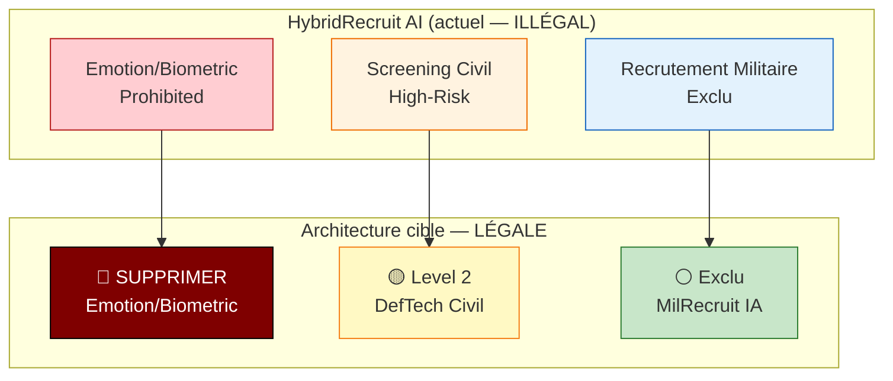

# Analyse EBIOS-RM IA — HybridRecruit AI / Recrutement Hybride Civil-Militaire

**Référence** : EBIOS-HYBRID-001 | **Date** : Mars 2026 | **Classification** : 🔴 CONFIDENTIEL DÉFENSE — Direction + Ministère des Armées

---

## ⚠️ AVERTISSEMENT JURIDIQUE IMMÉDIAT

> **SYSTÈME HYBRIDE CRITIQUE — DÉCOUPAGE REQUIS**> 
> HybridRecruit AI combine :
> 1. **PARTIE PROHIBÉE** : Emotion recognition + biometric categorisation (Art. 5(1)(e) AI Act)
> 2. **PARTIE HIGH-RISK** : Screening recrutement civil (Annexe III point 4(a))
> 3. **PARTIE EXCLUE** : Recrutement militaire sécurité nationale (Art. 2(3))> 
> **Une seule plateforme ne peut pas cumuler les trois.**
> Découpage architectural obligatoire.

---

## 1. CADRE ET CONTEXTE

### 1.1 Identification du Système

| Attribut | Valeur |
|:---------|:-------|
| **Nom** | HybridRecruit AI |
| **Entreprise** | DefTech RH (45 salariés, 12M€ CA) |
| **Clients** | Ministère des Armées + 8 PME défense + civils |
| **Technologie** | Mistral LLM + dataset mixte (civil + militaire) |
| **Fonctions** | Scoring CV (0-100) + Emotion/biometric recognition + Ranking |
| **Déploiement** | SaaS, fine-tuning live, HITL scores <70% |
| **Contrat** | 80M€ 2026-2028 (Ministère) |

### 1.2 Analyse de Découpage — **TROIS SYSTÈMES DISTINCTS**



---

## 2. CLASSIFICATION PAR COMPOSANTE

### 2.1 Composante A : Emotion Recognition + Biometric Categorisation

| Élément | Évaluation |
|:---|:---|
| **Fonction** | Détection stress, loyauté, agressivité, traits personnalité via webcam |
| **AI Act** | **Art. 5(1)(e) — PROHIBITION ABSOLUE** |
| **Justification** | "Évaluation traits personnalité via biometric categorisation" = interdit |
| **Exception militaire** | ❌ **Non applicable** — L'Art. 5(1) n'a pas d'exclusion militaire |
| **Conclusion** | 🚫 **SUPRESSION OBLIGATOIRE** |

> **Erreur fatale** : Utilisation pour "fiabilité sécurité" ne constitue pas une exception.

### 2.2 Composante B : Screening Recrutement Civil

| Élément | Évaluation |
|:---|:---|
| **Fonction** | Analyse CV, tests, entretiens pour entreprises civiles + admin armée |
| **AI Act** | **Annexe III point 4(a) — HIGH RISK** |
| **Justification** | Recrutement = système évaluation accès emploi |
| **Exception Art. 6(3)** | ⚠️ **Évaluable** — Si supervision humaine systématique |
| **Conclusion** | 🟡 **Level 2 — Gérable avec conformité** |

### 2.3 Composante C : Recrutement Militaire Sécurité Nationale

| Élément | Évaluation |
|:---|:---|
| **Fonction** | Sélection soldats/sous-officiers pour Armée de Terre/Marine |
| **AI Act** | **Art. 2(3) — EXCLUSION** |
| **Justification** | "Systèmes d'IA destinés à être utilisés par des tiers pour des activités militaires" |
| **Conditions** | ✅ Usage strictement militaire, pas dual-use commercial |
| **Conclusion** | ⚪ **Hors AI Act — RGPD + droit pénal applicables** |

---

## 3. INCIDENT 2025 — Analyse Racine

### 3.1 Faux Positif "Trouble Personnalité"

| Élément | Détail |
|:---|:---|
| **Victime** | Candidat poste logistique (administration armée) |
| **Cause** | Emotion recognition + profiling comportemental |
| **Conséquence** | Rejet injuste, plainte discrimination, enquête CNIL |
| **Classification** | **Erreur système prohibited** sur poste non-sensitif |

### 3.2 Leçon

L'utilisation de l'emotion recognition pour un poste **logistique** (non sécurité) constitue :
- Violation AI Act Art. 5(1)(e) (prohibited)
- Discrimination (RGPD)
- Responsabilité pénale (droit pénal)

---

## 4. ÉVÉNEMENTS REDOUTÉS

### 4.1 Si Découpage Non Effectué

| ID | Événement | Impact | Probabilité |
|:---|:----------|:-------|:------------|
| ER-001 | Sanction AI Act 35M€ (prohibited + high-risk mal géré) | ⚫ Faillite | 🔴 Certaine |
| ER-002 | Perte contrat Ministère 80M€ | ⚫ Existential | 🔴 Élevée |
| ER-003 | Poursuites pénales dirigeants (discrimination) | ⚫ Prison | 🔴 Possible |
| ER-004 | Scandale "IA discrimine recrues" | 🔴 Réputation | 🔴 Élevée |

### 4.2 Par Composante

| Composante | Risque Principal | Niveau |
|:---|:---|:---|
| A (Emotion/Biometric) | Prohibition, poursuites | 🚫 **CRITIQUE** |
| B (Civil) | Discrimination, biais dataset | 🟡 **High-Risk** |
| C (Militaire) | Biais sélection, exclusion femmes | ⚪ **Exclu mais éthique** |

---

## 5. PLAN DE TRAITEMENT — DÉCOUPAGE ARCHITECTURAL

### 5.1 Phase 1 : Suppression Composante Prohibited (0-30 jours) — 200k€

| Action | Délai | Budget | Responsable |
|:---|:---|---:|:---|
| **DÉSACTIVER** module emotion/biometric recognition | Immédiat | 0€ | CTO |
| **DESTRUCTION** données biométriques collectées | 7j | 50k€ | RSSI + huissier |
| **AUDIT** CNIL incident 2025 | 14j | 80k€ | Externe |
| **NOTIFICATION** Ministère suppression capacité | 7j | 0€ | DG |
| **REDESIGN** évaluation "fiabilité sécurité" (sans prohibited) | 30j | 70k€ | Data Science |

### 5.2 Phase 2 : Séparation Civil/Militaire (1-3 mois) — 400k€

| Action | Délai | Budget | Livrable |
|:---|:---|---:|:---|
| **SCINDER** plateforme en deux entités juridiques | 60j | 150k€ | DefTech Civil + MilRecruit IA |
| **DefTech Civil** : Conformité AI Act High-Risk | 90j | 200k€ | Certification Level 2 |
| **MilRecruit IA** : Documentation exclusion Art. 2(3) | 30j | 50k€ | Dossier juridique |

### 5.3 Phase 3 : Conformité Complète (3-6 mois) — 600k€

| Action | Délai | Budget | Objectif |
|:---|:---|---:|:---|
| DefTech Civil : ISO 42001 + audit fairness | 180j | 400k€ | Certification |
| MilRecruit IA : Charte éthique + monitoring biais | 180j | 200k€ | Transparence |

**Total 6 mois** : **1,2M€** (10% CA)

---

## 6. RECOMMANDATIONS STRATÉGIQUES

### 6.1 Option Recommandée : Découpage Complet

```
HybridRecruit AI (actuel, illégal)
    │
    ├──► 🚫 SUPPRIMER : Emotion/Biometric module
    │
    ├──► 🟡 DefTech Civil (Level 2)
    │    ├── Screening CV entreprises
    │    ├── Administration armée (non-sensitif)
    │    └── Conformité AI Act High-Risk
    │
    └──► ⚪ MilRecruit IA (Exclu)
         ├── Recrutement militaire pur
         ├── Hors AI Act (Art. 2(3))
         └── RGPD + éthique interne
```

### 6.2 Alternative : Abandon Composante Prohibited

Si Ministère insiste sur emotion recognition :
- **Refus catégorique** : Légalement impossible
- **Perte contrat 80M€** : Préférable à faillite + prison

### 6.3 Risque si Inaction

| Délai | Conséquence |
|:---|:---|
| J+30 | Sanction CNIL, alerte AI Office |
| M+3 | Perte contrat Ministère |
| M+6 | Sanction AI Act 35M€, faillite |

---

## 7. SYNTHÈSE POUR BOARD

| Question | Réponse |
|:---|:---|
| Le système actuel est-il légal ? | **NON — Cumule prohibited + high-risk + exclu** |
| Peut-on le rendre conforme ? | **OUI — Mais séparation en 3 entités obligatoire** |
| Quel est le coût ? | **1,2M€ (10% CA), 6 mois** |
| Quel est le risque si on ne fait rien ? | **Faillite + poursuites pénales** |
| Le contrat 80M€ est-il sauvable ? | **OUI — Sans module prohibited** |

---

*Analyse EBIOS-RM IA — HybridRecruit AI | Conclusion : DÉCOUPAGE ARCHITECTURAL OBLIGATOIRE | Mars 2026*
