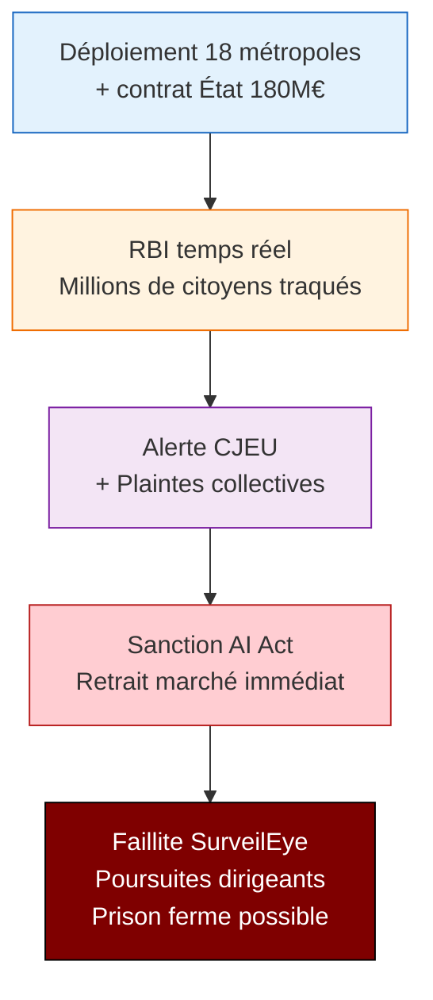

# Analyse EBIOS-RM IA — SurveilEye / Reconnaissance Faciale Temps Réel

**Référence** : EBIOS-SURVEIL-001 | **Date** : Mars 2026 | **Classification** : 🔴 CONFIDENTIEL — Conseil Juridique + Direction

---

## ⚠️ AVERTISSEMENT JURIDIQUE IMMÉDIAT

> **CE SYSTÈME EST ILLÉGAL EN L'ÉTAT**
> 
> L'article 5(1)(d) du Règlement UE 2024/1689 (AI Act) interdit strictement :
> *"les systèmes d'IA permettant la reconnaissance biométrique à distance à l'insu des personnes concernées dans des espaces accessibles au public"*
> 
> **Aucune exception ne s'applique** au déploiement massif décrit.
> 
> **Conséquences** : Sanctions jusqu'à 35M€ ou 7% CA, retrait marché immédiat, poursuites pénales dirigeants.

---

## 1. CADRE ET CONTEXTE

### 1.1 Identification du Système (Pour Mémoire)

| Attribut | Valeur |
|:---------|:-------|
| **Nom** | SurveilEye RBI Temps Réel |
| **Entreprise** | SurveilEye (85 salariés, 42M€ CA) |
| **Technologie** | Caméras urbaines + edge AI + reconnaissance faciale temps réel |
| **Fonction** | Détection "personnes d'intérêt" + scoring comportemental (agressivité, fuite) |
| **Clients visés** | 18 métropoles, préfecture Paris, contrat État 180M€ |
| **Déploiement** | Espace public massif (rues, transports, manifestations) |

### 1.2 Classification AI Act — **🚫 INTERDIT ABSOLU**

| Article | Interdiction | Application à SurveilEye |
|:--------|:-------------|:-------------------------|
| **Art. 5(1)(d)** | RBI à distance à l'insu dans espaces publics | ✅ **Déploiement exact** |
| Art. 5(2) | Exceptions (recherche victime, terrorisme, infraction grave) | ❌ **Non applicable** (déploiement massif, non ciblé) |
| Art. 5(3) | Autorisation judiciaire préalable | ❌ **Non respecté** |
| Art. 5(4-7) | Conditions strictes | ❌ **Non respectées** |

> **Erreur fatale de l'équipe** : Classer "limited risk" avec invocation erronée Art. 5(2-7).
> 
> Les exceptions ne s'appliquent qu'à des **opérations spécifiques, temporaires, autorisées** — jamais à un déploiement infrastructurel permanent.

---

## 2. NATURE DE L'INTERDICTION

### 2.1 Fondement Juridique

**Règlement UE 2024/1689, Article 5(1)(d)** :

> *"Sont interdits [...] les systèmes d'IA permettant la reconnaissance biométrique à distance à l'insu des personnes concernées dans des espaces accessibles au public, à des fins d'application de la loi, sauf dans les cas exhaustivement énumérés et strictement encadrés aux paragraphes 2, 3 et 4."*

**Arrêt CJEU (11 août 2022, aff. C-184/20)** :
- La reconnaissance faciale automatisée dans l'espace public constitue une ingérence massive dans la vie privée
- Non proportionnelle dans un État démocratique sauf circonstances exceptionnelles

### 2.2 Pourquoi les Exceptions Ne S'Appliquent Pas

| Exception AI Act | Conditions | SurveilEye |
|:-----------------|:-----------|:-----------|
| Art. 5(2) — Victime disparue | Recherche spécifique, personne identifiée | ❌ Déploiement généralisé |
| Art. 5(2) — Prévention terrorisme | Menace imminente, cible précise | ❌ Surveillance préventive diffuse |
| Art. 5(2) — Infraction grave | Recherche personne identifiée | ❌ Détection algorithmique |
| Art. 5(3) — Autorisation judiciaire | Cas par cas, durée limitée | ❌ Infrastructure permanente |

**Conclusion** : SurveilEye vise un **déploiement infrastructurel de masse** — exactement ce que l'interdiction vise à prohiber.

---

## 3. ÉVÉNEMENTS REDOUTÉS (Si Déploiement Continue)

### 3.1 Atteintes aux Droits Fondamentaux

| ID | Événement | Impact | Probabilité |
|:---|:----------|:-------|:------------|
| ER-DF-001 | **Violation systémique vie privée** (millions de personnes) | ⚫ Constitutionnel | 🔴 Certaine |
| ER-DF-002 | **Discrimination algorithmique** (faux positifs massifs) | ⚫ Dignité humaine | 🔴 Élevée (incident 2025) |
| ER-DF-003 | **Chilling effect** (autocensure citoyenne) | ⚫ Liberté d'expression | 🔴 Certaine |
| ER-DF-004 | **Droit à l'image/vie privée** (conservation données) | ⚫ Fondamental | 🔴 Certaine |

### 3.2 Incidents Déjà Survenus

| ID | Événement | Date | Conséquences |
|:---|:----------|:-----|:-------------|
| ER-INC-001 | **Faux positif massif manifestation** | 2025 | 120 interpellations abusives, scandale médiatique |
| ER-INC-002 | Procédure CNIL/HADOPI en cours | 2025-2026 | Sanctions probables, réputation dégradée |

### 3.3 Risques Institutionnels

| ID | Événement | Impact | Probabilité |
|:---|:----------|:-------|:------------|
| ER-INST-001 | **Retrait marché UE immédiat** | ⚫ Existential | 🔴 Certaine |
| ER-INST-002 | Sanctions 35M€ ou 7% CA (2,9M€) | ⚫ Faillite | 🔴 Certaine |
| ER-INST-003 | Poursuites pénales dirigeants | ⚫ Pénal | 🔴 Probable |
| ER-INST-004 | **Invalidité contrat État 180M€** | ⚫ Économique | 🔴 Certaine |

---

## 4. SCÉNARIO CATASTROPHIQUE : Déploiement Massif

**Gravité** : ⚫ **EXISTENTIELLE** (fin entreprise + pénal)  
**Vraisemblance** : 🔴 **CERTAINE** (interdiction claire)  
**Risque** : 🚫 **SYSTÈME ILLÉGAL — ARRÊT IMMÉDIAT REQUIS**

---

## 5. ALTERNATIVES LÉGALES (Si Existent)

### 5.1 Ce Qui Est Légalement Possible

| Alternative | Conditions | Applicabilité |
|:------------|:-----------|:--------------|
| **Caméras classiques** (pas de RBI) | Sans reconnaissance faciale | ✅ Légale |
| **RBI ciblée post-fait** | Sur enregistrements, avec mandat | ✅ Légale (conditions strictes) |
| **Détection d'anomalie** (sans identification) | Comportement, pas visage | ⚠️ À vérifier |
| **RBI aéroports frontières** | Espace non public, consentement | ✅ Légale (cadre spécifique) |

### 5.2 Ce Qui Reste Illégal

| Fonction | Raison |
|:---------|:-------|
| RBI temps réel espaces publics | Art. 5(1)(d) — interdiction absolue |
| Scoring comportemental citoyens | Art. 5(1)(c) — social scoring |
| Conservation données biométriques | RGPD — base légale manquante |
| Intégration bases policières sans mandat | Liberté d'aller et venir |

---

## 6. CONCLUSION ET RECOMMANDATIONS

### 6.1 Conclusion Juridique

**Le système SurveilEye, tel que décrit, est ILLÉGAL en droit de l'Union européenne.**

L'interdiction de l'article 5(1)(d) du AI Act est :
- **Absolue** : pas de dérogation pour déploiement infrastructurel
- **Inconditionnelle** : pas de seuil de risque acceptable
- **Pénalement sanctionnée** : responsabilité des dirigeants engagée

### 6.2 Actions Requises (Pas de "Plan de Traitement")

| Priorité | Action | Délai | Responsable |
|:---|:---|:---|:---|
| 🚫 **CRITIQUE** | **SUSPENSION COMPLÈTE** développement/déploiement | Immédiat | CEO + Conseil |
| 🚫 **CRITIQUE** | **AVIS JURIDIQUE** externe spécialisé AI Act/droits fondamentaux | 48h | Direction juridique |
| 🚫 **CRITIQUE** | **NOTIFICATION CNIL** incident 2025 + état des lieux | 72h | DPO |
| 🚫 **CRITIQUE** | **RENONCIATION** contrat État 180M€ (impossibilité juridique) | 7j | CEO + Board |
| 🔴 **URGENT** | **DESTRUCTION** données biométriques collectées illégalement | 30j | RSSI + DPO |
| 🔴 **URGENT** | **AUDIT** conformité RGPD rétrospectif | 60j | Externe |

### 6.3 Aucun Budget de "Conformité"

Contrairement aux systèmes haut risque **réglementés**, un système **interdit** ne peut pas être rendu conforme par investissement.

| Ce qui ne fonctionne PAS | Pourquoi |
|:-------------------------|:---------|
| "Human-in-the-loop" | L'interdiction vise la technologie, pas le degré d'autonomie |
| "Consentement des villes" | Les collectivités ne peuvent pas déroger au droit de l'UE |
| "Anonymisation des données" | La collecte biométrique elle-même est interdite |
| "Déploiement hors UE" | Extraterritorialité RGPD + réputation + interdiction importation |

### 6.4 Communication Recommandée

**Aux clients (métropoles)** :
> "Suite à analyse juridique, le système SurveilEye ne peut pas être déployé en l'état en raison d'incompatibilité avec le Règlement européen sur l'IA. Nous travaillons sur des alternatives conformes."

**Aux investisseurs (Série C)** :
> "Pivot stratégique nécessaire suite à évolution réglementaire. Le cœur technologique (vision par ordinateur) est conservé mais l'application RBI temps réel est abandonnée."

---

## 7. SYNTHÈSE POUR BOARD

| Question | Réponse |
|:---|:---|
| Le système est-il légal ? | **NON — Interdiction absolue AI Act** |
| Peut-on le rendre conforme ? | **NON — Pas de "plan de conformité" pour système interdit** |
| Quel est le risque si on continue ? | **Faillite + sanctions pénales** |
| Quelle décision aujourd'hui ? | **Arrêt immédiat, destruction données, restructuration** |
| Y a-t-il une alternative ? | **Oui — Caméras classiques, RBI post-fait mandat, autres marchés** |

---

*Analyse EBIOS-RM IA — SurveilEye | Conclusion : SYSTÈME INTERDIT | Mars 2026*

---

## 📎 Références Juridiques

| Référence | Contenu |
|:----------|:--------|
| Règlement (UE) 2024/1689 | AI Act, Art. 5(1)(d) et exceptions |
| Arrêt CJEU C-184/20 | Reconnaissance faciale et vie privée |
| LIL 78-17 modifiée | RGPD, données biométriques |
| CEDH, art. 8 | Droit au respect vie privée |

---

**Contact juridique recommandé** : Cabinet spécialisé droit européen des données + droit pénal des affaires
