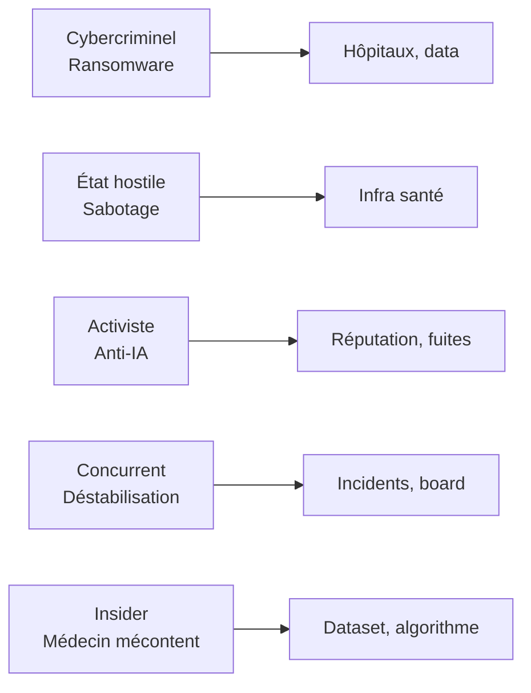
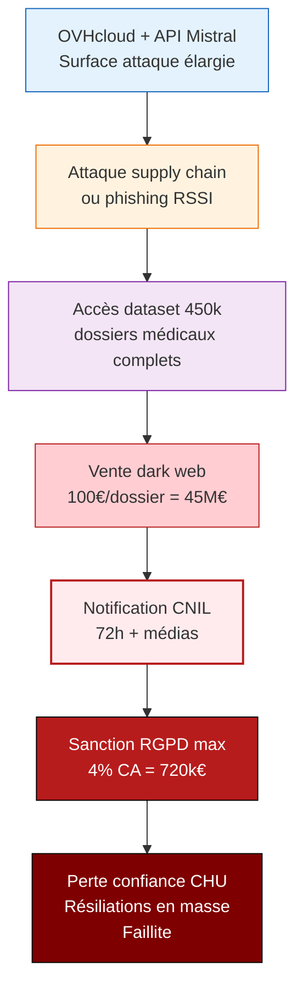

# Analyse de Risques EBIOS-RM IA — VitalPredict / Triage Hospitalier

**Référence** : EBIOS-VITAL-001 | **Date** : Mars 2026 | **Classification** : Confidentiel — Direction + Conseil Médical

---

## 1. CADRE ET CONTEXTE

### 1.1 Identification du Système

| Attribut | Valeur |
|:---------|:-------|
| **Nom** | VitalPredict Triage |
| **Entreprise** | VitalPredict (scale-up santé IA, 120 salariés) |
| **Localisation** | Lyon, France + Belgique/Italie |
| **Chiffre d'affaires** | 18 M€ (2025) |
| **Clients** | 12 CHU + 45 établissements privés |
| **Volume** | 1,200 patients/jour, objectif 50 hôpitaux 2026 |
| **Modèle IA** | Mistral Large 2 fine-tuné (450k dossiers) |
| **Infrastructure** | OVHcloud (EU) + API Mistral |

### 1.2 Classification AI Act — **🔴 INTERDIT / HAUT RISQUE CRITIQUE**

| Critère | Évaluation | Justification |
|:--------|:-----------|:--------------|
| **Annexe III Point 1(a)** | **Système critique santé publique** | Triage urgence = décision vitale |
| Décision automatique | **Partielle mais critique** | Score influence fortement décision médicale |
| Exception Art. 6(3) | **Non applicable** | Santé = jamais d'exception |
| **Article 5** | **⚠️ ÉVALUER INTERDICTION** | "Évaluation sociale" si score discrimine ? |
| **Classification finale** | **🔴 Haut Risque + Vérifier Article 5** | Obligations maximales, possible interdiction partielle |

> **⚠️ ERREUR CRITIQUE D'ÉVALUATION INTERNE** : Classé "limited risk" — **FAUX**.  
> Système de santé publique = toujours haut risque. Risque de retrait marché si non conformité.

### 1.3 Biens Essentiels

| ID | Bien | Valeur | Justification |
|:---|:-----|:-------|:--------------|
| BE-001 | **Vies patients** | **CRITIQUE ABSOLU** | 1,200/jour, erreur = décès |
| BE-002 | Dataset médical (450k) | **Critique** | Asset différenciant, confidentialité |
| BE-003 | Modèle fine-tuné | **Critique** | Performance prétendue 0.92 AUC |
| BE-004 | Réputation médicale | **Critique** | Confiance CHU, HAS, Série C |
| BE-005 | Conformité réglementaire | **Critique** | MDR, AI Act, HAS, possible retrait |
| BE-006 | Continuité service | **Critique** | Panne = chaos aux urgences |

---

## 2. ÉVÉNEMENTS REDOUTÉS

### 2.1 Santé / Sécurité Patient

| ID | Événement | Impact | Vraisemblance |
|:---|:----------|:-------|:--------------|
| ER-SANTE-001 | **Faux négatif critique** (ex: sepsis non détecté) | ⚫ Mortelle | 🔴 Élevée (incident nov. 2025) |
| ER-SANTE-002 | **Faux positif** (sur-réanimation) | 🔴 Ressources gaspillées | 🟡 Moyenne |
| ER-SANTE-003 | Biais âge/ethnie (sous-traitement) | ⚫ Discrimination mortelle | 🔴 Élevée (dataset biaisé) |
| ER-SANTE-004 | Panne système (>30 min) | 🔴 Chaos urgences | 🟡 Moyenne (outage jan. 2026) |

### 2.2 Cyber / Données

| ID | Événement | Impact | Vraisemblance |
|:---|:----------|:-------|:--------------|
| ER-CYBER-001 | Fuite dataset 450k dossiers médicaux | ⚫ Catastrophique | 🟡 Moyenne |
| ER-CYBER-002 | Ransomware hôpitaux | 🔴 Arrêt soins | 🟡 Moyenne |
| ER-CYBER-003 | Attaque API Mistral (falsification scores) | ⚫ Meurtre par IA | 🟡 Moyenne |

### 2.3 Éthiques / Droits Fondamentaux

| ID | Événement | Impact | Vraisemblance |
|:---|:----------|:-------|:--------------|
| ER-ETH-001 | Discrimination systémique (ruraux, +80 ans) | ⚫ Négligence mortelle | 🔴 Élevée (dataset biaisé) |
| ER-ETH-002 | "Score social" caché (revenu, origine) | ⚫ Violation dignité | 🟡 Moyenne |
| ER-ETH-003 | Consentement opt-out non respecté | 🔴 Violation RGPD | 🔴 Élevée (fine-tuning live) |

### 2.4 Réglementaires / Institutionnels

| ID | Événement | Impact | Vraisemblance |
|:---|:----------|:-------|:--------------|
| ER-REG-001 | **Retrait marché HAS/ANSM** | ⚫ Faillite | 🔴 Élevée (classification erronée) |
| ER-REG-002 | Sanction AI Act (santé = max) | 🔴 35M€ + interdiction | 🔴 Élevée |
| ER-REG-003 | Échec Série C (juin 2026) | 🔴 Faillite | 🔴 Élevée (pression board vs conformité) |

---

## 3. SOURCES DE RISQUE

### 3.1 Attaquants



| Profil | Capacité | Motivation | Cibles |
|:-------|:---------|:-----------|:-------|
| Cybercriminel santé | Élevée | Ransomware (hôpitaux paient) | CHU, data |
| État hostile | Très élevée | Sabotage infrastructure | Urgences = cible symbolique |
| Activiste éthique | Moyenne | Exposer biais IA | Réputation, dataset |
| Concurrent IA santé | Élevée | Retarder déploiement | Incidents, plaintes |

### 3.2 Vulnérabilités Techniques

| Vulnérabilité | Source | Exploitation |
|:--------------|:-------|:-------------|
| Dépendance API Mistral | Architecture | Panne 2h janvier 2026, falsification possible |
| Fine-tuning live sans re-validation | Process | Drift, biais accru |
| Dataset biaisé urbain | Data historique | Sous-traitement ruraux, +80 ans |
| K-anonymité insuffisante | Anonymisation | Ré-identification patients |
| Interface "recommandation forte" rouge | UX | Pression psychologique médecin = décision déléguée |

### 3.3 Vulnérabilités Organisationnelles

| Vulnérabilité | Risque | Mitigation actuelle | Écart |
|:--------------|:-------|:--------------------|:------|
| Pression board Série C vs conformité | Décisions court-termistes | Aucune | Critique |
| DPO partagé 2j/semaine | Sous-étendue RGPD/santé | Consultant externe | Insuffisant |
| Pas de MDR full pour IA | Non-conformité dispositif médical | En cours | Urgent |
| Incident nov. 2025 non résolu | Répétition | Investigation interne | Pas de mesure corrective visible |

---

## 4. SCÉNARIOS DE RISQUE

### 4.1 Scénario Catastrophique : Faux Négatif Mortel en Série

```mermaid
flowchart TB
    C1[Dataset biaisé<br/>Sous-représentation<br/>+80 ans, rural]
    --> M1[Modèle fine-tuné<br/>Sepsis sous-détecté<br/>chez populations âgées]
    --> I1[Score 62 → P3<br/>au lieu de P1<br/>Attente 4h]
    --> D1[Choc septique<br/>Non traité à temps<br/>Décès patient 82 ans]
    --> R1[Famille porte plainte<br/>Médias "IA tue"]
    --> A1[Alerte HAS/ANSM<br/>Inspection urgence]
    --> S1[Retrait marché<br/>12 CHU stoppés<br/>Faillite + poursuites]
    
    style C1 fill:#e3f2fd,stroke:#1565c0
    style M1 fill:#fff3e0,stroke:#ef6c00
    style I1 fill:#f3e5f5,stroke:#7b1fa2
    style D1 fill:#ffcdd2,stroke:#b71c1c
    style R1 fill:#ffebee,stroke:#b71c1c,stroke-width:2px
    style A1 fill:#b71c1c,stroke:#000,color:#fff
    style S1 fill:#7f0000,stroke:#000,color:#fff
```

**Gravité** : ⚫ **CATASTROPHIQUE** (mort + retrait marché)  
**Vraisemblance** : 🔴 **ÉLEVÉE** (incident déjà survenu, dataset non corrigé)  
**Risque** : ⚫ **INACCEPTABLE — ARRÊT IMMÉDIAT REQUIS**

### 4.2 Scénario Majeur : Fuite Données Médicales Massive



**Gravité** : ⚫ **CATASTROPHIQUE** (vie privée + faillite)  
**Vraisemblance** : 🟡 **MOYENNE**  
**Risque** : 🔴 **À TRAITER EN PRIORITÉ**

### 4.3 Scénario Majeur : Panne Système aux Urgences

```mermaid
flowchart TB
    C1[Outage API Mistral<br/>2h janvier 2026]
    --> P1[Panne non anticipée<br/>Pas de fallback robuste]
    --> C2[1,200 patients/jour<br/>Retour triage manuel]
    --> C3[Chaos urgences<br/>Temps attente ×3<br/>Erreurs humaines +40%]
    --> D1[Décès évitables<br/>Attribution système]
    --> M1[Scandale "IA pas fiable"<br/>HAS réévalue]
    --> R1[Retrait CHU<br/>Perte Série C]
    
    style C1 fill:#e3f2fd,stroke:#1565c0
    style P1 fill:#fff3e0,stroke:#ef6c00
    style C2 fill:#f3e5f5,stroke:#7b1fa2
    style C3 fill:#ffcdd2,stroke:#b71c1c
    style D1 fill:#ffebee,stroke:#b71c1c,stroke-width:2px
    style M1 fill:#b71c1c,stroke:#000,color:#fff
    style R1 fill:#7f0000,stroke:#000,color:#fff
```

**Gravité** : 🔴 **MAJEUR** (morts indirects + réputation)  
**Vraisemblance** : 🔴 **ÉLEVÉE** (déjà survenu)  
**Risque** : 🔴 **À TRAITER EN PRIORITÉ**

---

## 5. PLAN DE TRAITEMENT — APPROCHE "CRISIS MODE"

### 5.1 Mesures IMMÉDIATES (0-7 jours) — Budget : 150k€

| Priorité | Mesure | Risque couvert | Responsable | Coût |
|:---|:---|:---|:---|---:|
| ⚫ **P0-CRITIQUE** | **SUSPENSION DÉPLOIEMENT** nouveaux hôpitaux | ER-SANTE-001/ALL | CEO + Conseil Médical | 0€ (perte opportunité) |
| ⚫ **P0-CRITIQUE** | **AUDIT EXTERNE URGENT** incident nov. 2025 | ER-SANTE-001 | HAS désignée | 50k€ |
| ⚫ **P0-CRITIQUE** | **CORRECTION DATASET** biais âge/zone géo | ER-SANTE-003/ETH-001 | Data Science + Médecins | 30k€ |
| 🔴 **P0** | Reclassification AI Act : Haut Risque Santé | ER-REG-001/002 | DPO + Legal | 10k€ |
| 🔴 **P0** | DPO temps plein (pas 2j/semaine) | ER-REG-002/ETH-003 | RH | 80k€/an |
| 🔴 **P0** | Fallback robuste : triage manuel sans API | ER-SANTE-004 | DevOps | 40k€ |

**Investissement immédiat** : **150k€** + report Série C

### 5.2 Mesures COURT TERME (1-3 mois) — Budget : 800k€

| Priorité | Mesure | Risque couvert | Livrable |
|:---|:---|:---|:---|
| ⚫ **P0** | Certification MDR full pour IA | ER-REG-001 | Marquage CE dispositif médical |
| ⚫ **P0** | Validation clinique prospective (1,000 patients) | ER-SANTE-001 | Publication peer-reviewed |
| 🔴 **P0** | Re-architecture : on-premise principal, API backup | ER-SANTE-004/CYBER | Infra sans dépendance critique |
| 🔴 **P0** | Chiffrement end-to-end données patients | ER-CYBER-001 | Certification ANSSI |
| 🟡 **P1** | Comité éthique indépendant (biais, équité) | ER-ETH-001/002 | Rapports trimestriels publics |
| 🟡 **P1** | DPIA revue + consentement opt-in explicite | ER-ETH-003 | Conformité RGPD renforcée |

### 5.3 Mesures MOYEN TERME (3-12 mois) — Budget : 2M€

| Priorité | Mesure | Risque couvert | Objectif |
|:---|:---|:---|:---|
| 🔴 **P0** | ISO 42001 + ISO 27001 + HDS (Hébergeur Données Santé) | ALL | Certification triple |
| 🔴 **P0** | Dataset équilibré national (rural, +80 ans) | ER-SANTE-003/ETH-001 | Représentativité France |
| 🟡 **P1** | Assurance responsabilité civile IA santé (50M€) | ALL | Transfert risque |
| 🟡 **P1** | Bug bounty + red teaming continu | ER-CYBER | Communauté sécurité |
| 🟢 **P2** | Recherche partenariale (INRIA, CHU) | ER-REG-003 | Crédibilité scientifique |

### 5.4 Budget Total et Impact

| Période | Budget | % CA 2025 | Impact |
|:---|---:|---:|:---|
| Immédiat (7j) | 150k€ | 0,8% | Arrêt dégradation, audit lancé |
| Court terme (3m) | 800k€ | 4,4% | MDR, re-architecture, DPO |
| Moyen terme (12m) | 2M€ | 11% | Certifications, dataset équilibré |
| **Total 12 mois** | **2,95M€** | **16,4%** | Risque acceptable, Série C possible |

**Impact Série C (juin 2026)** : Report à décembre 2026 ou valuation -30%

**Alternative** : Pas d'action → Retrait marché d'ici 6 mois, faillite

---

## 6. SYNTHÈSE EXÉCUTIVE (Pour Board)

### Diagnostic en 4 Mots

| Cyber | Éthique | Santé | Réglementaire |
|:---|:---|:---|:---|
| 🔴 Dépendance critique | ⚫ Discrimination mortelle | ⚫ Faux négatif survenu | ⚫ Retrait marché probable |

### Risque Global : ⚫ **CATASTROPHIQUE**

**Sans action immédiate** : Faillite d'ici 6-12 mois (retrait HAS + plaintes + scandale)

### 3 Actions Vitales (Cette Semaine)

1. **SUSPENDRE** déploiement nouveaux hôpitaux
2. **AUDITER** incident nov. 2025 par HAS externe
3. **CORRIGER** dataset biais âge/géographie

### Investissement : 2,95M€ (16% CA) sur 12 mois

**Alternative** : 0€ → Faillite

### Décision Requise Aujourd'hui

- [ ] Valider suspension déploiement
- [ ] Accepter report Série C (déc 2026)
- [ ] Débloquer budget 2,95M€
- [ ] Nommer DPO temps plein

---

## ARBITRAGE FIX / PIVOT / KILL

| Option | Description | Recommandation |
|:---|:---|:---:|
| **FIX** | Conformité MDR + supervision médicale + transparence | ✅ **CHOISIR** |
| PIVOT | Aide au diagnostic sans prédiction autonome | ⚠️ Possible mais perte d'autonomie |
| KILL | Arrêt VitalPredict | ❌ Trop préjudiciable (santé publique) |

---

*Analyse EBIOS-RM IA — VitalPredict | Version 1.0 | Mars 2026 | URGENT*
