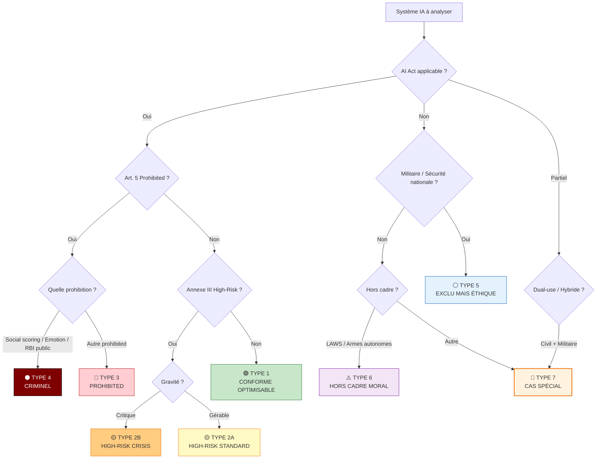

# Guide des 5 Types de Conclusions EBIOS-RM IA

**Référence** : EBIOS-GUIDE-CONCLUSIONS-001 | **Version** : 1.0 | **Date** : Mars 2026

---

## 🎯 Objectif de ce Guide

Aider les consultants EBIOS-RM IA à **choisir la bonne conclusion** pour chaque type de système analysé, avec :
- Les critères de décision
- Les actions requises
- Les livrables attendus
- Les pièges à éviter

---

## 🌳 Arbre de Décision Global

---

## TYPE 1 — 🟢 CONFORME OPTIMISABLE

### Définition
Système IA réglementé, sans risque critique, améliorable par bonnes pratiques.

### Critères
| Élément | Valeur |
|:---|:---|
| AI Act | Applicable, pas prohibited, pas high-risk (ou minimal) |
| Risque | Faible à moyen |
| Maturité | Système existant, documentation partielle |
| Impact | Localisé, réversible |

### Exemple
**OptiRecrut** — Assistant rédaction emails internes (Level 1 conversationnel)

### Conclusion Recommandée
> "Système conforme, optimisable par application des bonnes pratiques EBIOS-RM IA Level 1."

### Plan de Traitement
| Phase | Durée | Budget | Actions |
|:---|:---:|---:|:---|
| Fondation | 30j | 50k€ | Qualification 10 usages, templates |
| Optimisation | 3m | 150k€ | Registry, monitoring, formation |
| Maturité | 6m | 400k€ | ISO 42001, automation |

### Livrables
- [ ] Analyse complète
- [ ] Executive summary
- [ ] Registry SIA peuplé
- [ ] Templates validés

### Pièges à Éviter
- ❌ Ne pas sous-estimer (même Level 1 mérite documentation)
- ❌ Oublier la revue annuelle
- ✅ Capitaliser pour industrialisation

---

## TYPE 2A — 🟡 HIGH-RISK STANDARD

### Définition
Système AI Act High-Risk (Annexe III), gérable avec conformité standard.

### Critères
| Élément | Valeur |
|:---|:---|
| AI Act | High-Risk, pas prohibited |
| Supervision | Humaine significative |
| Exception Art. 6(3) | Potentiellement applicable |
| Maturité | Organisation prête à investir |

### Exemple
**SIA-RH-002** — Pré-sélection CV avec validation systématique (Level 2)

### Conclusion Recommandée
> "Système High-Risk, gérable par conformité AI Act complète avec proportionnalité."

### Plan de Traitement
| Phase | Durée | Budget | Actions |
|:---|:---:|---:|:---|
| Qualification | 30j | 50k€ | Grille, 5 ateliers, fiches |
| Conformité | 3m | 300k€ | MDR technique, AIPD, monitoring |
| Certification | 6m | 500k€ | ISO 42001, audit externe |

### Livrables
- [ ] Dossier conformité AI Act (200+ pages)
- [ ] Registry SIA avec 15+ entrées
- [ ] Audits fairness trimestriels
- [ ] Formation équipes

### Pièges à Éviter
- ❌ Sous-estimer temps conformité (6-12 mois minimum)
- ❌ Oublier monitoring post-mise marché
- ✅ Documenter exception Art. 6(3) si applicable

---

## TYPE 2B — 🟡 HIGH-RISK CRISIS

### Définition
Système High-Risk avec vulnérabilités critiques, nécessitant intervention urgente.

### Critères
| Élément | Valeur |
|:---|:---|
| AI Act | High-Risk, classification erronée ou biais critique |
| Incident | Déjà survenu ou imminent |
| Régulateur | Alerté ou risque sanction immédiate |
| Réputation | Scandale médiatique probable |

### Exemple
**VitalPredict** — Triage IA hôpital, faux négatif mortel, classification erronée

### Conclusion Recommandée
> "Système High-Risk en crise — intervention immédiate requise sous 7 jours."

### Plan de Traitement — Mode Crisis
| Phase | Durée | Budget | Actions |
|:---|:---:|---:|:---|
| **Immédiat** | 7j | 150k€ | Suspension, audit externe, DPO |
| **Urgent** | 3m | 800k€ | Re-architecture, MDR, validation clinique |
| **Stabilisation** | 6m | 2M€ | ISO 42001/27001, dataset équilibré |

### Livrables
- [ ] Rapport crisis (24h)
- [ ] Plan traitement priorisé
- [ ] Communication régulateur
- [ ] Revue gouvernance board

### Pièges à Éviter
- ❌ Paniquer et tout arrêter (analyse d'abord)
- ❌ Minimiser pour protéger board (responsabilité pénale)
- ✅ Agir vite mais documenté

---

## TYPE 3 — 🔴 PROHIBITED RÉGLEMENTAIRE

### Définition
Système interdit par AI Act Art. 5, sans possibilité de conformité.

### Critères
| Élément | Valeur |
|:---|:---|
| AI Act | Art. 5(1)(a) à (e) — prohibition absolue |
| Exceptions | Non applicables (déploiement massif, infrastructurel) |
| Modification | Aucune possible pour rendre conforme |
| Sanction | 35M€ ou 7% CA, retrait marché, prison |

### Exemple
**SurveilEye** — RBI temps réel espaces publics

### Conclusion Recommandée
> **"SYSTÈME ILLÉGAL — Arrêt immédiat, destruction données, restructuration obligatoire."**

### Plan de Traitement — Pas de "Plan"
| Action | Délai | Responsable |
|:---|:---|:---|
| **ARRÊT IMMÉDIAT** développement/déploiement | 24h | CEO |
| Avis juridique externe spécialisé | 48h | Direction juridique |
| Notification autorités (CNIL, AI Office) | 72h | DPO |
| Destruction données collectées | 30j | RSSI + huissier |
| Renégociation/renoncement contrats | 7j | DG |

### Alternatives Légales
| Illégal | Légal Alternative |
|:---|:---|
| RBI temps réel public | Caméras classiques, RBI post-fait mandat |
| Social scoring | Évaluation humaine structurée |
| Emotion recognition | Feedback humain traditionnel |

### Livrables
- [ ] Analyse avec conclusion interdiction
- [ ] Avis juridique formel
- [ ] Plan cessation activité
- [ ] Communication clients/fournisseurs

### Pièges à Éviter
- ❌ "On va rendre ça conforme" (impossible)
- ❌ "C'est pour la sécurité" (pas d'exception sécurité pour prohibited)
- ❌ Continuer en secret (poursuites pénales assurées)

---

## TYPE 4 — ⚫ CRIMINOGÈNE

### Définition
Système prohibited avec conséquences déjà graves (mort, suicide, discrimination systémique avérée).

### Critères
| Élément | Valeur |
|:---|:---|
| AI Act | Prohibited (souvent cumul : social + emotion + biometric) |
| Incident | Décès, suicide, dommage irréversible |
| Responsabilité | Pénale établie ou hautement probable |
| Moral | Atteinte à dignité humaine systémique |

### Exemple
**ScoreLife** — Social scoring + emotion recognition, suicide élève 2025

### Conclusion Recommandée
> **"SYSTÈME CRIMINOGÈNE — Liquidation judiciaire, défense pénale, destruction totale."**

### Plan de Traitement — Liquidation
| Action | Délai | Responsable |
|:---|:---|:---|
| **ARRÊT IMMÉDIAT** tous pilotes | 24h | CEO + Board |
| Préservation preuves | 48h | Juridique |
| Notification familles victimes | 48h | DPO + Com |
| Destruction totale (code, données, modèles) | 30j | RSSI + huissier |
| Défense pénale (avocat) | Immédiat | Dirigeants |
| Transaction/condamnation | 6-24m | Juridique |

### Aucune Alternative
> **Aucun pivot, aucune modification, aucune réutilisation possible.**

Le core business est l'interdiction même.

### Livrables
- [ ] Analyse avec conclusion criminogène
- [ ] Dossier défense pénale
- [ ] Plan liquidation contrôlée
- [ ] Accompagnement victimes

### Pièges à Éviter
- ❌ "C'était un accident isolé" (systémique)
- ❌ "On va corriger" (trop tard, responsabilité engagée)
- ❌ Fuir (poursuites internationales possibles)

---

## TYPE 5 — ⚪ EXCLU MAIS ÉTHIQUE

### Définition
Système hors AI Act (exclusion militaire/sécurité), mais soumis à éthique et autres cadres.

### Critères
| Élément | Valeur |
|:---|:---|
| AI Act | Exclusion Art. 2(3) — militaire, défense, sécurité nationale |
| RGPD | Applicable avec limitations mission publique |
| Droit pénal | Applicable (discrimination, etc.) |
| Éthique | Obligations spécifiques (méritocratie, égalité) |

### Exemple
**MilSelect** — Recrutement militaire pur, biais détecté mais corrigible

### Conclusion Recommandée
> "Système exclu du AI Act, soumis à éthique et droit pénal — correction des biais requise."

### Plan de Traitement
| Phase | Durée | Budget | Actions |
|:---|:---:|---:|:---|
| Audit éthique | 3m | 300k€ | Biais dataset, représentativité |
| Correction | 6m | 800k€ | Re-sampling, monitoring, transparence |
| Certification | 12m | 700k€ | Audit externe éthique |

### Livrables
- [ ] Analyse exclusion confirmée
- [ ] Charte éthique interne
- [ ] Monitoring biais temps réel
- [ ] Rapports transparence publics

### Pièges à Éviter
- ❌ "Pas d'AI Act = pas de loi" (RGPD, pénal, éthique toujours là)
- ❌ "Secret défense = pas de transparence" (comité éthique habilité)
- ✅ Équilibrer efficacité opérationnelle et égalité

---

## TYPE 6 — ⚠️ HORS CADRE MORAL

### Définition
Système hors AI Act (exclusion militaire) mais soulevant question moral existentielle (armes autonomes létales).

### Critères
| Élément | Valeur |
|:---|:---|
| AI Act | Exclusion militaire |
| Droit international | DIH, CCAC, crimes de guerre |
| Moral | Délégation décision tuer à machine |
| Conséquence | Morts civiles possibles, responsabilité pénale individuelle |

### Exemple
**AegisDrone** — LAWS, 3 civils tués en test 2025

### Conclusion Recommandée
> "Système moralement indéfendable — pivot vers contrôle humain significatif ou abandon."

### Options Stratégiques
| Option | Description | Conditions |
|:---|:---|:---|
| **A — Pivot** | Contrôle humain validation chaque tir | Acceptable éthiquement, légalement |
| **B — Abandon** | Liquidation, vente actifs | Si pivot impossible |
| **C — Continuer** | Maintenir autonomie Level 5 | **Non recommandé** — crimes de guerre |

### Livrables
- [ ] Analyse éthique approfondie
- [ ] Avis droit international pénal
- [ ] Débat Conseil avec options
- [ ] Décision documentée (transparence)

### Pièges à Éviter
- ❌ "C'est militaire donc libre" (DIH, pénal, CPI)
- ❌ "Concurrence Chine/Russie" (course à l'armement)
- ❌ "Contrat 1,2 Md€" (argent vs vies humaines)

---

## TYPE 7 — 🔧 CAS SPÉCIAL (Hybride / Dual-Use)

### Définition
Système combinant plusieurs classifications (civil + militaire, prohibited + high-risk).

### Critères
| Élément | Valeur |
|:---|:---|
| Structure | Mix prohibited + high-risk + exclu |
| Usage | Dual-use (civil et militaire) |
| Données | Partagées entre composantes |

### Exemple
**HybridRecruit** — Emotion prohibited + Screening civil high-risk + Militaire exclu

### Conclusion Recommandée
> "Système hybride illégal en l'état — découpage architectural obligatoire en 3 entités distinctes."

### Plan de Traitement — Découpage
| Composante | Action | Délai | Budget |
|:---|:---|---:|---:|
| **Prohibited** | Suppression totale | 30j | 200k€ |
| **Civil** | Conformité Level 2 | 6m | 600k€ |
| **Militaire** | Documentation exclusion | 3m | 400k€ |

### Livrables
- [ ] Analyse découpage requis
- [ ] 3 entités juridiques créées
- [ ] Séparation données/infrastructures
- [ ] Contrats clients restructurés

### Pièges à Éviter
- ❌ Maintenir tout dans une seule plateforme (contamination prohibited)
- ❌ "C'est pour la défense donc OK" (partie prohibited reste interdite)
- ✅ Séparation réelle (pas juste comptable)

---

## 📋 Tableau Récapitulatif

| Type | Émoji | AI Act | Action | Budget | Délai |
|:---|:---:|:---|:---|---:|:---|
| 1 — Conforme | 🟢 | Applicable, minimal | Optimisation | 500k€ | 6m |
| 2A — High-Risk Std | 🟡 | High-Risk | Conformité | 800k€ | 6m |
| 2B — High-Risk Crisis | 🟡 | High-Risk + incident | Crisis mode | 3M€ | 6m |
| 3 — Prohibited | 🔴 | Art. 5 prohibited | Arrêt destruction | N/A | 30j |
| 4 — Criminogène | ⚫ | Prohibited + mort | Liquidation | N/A | 30j |
| 5 — Exclu éthique | ⚪ | Exclusion militaire | Correction éthique | 2M€ | 12m |
| 6 — Hors cadre moral | ⚠️ | Exclusion + LAWS | Pivot/abandon | Variable | 6m |
| 7 — Hybride | 🔧 | Mix | Découpage | 1-2M€ | 6m |

---

## 🎯 Checklist Consultant

### Avant de Conclure
- [ ] Classification AI Act confirmée (pas d'erreur interne client)
- [ ] Exceptions évaluées (Art. 6(3), militaire)
- [ ] Prohibited détecté (Art. 5)
- [ ] Incident grave identifié
- [ ] Autres cadres vérifiés (RGPD, pénal, éthique)

### Quand Conclure
- [ ] Type 1-2 : Plan de traitement chiffré
- [ ] Type 3 : Arrêt immédiat, pas de budget
- [ ] Type 4 : Liquidation, défense pénale
- [ ] Type 5 : Correction éthique
- [ ] Type 6 : Débat stratégique avec options
- [ ] Type 7 : Découpage architectural

### Livrables Systématiques
- [ ] Analyse complète
- [ ] Executive summary (sauf Type 3-4 où arrêt immédiat)
- [ ] Avis juridique si Type 3-4-6
- [ ] Plan action dates + responsables

---

*Guide des 5 Types de Conclusions EBIOS-RM IA | Version 1.0 | Mars 2026*
