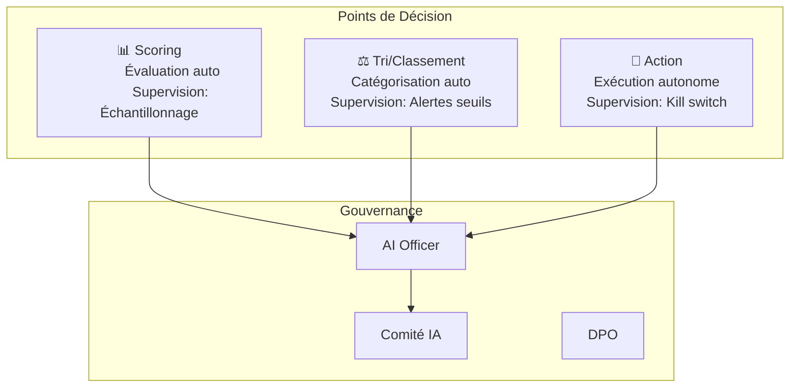

<!-- === EN-TÊTE DOCUMENTAIRE ISO-GRADE === -->

| Métadonnées | Valeur |
|-------------|--------|
| **Référence** | `EBIOS-L3-001` |
| **Titre** | EBIOS-RM Level 3 — Usage Décisionnel |
| **Version** | `2.0.0` |
| **Date** | `06/03/2026` |
| **Propriétaire** | `Consultant EBIOS-RM IA` |
| **Classification** | `Client — Confidentiel` |

---

# EBIOS-RM Level 3 — Usage Décisionnel 🔴

**Pour** : Usages critiques où l'IA prend des décisions ou agit autonomement

**Exemples** : Tri automatique, scoring, actions autonomes, impact réglementaire (Annexe III AI Act)

---

## 🎯 Objectif

> "Garantir la maîtrise des risques critiques et la conformité"

---

## ⏱️ Processus Level 3 (EBIOS Complet + Modules)

| Phase | Durée | Focus |
|:------|:------|:------|
| EBIOS Atelier 1 : Cadrage | 2h | Périmètre complet, gouvernance, cartographie |
| EBIOS Atelier 2 : Sources Risque | 3h | Menaces étendues, attaquants, cyberattaques |
| EBIOS Atelier 3 : Scénarios | 4h | Cascades technique→métier→réglementaire |
| EBIOS Atelier 4 : Traitement | 3h | Mesures IA-hardened, HITL, tests adversariaux |
| EBIOS Atelier 5 : Feuille Route | 2h | Jalons réévaluation, governance review |
| Module Variante Technique* | +2h | Si fine-tuning (LoRA, etc.) |
| Module AI Act* | +2h | Si Annexe III (checklist Art. 8-15) |
| Module AIPD* | +2h | Si RGPD (articulation privacy) |

**Durée totale : 1-2 jours** (+ modules si applicables)

*Modules obligatoires si condition remplie

---

## 📋 Template Level 3

### 1. CADRAGE RENFORCÉ

#### 1.1 Identification

| Champ | Valeur |
|:------|:-------|
| ID SIA | `SIA-[XXX]-[NNN]` |
| Nom | |
| Équipe | |
| Date qualification | |
| Qualifié par | |
| Version | 1.0 |

#### 1.2 Description Détaillée

```
[Contexte métier]
[Problématique résolue]
[Solution IA proposée]
[Parties prenantes]
[Contraintes réglementaires]
```

#### 1.3 Cartographie des Points de Décision Délégués



| Point de Décision | Autonomie IA | Supervision | Kill Switch |
|:------------------|:-------------|:------------|:------------|
| Scoring | Élevée | Échantillonnage | ☐ |
| Tri/Classement | Élevée | Seuils alertes | ☐ |
| Action | Totale | Temps réel | ☑ Obligatoire |

#### 1.4 Biens Essentiels Étendus

| ID | Bien | Valeur | Justification | Propriétaire |
|:---|:-----|:-------|:--------------|:-------------|
| BE-001 | Modèles / Algorithmes | Critique | IP core, avantage compétitif | |
| BE-002 | Données d'entraînement | Critique | Biais, qualité, provenance | |
| BE-003 | Décisions automatisées | Critique | Impact juridique/financier | |
| BE-004 | Réputation client | Élevée | Confiance, image | |
| BE-005 | Conformité réglementaire | Critique | AI Act, sanctions | |

---

### 2. SOURCES DE RISQUE ÉTENDUES

#### 2.1 Attaquants

| Profil | Capacité | Motivation | Cible |
|:-------|:---------|:-----------|:------|
| Attaquant externe (script kiddie) | Faible | Opportuniste | API exposée |
| Attaquant externe (organisé) | Élevée | Financier | Données, modèle |
| Insider malveillant | Élevée | Revenge, financier | Données, sabotage |
| Insider négligent | Moyenne | Incompétence | Fuite données |
| État/nation | Très élevée | Stratégique | Infrastructure |

#### 2.2 Cyberattaques Spécifiques IA

| Attaque | Description | Impact | Mitigation |
|:--------|:------------|:-------|:-----------|
| **Model Extraction** | Reconstruction modèle via requêtes | Vol IP | Rate limiting, watermarking |
| **Membership Inference** | Déterminer si donnée dans training | Fuite privacy | Differential privacy |
| **Model Inversion** | Reconstruction données training | Violation RGPD | Output constraints |
| **Adversarial Examples** | Inputs modifiés pour tromper | Erreurs critiques | Adversarial training |
| **Supply Chain** | Compromission dépendances | Backdoor | SBOM, audits |
| **Prompt Injection** | Détournement via input | Comportement non prévu | Input validation |
| **Jailbreak** | Contournement guardrails | Sorties dangereuses | Multi-layer defense |

#### 2.3 Risques Non-Malveillants Critiques

| Risque | Cause | Impact | Détection |
|:-------|:------|:-------|:----------|
| **Goal Misalignment** | Objectifs mal spécifiés | Comportements nuisibles | Red teaming |
| **Reward Hacking** | Exploitation métriques | Optimisation perverse | Monitoring comportemental |
| **Capability Overhang** | Capacités non anticipées | Surprises dangereuses | Évaluation extensive |
| **Emergent Behaviors** | Comportements imprévus | Risques inconnus | Surveillance continue |
| **Distribution Shift** | Données production ≠ training | Dégradation performance | Drift detection |

---

### 3. SCÉNARIOS DE RISQUE CRITIQUES

#### 3.1 Scénario 1 : [Nom — Impact maximal]

```
Contexte : [Situation initiale]

Déclencheur : [Événement déclencheur]
    │
    ▼
[Étape 1 : Propagation technique]
    │
    ▼
[Étape 2 : Impact métier]
    │
    ▼
[Étape 3 : Impact réglementaire/réputation]
    │
    ▼
[Impact final : Dommage maximal]
```

| Évaluation | Valeur |
|:-----------|:-------|
| Vraisemblance | ☐ 1 ☐ 2 ☐ 3 ☐ 4 |
| Impact technique | ☐ 1 ☐ 2 ☐ 3 ☐ 4 |
| Impact métier | ☐ 1 ☐ 2 ☐ 3 ☐ 4 |
| Impact réglementaire | ☐ 1 ☐ 2 ☐ 3 ☐ 4 |
| **Niveau risque** | 🟢 🟡 🔴 ⚫ |

#### 3.2 Scénario 2 : [Nom — Probabilité élevée]

[Structure identique]

#### 3.3 Scénario 3 : [Nom — Cas limite]

[Structure identique]

---

### 4. TRAITEMENT RENFORCÉ

#### 4.1 Mesures IA-Hardened

| Catégorie | Mesure | Implémentation | Validation |
|:----------|:-------|:---------------|:-----------|
| **Robustesse** | Adversarial training | | Test pen. |
| **Explicabilité** | LIME/SHAP pour décisions | | Audit |
| **Fairness** | Audits biais réguliers | | Métriques |
| **Privacy** | Differential privacy | | Audit DP |
| **Sécurité** | Input sanitization | | Fuzzing |
| **Surveillance** | Human-in-the-loop | | Logs review |

#### 4.2 Tests et Validation

| Type de Test | Méthode | Fréquence | Responsable |
|:-------------|:--------|:----------|:------------|
| Tests adversariaux | Red teaming | Avant MEP + maj | Security |
| Tests fairness | Métriques fairness | Mensuel | Data Science |
| Tests robustesse | Perturbations | Par release | QA |
| Tests pénétration | OWASP ASI | Semestriel | Pentest |
| Audits externes | Tierce partie | Annuel | Conformité |

#### 4.3 Monitoring Continu

| Indicateur | Seuil Critique | Action | Escalade |
|:-----------|:---------------|:-------|:---------|
| Drift performance | > 10% dégradation | Investigation | AI Officer |
| Anomalies entrées | > 5σ | Blocage temporaire | Security |
| Biais détecté | Δ > 15% entre groupes | Réentraînement | Conformité |
| Incidents sécurité | Tout événement | Analyse forensique | RSSI |

---

### 5. FEUILLE DE ROUTE ET GOUVERNANCE

#### 5.1 Gouvernance Renforcée

```
                    ┌─────────────┐
                    │  Board /    │
                    │  Direction  │
                    └──────┬──────┘
                           │
                    ┌──────▼──────┐
                    │  Comité IA  │ ← Revue trimestrielle
                    │  (Stratège) │
                    └──────┬──────┘
                           │
        ┌──────────────────┼──────────────────┐
        │                  │                  │
   ┌────▼────┐      ┌─────▼─────┐     ┌─────▼─────┐
   │  AI     │      │   DPO     │     │  RSSI     │
   │ Officer │      │           │     │           │
   │(Opér.)  │      │(Privacy)  │     │(Security) │
   └────┬────┘      └─────┬─────┘     └─────┬─────┘
        │                 │                 │
        └─────────────────┼─────────────────┘
                          │
                   ┌──────▼──────┐
                   │  Équipe     │
                   │  Projet     │
                   └─────────────┘
```

#### 5.2 Plan d'Action Détaillé

| ID | Action | Priorité | Responsable | Échéance | Budget | Statut |
|:---|:-------|:---------|:------------|:---------|:-------|:-------|
| | | 🔴/🟡/🟢 | | | | ☐ ☐ ☐ |

#### 5.3 Jalons de Réévaluation Obligatoires

| Jalon | Déclencheur | Fréquence min | Livrable |
|:------|:------------|:--------------|:---------|
| Revue opérationnelle | Calendaire | Mensuelle | Dashboard risques |
| Réévaluation technique | Changement modèle | Immédiate | Nouveau dossier |
| Audit conformité | Calendaire | Semestrielle | Rapport audit |
| Revue stratégique | Calendaire | Trimestrielle | Comité IA |

---

## MODULES COMPLÉMENTAIRES

### Module A : Variante Technique (Si fine-tuning)

```yaml
variante_technique:
  nom: "[Nom explicite]"
  methode: "[LoRA / Full / RAG / etc.]"
  
  parametres:
    rank: 16
    alpha: 32
    learning_rate: 0.0001
    
  donnees_entrainement:
    source: "[Origine]"
    volume: 0
    qualite: "[Métrique]"
    
  evaluation:
    metriques:
      - "[Métrique 1]"
      - "[Métrique 2]"
    tests_adversariaux: "[Résultats]"
    
  reversibilite:
    possible: true
    procedure_rollback: "[Procédure]"
    duree_max: "[Durée]"
    
  documentation:
    fiche_technique: "[Lien]"
    model_card: "[Lien]"
    data_sheet: "[Lien]"
```

### Module B : AI Act (Si Annexe III)

| Article | Exigence | Statut | Preuve |
|:--------|:---------|:-------|:-------|
| Art. 8 | Système qualité | ☐ | |
| Art. 9 | Documentation technique | ☐ | |
| Art. 10 | Gestion risques | ☐ | |
| Art. 11 | Jeu de données | ☐ | |
| Art. 12 | Traçabilité | ☐ | |
| Art. 13 | Transparence | ☐ | |
| Art. 14 | Supervision humaine | ☐ | |
| Art. 15 | Exactitude, robustesse | ☐ | |

### Module C : AIPD (Si RGPD)

| Section | Élément | Statut |
|:--------|:--------|:-------|
| 1 | Nécessité et proportionnalité | ☐ |
| 2 | Risques pour droits/libertés | ☐ |
| 3 | Mesures envisagées | ☐ |
| 4 | Consultation DPO | ☐ |
| 5 | Avis personnes concernées | ☐ |
| 6 | Validation | ☐ |

---

## ✅ VALIDATIONS OBLIGATOIRES

| Rôle | Nom | Date | Signature |
|:-----|:----|:-----|:----------|
| Sponsor Exécutif | | | |
| AI Officer | | | |
| DPO | | | |
| RSSI | | | |
| Responsable Métier | | | |
| Responsable Technique | | | |

---

## 📝 Exemple Rempli (Scoring Crédit)

### SIA-FIN-004 — Scoring interne demandes crédit

**Cadrage**
- Usage : Évaluation automatique des demandes de crédit
- Autonomie : Scoring (élevée), Décision finale (validation humaine)
- Gouvernance : Comité IA mensuel, AI Officer dédié

**Sources Risque**
- Attaquants : Fraudeurs (injection données), concurrents (extraction modèle)
- Cyberattaques : Model inversion (données clients), adversarial (faux positifs)
- Non-malveillant : Biais historique, drift économique

**Scénario Critique**
```
Attaquant injecte données malveillantes dans training
    │
    ▼
Modèle apprend pattern frauduleux comme positif
    │
    ▼
Fraudeurs exploitent le biais pour obtenir crédits
    │
    ▼
Perte financière + sanction réglementaire
```

**Mesures**
- Adversarial training, audits biais trimestriels
- HITL sur décisions > 100K€
- Kill switch sur détection anomalie

---

*Template Level 3 — Version 2.0*
