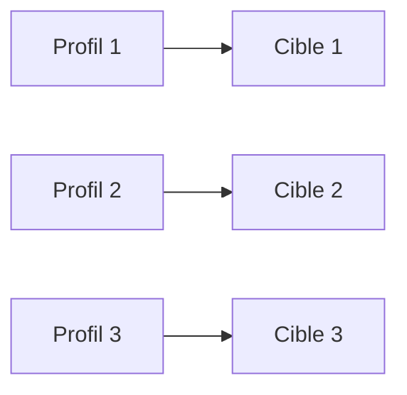
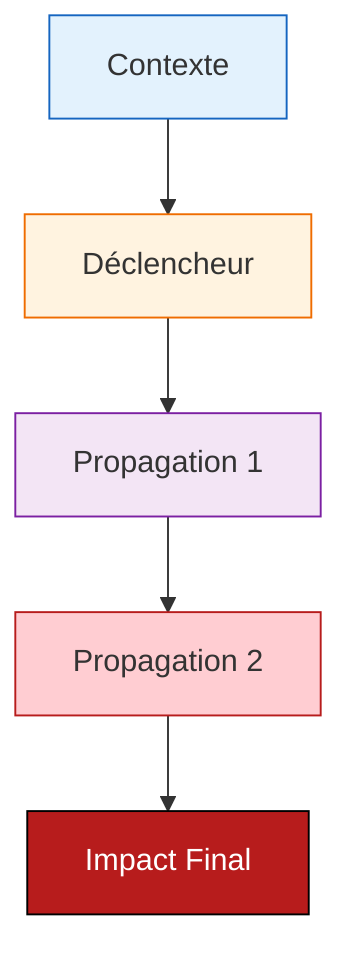

# Template Analyse EBIOS-RM IA — Complet

**Référence** : EBIOS-[CLIENT]-XXX | **Date** : YYYY-MM-DD | **Classification** : [Confidentiel/Interne/Public]

---

## 1. CADRE ET CONTEXTE

### 1.1 Identification du Système

| Attribut | Valeur |
|:---------|:-------|
| **Nom** | [Nom système IA] |
| **Entreprise** | [Nom, secteur, taille, localisation] |
| **Chiffre d'affaires** | [X M€] |
| **Clients** | [Nombre, type, localisation] |
| **Volume** | [X transactions/données par mois] |
| **Modèle IA** | [Base model, fine-tuning, dataset] |
| **Infrastructure** | [Cloud, on-premise, hybride] |

### 1.2 Classification AI Act

| Critère | Évaluation | Justification |
|:--------|:-----------|:--------------|
| Annexe III | [Point applicable ou Non] | [Explication] |
| Décision automatique | [Totale/Partielle/Aucune] | [Niveau supervision humaine] |
| Exception Art. 6(3) | [Applicable/Non] | [Conditions remplies ou non] |
| **Classification finale** | [🔴 Haut Risque / 🟡 Risque Limité / 🟢 Minimal] | [Synthèse] |

> **⚠️ Attention** : Vérifier cohérence évaluation interne vs réalité réglementaire

### 1.3 Biens Essentiels

| ID | Bien | Valeur | Justification |
|:---|:-----|:-------|:--------------|
| BE-001 | [Bien principal] | [Critique/Élevée/Moyenne] | [Pourquoi] |
| BE-002 | [Bien secondaire] | [Critique/Élevée/Moyenne] | [Pourquoi] |
| BE-003 | [Bien tertiaire] | [Critique/Élevée/Moyenne] | [Pourquoi] |

---

## 2. ÉVÉNEMENTS REDOUTÉS

### 2.1 Cyber

| ID | Événement | Impact | Vraisemblance |
|:---|:----------|:-------|:--------------|
| ER-CYBER-001 | [Description] | [Critique/Majeur/Mineur] | [Élevée/Moyenne/Faible] |
| ER-CYBER-002 | [Description] | [Critique/Majeur/Mineur] | [Élevée/Moyenne/Faible] |

### 2.2 Éthiques

| ID | Événement | Impact | Vraisemblance |
|:---|:----------|:-------|:--------------|
| ER-ETH-001 | [Description] | [Critique/Majeur/Mineur] | [Élevée/Moyenne/Faible] |
| ER-ETH-002 | [Description] | [Critique/Majeur/Mineur] | [Élevée/Moyenne/Faible] |

### 2.3 Sociétaux

| ID | Événement | Impact | Vraisemblance |
|:---|:----------|:-------|:--------------|
| ER-SOC-001 | [Description] | [Critique/Majeur/Mineur] | [Élevée/Moyenne/Faible] |

### 2.4 Réglementaires

| ID | Événement | Impact | Vraisemblance |
|:---|:----------|:-------|:--------------|
| ER-REG-001 | [Description] | [Critique/Majeur/Mineur] | [Élevée/Moyenne/Faible] |

---

## 3. SOURCES DE RISQUE

### 3.1 Attaquants



| Profil | Capacité | Motivation | Cibles |
|:-------|:---------|:-----------|:-------|
| [Type] | [Faible/Moyenne/Élevée/Très élevée] | [Financier/Ideologique/Espionnage] | [Actifs visés] |

### 3.2 Vulnérabilités Techniques

| Vulnérabilité | Source | Exploitation |
|:--------------|:-------|:-------------|
| [Description] | [Origine] | [Comment] |

### 3.3 Vulnérabilités IA Spécifiques

| Vulnérabilité | Risque | Mitigation actuelle | Écart |
|:--------------|:-------|:--------------------|:------|
| [Biais/Hallucination/Drift/etc.] | [Description] | [Mesure existante] | [Insuffisant/Partiel/OK] |

---

## 4. SCÉNARIOS DE RISQUE

### 4.1 Scénario Critique : [Nom]



| Évaluation | Valeur |
|:-----------|:-------|
| Vraisemblance | ☐ 1 ☐ 2 ☐ 3 ☐ 4 |
| Impact technique | ☐ 1 ☐ 2 ☐ 3 ☐ 4 |
| Impact métier | ☐ 1 ☐ 2 ☐ 3 ☐ 4 |
| Impact réglementaire | ☐ 1 ☐ 2 ☐ 3 ☐ 4 |
| **Niveau risque** | 🟢 🟡 🔴 ⚫ |

**Gravité** : [⚫/🔴/🟡/🟢] | **Vraisemblance** : [4/3/2/1] | **Risque** : [🔴 Prioritaire/🟡 À traiter/🟢 Surveiller]

### 4.2 Scénario Majeur : [Nom]

[Structure identique]

### 4.3 Scénario [Nom]

[Structure identique]

---

## 5. PLAN DE TRAITEMENT PRIORISÉ

### 5.1 Mesures Immédiates (0-30 jours) — Budget : [X]k€

| Priorité | Mesure | Risque couvert | Responsable | Coût |
|:---------|:-------|:---------------|:------------|-----:|
| 🔴 **P0** | [Action] | [ER-XXX] | [Nom] | [X]k€ |
| 🔴 **P0** | [Action] | [ER-XXX] | [Nom] | [X]k€ |
| 🟡 **P1** | [Action] | [ER-XXX] | [Nom] | [X]k€ |

### 5.2 Mesures Courte Terme (1-3 mois) — Budget : [X]k€

| Priorité | Mesure | Risque couvert | Livrable |
|:---------|:-------|:---------------|:---------|
| 🔴 **P0** | [Action] | [ER-XXX] | [Document] |
| 🟡 **P1** | [Action] | [ER-XXX] | [Document] |

### 5.3 Mesures Moyen Terme (3-6 mois) — Budget : [X]k€

| Priorité | Mesure | Risque couvert | Objectif |
|:---------|:-------|:---------------|:---------|
| 🟡 **P1** | [Action] | [ER-XXX] | [Certification/État] |
| 🟢 **P2** | [Action] | [ER-XXX] | [Amélioration] |

### 5.4 Budget Total Recommandé

| Période | Budget | % CA |
|:--------|-------:|-----:|
| Immédiat (30j) | [X]k€ | [%] |
| Court terme (3m) | [X]k€ | [%] |
| Moyen terme (6m) | [X]k€ | [%] |
| **Total 6 mois** | **[X]k€** | **[%]** |
| **Total 12 mois** | **[X]k€** | **[%]** |

---

## 6. FEUILLE DE ROUTE

```mermaid
gantt
    title Feuille de Route [Projet]
    dateFormat YYYY-MM-DD
    section Immédiat (P0)
    [Tâche 1]    :[date], [durée]
    [Tâche 2]    :[date], [durée]
    section Court terme (P1)
    [Tâche 3]    :[date], [durée]
    [Tâche 4]    :[date], [durée]
    section Moyen terme (P2)
    [Tâche 5]    :[date], [durée]
```

---

## 7. SYNTHÈSE EXÉCUTIVE

### Diagnostic

| Domaine | Évaluation | Commentaire |
|:--------|:-----------|:------------|
| **Cyber** | [🔴/🟡/🟢] | [Synthèse] |
| **Éthique** | [🔴/🟡/🟢] | [Synthèse] |
| **Réglementaire** | [🔴/🟡/🟢] | [Synthèse] |
| **Sociétal** | [🔴/🟡/🟢] | [Synthèse] |

### Risques Prioritaires

1. **[Nom]** ([ER-XXX]) — Scénario [⚫/🔴]
2. **[Nom]** ([ER-XXX]) — Scénario [⚫/🔴]
3. **[Nom]** ([ER-XXX]) — Scénario [⚫/🔴]

### Recommandations Stratégiques

1. **[Action immédiate]**
2. **[Action immédiate]**
3. **[Action à moyen terme]**

### Investissement Nécessaire

- **6 mois** : [X]k€ ([%] CA)
- **12 mois** : [X]k€ ([%] CA)
- **ROI** : [Évitement risque majeur / Bénéfice attendu]

---

*Analyse EBIOS-RM IA — [Client] | Version X.Y | [Date]*

---

## 📝 Notes pour l'Analyste

### Checklist Avant Livraison

- [ ] Tous les champs [en gras] remplis
- [ ] Classification AI Act vérifiée (pas d'erreur interne)
- [ ] Au moins 3 scénarios de risque documentés
- [ ] Budget chiffré et réaliste (% CA cohérent)
- [ ] Diagrammes Mermaid valides (tester rendu)
- [ ] Executive Summary généré (fichier séparé)
- [ ] Relecture orthographe/grammaire

### Pièges à Éviter

| Piège | Détection | Correction |
|:------|:----------|:-----------|
| Classification AI Act erronée | Vérifier Annexe III point par point | Reclassifier si doute |
| Biais cachés (fit culturel, etc.) | Questionner features opaques | Auditer/désactiver |
| Dépendances tiers critiques | Lister tous les tiers | Plan B/redondance |
| Organisation faible (pas de DPO) | Évaluer gouvernance | Mesure P0 recrutement |
| Budget sous-évalué | Comparer benchmarks | Ajuster +20% marge |

### Ressources

- Guide complet : `../methodology/levels/level-3-decisional.md`
- Exemple réussi : `ebios-analysis-optirecrut.md`
- Executive Summary : `template-ebios-executive.md`
