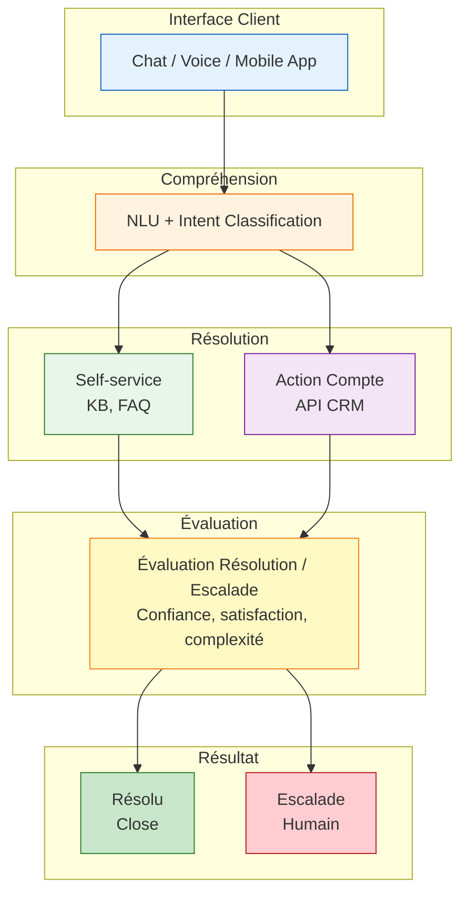

# Cas Réel Anonymisé #3 — Support Client Autonome

**Secteur** : Télécom / Services | **Taille** : 5,000 employés | **Région** : France

---

## Contexte

### Client
- Opérateur télécom B2C avec 2M clients
- Call center : 200 agents, coût élevé, turnover important
- 60% demandes niveau 1 (facture, forfait, panne simple)

### Problématique
- Coût support : €8/appel en moyenne
- Temps d'attente client : 8-12 minutes
- Satisfaction : 6.2/10 (insuffisant vs concurrence)
- Pénurie de personnel (difficulté recrutement)

### Solution IA Proposée
- Agent conversationnel autonome niveau 1
- Intégration CRM pour actions (changement forfait, dépannage)
- Escalade humaine sur demande ou cas complexe
- Objectif : résoudre 70% niveau 1 sans humain

---

## Qualification EBIOS-RM

### Grille Express

| Q | Réponse | Justification |
|:-:|:--------|:--------------|
| 1 | Oui | Actions sur compte client (données métier) |
| 2 | Oui | Décision résolution / escalade |
| 3 | Oui | Automatisé (pas de validation systématique) |
| 4 | Non | Support client ≠ Annexe III directement |
| 5 | Oui | Données clients (contrats, facturation, usage) |

### Niveau Déterminé

**🔴 Level 3** — Agent autonome avec impact client

Justification :
- Pas d'Annexe III directe MAIS :
  - Automatisation totale niveau 1
  - Actions sur compte (modification forfait, résiliation)
  - Impact financier direct (erreur = remboursement)
- Précaution : traité en Level 3 pour auditabilité

---

## Fiche EBIOS-RM Level 3 (Extraits)

### Cadrage Renforcé

**Points de Décision Délégués**
| Décision | IA ? | Supervision | Kill Switch |
|:---------|:-----|:------------|:------------|
| Compréhension demande | ✅ Oui | Logs review | ☐ |
| Proposition solution | ✅ Oui | Satisfaction | ☐ |
| Action compte client | ✅ Oui | Plafond €50 | ☑ Oui |
| Résolution / Escalade | ✅ Oui | Taux transfert | ☑ Oui |
| Résiliation | ❌ Non | Jamais délégué | — |

**Biens Essentiels**
- BE-001 : Base de connaissances (qualité réponses)
- BE-002 : Données clients (RGPD, confidentialité)
- BE-003 : Actions autonomes (impact financier)
- BE-004 : Satisfaction client (NPS, churn)
- BE-005 : Réputation service client

### Architecture Agent



### Sources Risque Spécifiques

| Risque | Probabilité | Impact | Mitigation |
|:-------|:------------|:-------|:-----------|
| **Hallucination solution** | Élevée | Moyen | KB vérifiée, pas de génération libre |
| **Mauvaise compréhension intention** | Élevée | Moyen | Confirmation explicite client |
| **Action non autorisée** | Moyenne | Élevé | Plafonds, whitelist actions |
| **Boucle infinie (pas de résolution)** | Moyenne | Moyen | Timeout, max 3 tentatives |
| **Fuite données conversation** | Faible | Critique | Chiffrement, pas de données sensibles en clair |
| **Prompt injection** | Moyenne | Élevé | Input validation, sandbox |

### Scénario Critique : Action Non Autorisée

```mermaid
flowchart TB
    C1[Client demande<br/>"changer mon forfait"]
    A1[Agent comprend<br/>"augmenter"<br/>Intention incorrecte]
    P1[Passe forfait<br/>€20 → €80<br/>Sans confirmation]
    M1[Client mécontent<br/>Plainte<br/>Remboursement €60]
    R1[Médias sociaux<br/>Réputation]
    
    C1 --> A1
    A1 --> P1
    P1 --> M1
    M1 --> R1
    
    style C1 fill:#e3f2fd,stroke:#1565c0
    style A1 fill:#fff3e0,stroke:#ef6c00
    style P1 fill:#f3e5f5,stroke:#7b1fa2
    style M1 fill:#ffcdd2,stroke:#b71c1c
    style R1 fill:#b71c1c,stroke:#000,color:#fff
```

**Mesures**
- Confirmation explicite pour tout changement tarifaire
- Récapitulatif avant action ("Je résume : vous voulez...")
- Plafond automatique : alerte si +€10/mois
- Annulation possible dans 24h sans frais

### Monitoring Continu

| Indicateur | Seuil | Action | Fréquence |
|:-----------|:------|:-------|:----------|
| Taux résolution autonome | < 65% | Optimisation intents | Hebdo |
| Satisfaction agent (CSAT) | < 7/10 | Analyse échecs | Quotidien |
| Temps moyen résolution | > 5 min | Optimisation parcours | Quotidien |
| Taux escalade | > 35% | Ajustement seuils | Hebdo |
| Erreurs action compte | > 0.5% | Blocage + investigation | Temps réel |
| Sentiment négatif | Détection | Escalade proactive | Temps réel |

### Gouvernance

| Rôle | Responsabilité | KPI |
|:-----|:---------------|:----|
| AI Product Owner | Performance agent, roadmap | CSAT, résolution |
| Customer Success | Satisfaction, churn | NPS, rétention |
| Conformité | RGPD, preuve consentement | Audits, incidents |
| Ops IT | Disponibilité, latence | Uptime, MTTR |

---

## Résultats Après 9 Mois

| Métrique | Avant | Après | Évolution |
|:---------|:------|:------|:----------|
| Coût/appel | €8 | €2.5 | -69% |
| Temps attente | 10 min | Instantané | -100% |
| Taux résolution L1 | 0% | 72% | +72 pts |
| CSAT support | 6.2/10 | 7.8/10 | +26% |
| NPS | +12 | +28 | +133% |
| Churn lié support | 8%/an | 3%/an | -62% |
| Charge agents humains | 100% | 45% | Réaffectation L2 |

---

## Apprentissages Clés

### Ce qui a marché
- **KB structurée** (pas de génération libre) → hallucinations quasi nulles
- **Confirmation explicite** → erreurs action -90%
- **Escalade facile** → clients pas bloqués, satisfaction
- **Monitoring temps réel** → détection problèmes en minutes

### Ce qui a été difficile
- **Intentions ambiguës** ("je veux changer" → forfait ? adresse ? rib ?)
- **Clients énervés** → agent doit détecter et escalader vite
- **Intégration legacy** (CRM 15 ans, API limitées)

### Recommandations
1. **Pas de génération libre** — KB structurée seulement
2. **Escalade facile** — bouton "parler à un humain" toujours visible
3. **Confirmation explicite** — récapitulatif avant toute action
4. **Monitoring temps réel** — pas seulement reporting hebdo
5. **Test A/B continu** — optimiser parcours sans arrêt

---

## Spécificité : Pas d'Annexe III mais Level 3

| Critère | Évaluation | Justification |
|:--------|:-----------|:--------------|
| Annexe III | Non directement | Support client standard |
| Automatisation | Totale | Pas de validation systématique |
| Impact financier | Direct | Actions sur compte |
| Impact client | Élevé | Satisfaction, churn |
| Précaution | Level 3 | Auditabilité, prudence |

> **Principe** : Quand doute entre 🟡 et 🔴, choisir 🔴 pour première qualification.

---

## Fichiers Associés

| Document | Lien |
|:---------|:-----|
| Fiche complète | `cases/case-3-support-full.md` |
| Template utilisé | `../../templates/template-level-3.md` |
| Entrée registre | `../../registry/examples.yaml` (SIA-EXP-004 → migré SIA-SUP-005) |
| Guide cas limites | `../../methodology/levels/level-2-3-boundary.md` |

---

*Cas Réel #3 — Support Client Autonome | Anonymisé | Usage avec permission*
