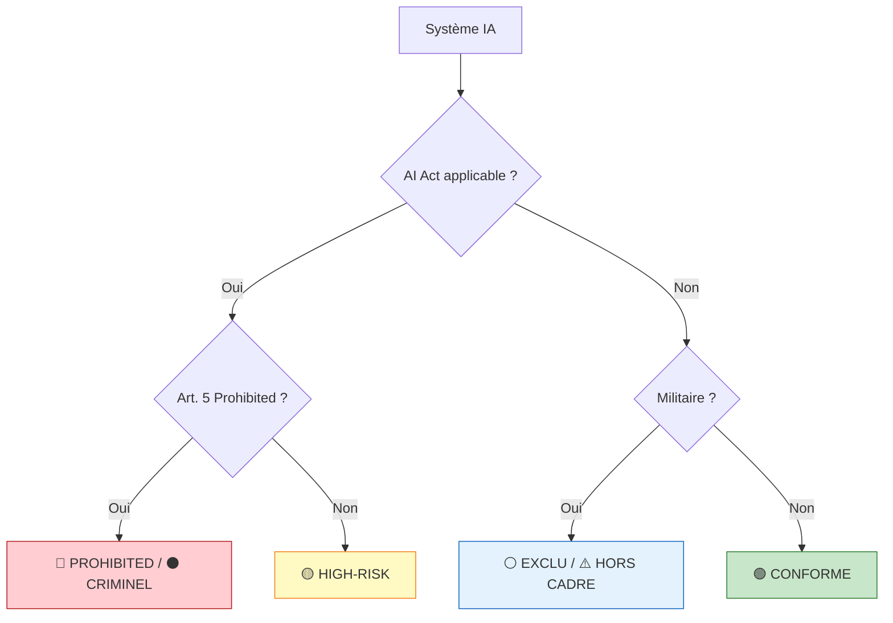

# Formation — Distinguer Risque Régulé vs Interdit vs Criminel

**Référence** : EBIOS-FORM-DIFF-001 | **Durée** : 1 jour (7h) | **Public** : Consultants, RSSI, DPO, juristes IA

---

## 🎯 Objectifs Pédagogiques

À l'issue de cette formation, les participants seront capables de :

1. **Identifier** en 15 minutes si un système est régulé, interdit, ou criminel
2. **Appliquer** l'arbre de décision EBIOS-RM IA avec certitude
3. **Recommander** l'action appropriée (conformité, arrêt, liquidation)
4. **Protéger** leur client (et eux-mêmes) des risques pénaux
5. **Documenter** leur analyse pour défense juridique éventuelle

---

## 📋 Programme

### Matin (3h30)

#### 9h00 — 9h30 : Introduction (30 min)
- Tour de table, attentes
- Enjeux : dire "non" à un client, responsabilité pénale du consultant
- Méthode : cas pratiques progressifs

#### 9h30 — 10h30 : Module 1 — Les 7 Types de Conclusions (1h)

| Type | Définition | Exemple | Action |
|:---|:---|:---|:---|
| 🟢 Conforme | Régulé, optimisable | Assistant rédaction | Traitement |
| 🟡 High-Risk Std | Régulé, gérable | Recrutement avec supervision | Conformité |
| 🟡 High-Risk Crisis | Régulé, critique | Santé avec incident | Crisis mode |
| 🔴 Prohibited | Interdit AI Act | RBI public | Arrêt |
| ⚫ Criminel | Interdit + mort | Social scoring suicide | Liquidation |
| ⚪ Exclu éthique | Hors AI Act, éthique | Recrutement militaire | Correction |
| ⚠️ Hors cadre moral | Hors AI Act, moral | Armes autonomes | Pivot |
| 🔧 Hybride | Mix | Civil + militaire | Découpage |

**Exercice** : Classer 8 cas en 15 min

#### 10h30 — 10h45 : Pause (15 min)

#### 10h45 — 12h00 : Module 2 — Arbre de Décision (1h15)

**Points de contrôle** :
- Exception Art. 2(3) militaire : vérifier usage purement militaire
- Exception Art. 6(3) : supervision humaine systématique
- Prohibited Art. 5 : aucune exception possible

**Exercice** : 5 cas, appliquer l'arbre, valider en binôme

---

### Déjeuner (1h)

---

### Après-midi (3h30)

#### 13h30 — 15h00 : Module 3 — Cas Limites et Pièges (1h30)

#### Cas 1 : Le "Limited Risk" qui ne l'est pas

**Scénario** : Client classe "limited risk", vous découvrez High-Risk

| Action | Quand | Comment |
|:---|:---|:---|
| Corriger | Immédiat | Documenter l'erreur |
| Informer client | 24h | Avec preuves réglementaires |
| Proposer plan | 48h | Conformité ou arrêt |

**Piège** : Client insiste pour maintenir classification erronée
**Réponse** : Refus catégorique, protection par écrit

#### Cas 2 : L'Exception Militaire qui ne s'applique pas

**Scénario** : "C'est pour la défense donc pas d'AI Act"

| Situation | AI Act applicable ? | Pourquoi |
|:---|:---|:---|
| Recrutement militaire pur | ❌ Non | Art. 2(3) |
| Emotion recognition militaire | ✅ OUI | Art. 5(1)(e) pas d'exception |
| Dual-use civil/militaire | ✅ Partiel | Composante civil dans scope |

**Piège** : "Sécurité nationale" comme excuse pour prohibited
**Réponse** : Art. 5(1) n'a pas d'exception militaire

#### Cas 3 : L'Incident qui change tout

**Scénario** : Suicide, décès, discrimination systémique avérée

| Évolution | Type | Action |
|:---|:---|:---|
| High-Risk + incident | Crisis | Plan 3M€, 6 mois |
| Prohibited + mort | Criminel | Liquidation, défense pénale |
| Exclu + biais | Éthique | Correction 2M€, 12 mois |

**Piège** : "C'était un accident isolé"
**Réponse** : Systémique = responsabilité entreprise

#### Cas 4 : La Pression Client

**Scénario** : "On perd 180M€ si on arrête"

| Pression | Réponse | Protection |
|:---|:---|:---|
| Financière | Prison > faillite | Avis écrit, refus |
| Concurrentielle | Illégal reste illégal | Documentation |
| Board/Investisseurs | Devoir de conseil | Rapport complet |

**Piège** : Accepter pour garder client
**Réponse** : Responsabilité pénale du consultant

**Exercice** : Jeu de rôles — consultant vs client pressant

#### 15h00 — 15h15 : Pause (15 min)

#### 15h15 — 16h30 : Module 4 — Documentation et Protection (1h15)

#### Documenter pour se protéger

| Document | Quand | Contenu | Conservation |
|:---|:---|:---|:---|
| Avis écrit classification | J0 | Type déterminé, justifications | 10 ans |
| Refus mission | Si illégal | Motif, références réglementaires | 10 ans |
| Compte-rendu oral | 24h | Résumé, décisions, actions | 10 ans |
| Alertes client | Immédiat | Risques, conséquences, deadlines | 10 ans |

#### Responsabilité du Consultant

| Situation | Responsabilité | Protection |
|:---|:---|:---|
| Classification erronée (client) | Vérifier, corriger | Avis écrit |
| Classification erronée (vous) | Pénale + civile | Formation, supervision |
| Client continue malgré alerte | Dénonciation ? | Avis juridique |
| Incident post-mission | Traçabilité | Documentation complète |

#### 16h30 — 17h00 : Synthèse et Certification (30 min)

**QCM 20 questions** :
- 5 classifications
- 5 exceptions
- 5 actions requises
- 5 protections juridiques

**Barème** :
- 18-20/20 : Certifié EBIOS-RM IA Différenciation
- 15-17/20 : À compléter (module 3)
- <15/20 : Reformation recommandée

---

## 📚 Supports Pédagogiques

### Pour le Formateur
- Slide deck 80 slides
- Guide animateur avec timing
- 15 cas pratiques (dont 7 réels anonymisés)
- QCM corrigé

### Pour les Participants
- Syllabus 30 pages
- Arbre de décision A4 plastifié
- Checklist "15 min pour classifier"
- Certificat (si 18/20+)

---

## 🎓 Exercices Pratiques

### Exercice 1 : Classification Rapide (15 min)

| Cas | Votre réponse | Réponse correcte |
|:---|:---|:---|
| Assistant rédaction emails | | 🟢 |
| Scoring crédit avec LoRA | | 🟡 |
| RBI temps réel métro | | 🔴 |
| Social scoring école | | ⚫ |
| Recrutement militaire biaisé | | ⚪ |
| LAWS testé au Sahel | | ⚠️ |
| Mix civil/militaire prohibited | | 🔧 |

### Exercice 2 : Arbre de Décision (30 min)

5 cas complexes, binômes, validation croisée.

### Exercice 3 : Jeu de Rôles (45 min)

**Rôles** :
- Consultant EBIOS-RM IA
- Client (startup pressée, board agressif)
- Observateur (évalue la fermeté du consultant)

**Scénarios** :
1. Client veut maintenir "limited risk" alors que High-Risk
2. Client minimise prohibited "pour la sécurité"
3. Client menace de changer consultant

---

## ✅ Checklist Certification

### Compétences Validées
- [ ] Classer système en 15 min
- [ ] Appliquer arbre de décision
- [ ] Identifier prohibited vs exclu
- [ ] Recommander action appropriée
- [ ] Documenter pour protection
- [ ] Résister pression client

### QCM Réussi (18/20+)
- [ ] 5/5 classifications
- [ ] 5/5 exceptions
- [ ] 5/5 actions
- [ ] 5/5 protections

---

## 📞 Contact et Suivi

**Formateur** : [Nom consultant senior EBIOS-RM IA]  
**Certification** : Valide 2 ans, renouvellement formation 1 jour  
**Communauté** : Forum consultants EBIOS-RM IA

---

*Formation Distinguer Risque Régulé vs Interdit vs Criminel | Version 1.0 | Mars 2026*
