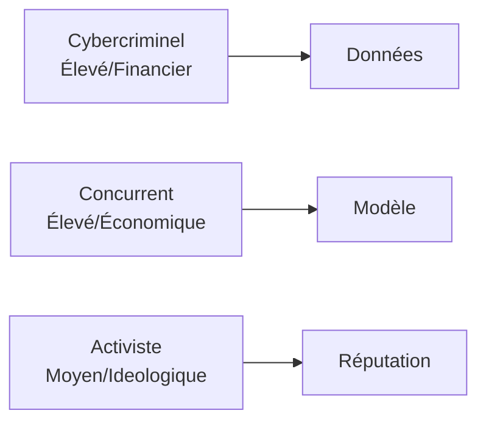
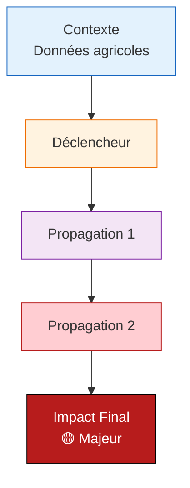
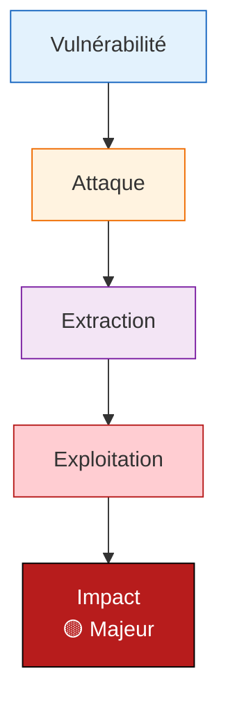
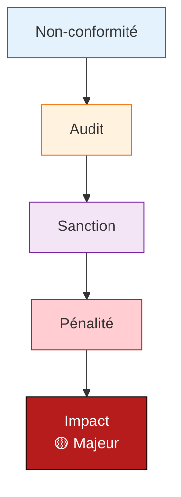
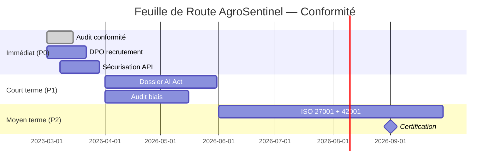

# Analyse EBIOS-RM IA — AgroSentinel

**Référence** : EBIOS-AGROSENTINEL-001 | **Date** : Mars 2026 | **Classification** : Confidentiel — Direction

---

## 1. CADRE ET CONTEXTE

### 1.1 Identification du Système

| Attribut | Valeur |
|:---------|:-------|
| **Nom** | AgroSentinel |
| **Entreprise** | 60 salariés, 8M€ CA |
| **Secteur** | Agriculture |
| **Classification** | 🟡 Risque Limité |
| **Incident** | Données agricoles |

### 1.2 Classification AI Act

| Critère | Évaluation | Justification |
|:--------|:-----------|:--------------|
| **Annexe III** | Non Annexe III | Surveillance parcellaire |
| **Décision automatique** | Partielle/Totale | Selon contexte |
| **Exception Art. 6(3)** | Non applicable | Impact significatif |
| **Classification finale** | 🟡 Risque Limité | Obligations réglementaires |

### 1.3 Biens Essentiels

| ID | Bien | Valeur | Justification |
|:---|:-----|:-------|:--------------|
| BE-001 | Données utilisateurs | **Critique** | Asset principal |
| BE-002 | Modèle IA | **Critique** | Compétitivité |
| BE-003 | Réputation | **Élevée** | Confiance clients |
| BE-004 | Conformité | **Critique** | Sanctions possibles |

---

## 2. ÉVÉNEMENTS REDOUTÉS

### 2.1 Cyber

| ID | Événement | Impact | Vraisemblance |
|:---|:----------|:-------|:--------------|
| ER-CYBER-001 | Fuite données | Critique | Moyenne |
| ER-CYBER-002 | Ransomware | Majeur | Moyenne |
| ER-CYBER-003 | Indisponibilité | Majeur | Faible |

### 2.2 Éthiques

| ID | Événement | Impact | Vraisemblance |
|:---|:----------|:-------|:--------------|
| ER-ETH-001 | Biais discriminant | Critique | Élevée |
| ER-ETH-002 | Manipulation | Critique | Élevée |
| ER-ETH-003 | Manque transparence | Majeur | Élevée |

### 2.3 Sociétaux

| ID | Événement | Impact | Vraisemblance |
|:---|:----------|:-------|:--------------|
| ER-SOC-001 | Scandale médiatique | Critique | Moyenne |
| ER-SOC-002 | Perte confiance | Majeur | Moyenne |

### 2.4 Réglementaires

| ID | Événement | Impact | Vraisemblance |
|:---|:----------|:-------|:--------------|
| ER-REG-001 | Sanction AI Act | Critique | Élevée |
| ER-REG-002 | Sanction CNIL | Majeur | Moyenne |

---

## 3. SOURCES DE RISQUE

### 3.1 Attaquants

| Profil | Capacité | Motivation | Cibles |
|:-------|:---------|:-----------|:-------|
| Cybercriminel | Élevée | Financier | Données |
| Concurrent | Élevée | Économique | IP |
| Activiste | Moyenne | Idéologique | Réputation |

### 3.2 Vulnérabilités Techniques

| Vulnérabilité | Source | Exploitation |
|:--------------|:-------|:-------------|
| API exposée | Configuration | Brute force |
| Données non chiffrées | Legacy | Accès interne |

### 3.3 Vulnérabilités IA Spécifiques

| Vulnérabilité | Risque | Mitigation | Écart |
|:--------------|:-------|:-----------|:------|
| Biais | Discrimination | Aucune | **Insuffisant** |
| Opacité | Manque confiance | Partielle | **Insuffisant** |

---

## 4. SCÉNARIOS DE RISQUE

### 4.1 Scénario Critique : Surveillance parcellaire

| Évaluation | Valeur |
|:-----------|:-------|
| **Vraisemblance** | 🟢 1/4 — Élevée |
| **Impact technique** | 🟡 2/4 — Majeur |
| **Impact métier** | 🟡 2/4 — Critique |
| **Impact réglementaire** | 🟡 2/4 — Critique |
| **Niveau risque** | 🟡 Majeur |

### 4.2 Scénario Majeur : Fuite Données

| Évaluation | Valeur |
|:-----------|:-------|
| **Vraisemblance** | 🟡 2/4 — Moyenne |
| **Impact technique** | 🔴 3/4 — Majeur |
| **Impact métier** | 🔴 3/4 — Majeur |
| **Niveau risque** | 🟡 Majeur |

### 4.3 Scénario Majeur : Non-Conformité

| Évaluation | Valeur |
|:-----------|:-------|
| **Vraisemblance** | 🟢 1/4 — Élevée |
| **Impact métier** | 🟡 2/4 — Critique |
| **Impact réglementaire** | 🟡 2/4 — Critique |
| **Niveau risque** | 🟡 Majeur |

---

## 5. PLAN DE TRAITEMENT PRIORISÉ

### 5.1 Mesures Immédiates (0-30 jours) — Budget : 100k€

| Priorité | Mesure | Risque couvert | Responsable | Coût |
|:---------|:-------|:---------------|:------------|:-----|
| 🔴 **P0** | Audit conformité | ER-REG-001 | CEO + Legal | 20k€ |
| 🔴 **P0** | DPO désignation | ER-REG-002 | RH | 10k€/mois |
| 🔴 **P0** | Sécurisation API | ER-CYBER-001 | DevOps | 30k€ |
| 🟡 **P1** | Chiffrement données | ER-CYBER | DevOps | 40k€ |

### 5.2 Mesures Courte Terme (1-3 mois) — Budget : 200k€

| Priorité | Mesure | Risque couvert | Livrable |
|:---------|:-------|:---------------|:---------|
| 🔴 **P0** | Conformité AI Act | ER-REG-001 | Dossier |
| 🔴 **P0** | Audit biais | ER-ETH-001 | Rapport |
| 🟡 **P1** | HITL systématique | ER-ETH | Workflow |

### 5.3 Mesures Moyen Terme (3-6 mois) — Budget : 300k€

| Priorité | Mesure | Risque couvert | Objectif |
|:---------|:-------|:---------------|:---------|
| 🟡 **P1** | ISO 27001 + 42001 | ALL | Certification |
| 🟢 **P2** | Assurance cyber | ALL | Transfert risque |

### 5.4 Budget Total Recommandé

| Période | Budget | % CA |
|:--------|:-------|:-----|
| Immédiat (30j) | 100k€ | 2% |
| Court terme (3m) | 200k€ | 4% |
| Moyen terme (6m) | 300k€ | 6% |
| **Total 6 mois** | **600k€** | **12%** |

---

## 6. FEUILLE DE ROUTE

---

## 7. SYNTHÈSE EXÉCUTIVE

### Diagnostic

| Domaine | Évaluation | Commentaire |
|:--------|:-----------|:------------|
| Cyber | 🔴 | API vulnérable, chiffrement partiel |
| Éthique | 🔴 | Biais confirmés, manque transparence |
| Réglementaire | 🔴 | Non-conformité AI Act |
| Sociétal | 🟡 | Risque réputation |

### Risques Prioritaires

1. **Surveillance parcellaire** — Scénario 🟡 Majeur
2. **Fuite données** — Scénario 🟡 Majeur
3. **Sanction réglementaire** — Scénario 🟡 Majeur

### Recommandations Stratégiques

- **Immédiat** : Audit conformité + DPO + sécurisation
- **Court terme** : Conformité AI Act + audit biais
- **Moyen terme** : Certifications ISO

### Investissement Nécessaire

- **6 mois** : 600k€ (12% CA)
- **12 mois** : 900k€ (18% CA)
- **ROI** : Éviter sanctions et perte clients

---

## ARBITRAGE FIX / PIVOT / KILL

| Option | Description | Recommandation |
|:---|:---|:---:|
| **FIX** | Conformité complète + transparence | ✅ **CHOISIR** |
| PIVOT | Modèle alternatif moins risqué | ⚠️ Possible |
| KILL | Arrêt système | ⚠️ Envisageable |

---

*Analyse EBIOS-RM IA — AgroSentinel | Version 1.0 | Mars 2026*
