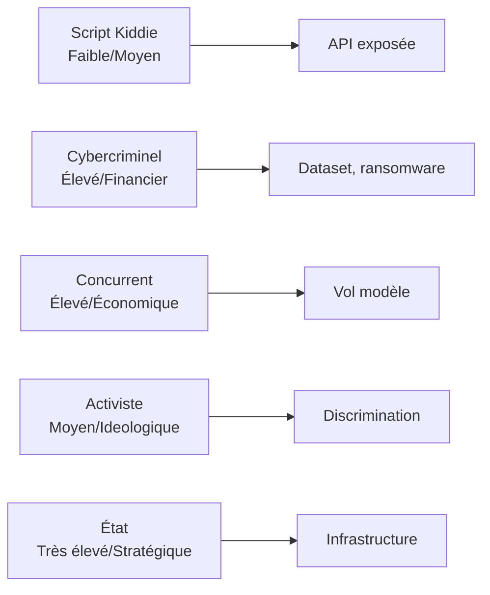
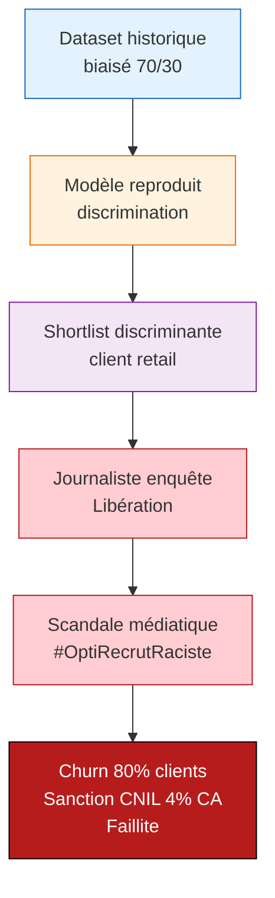
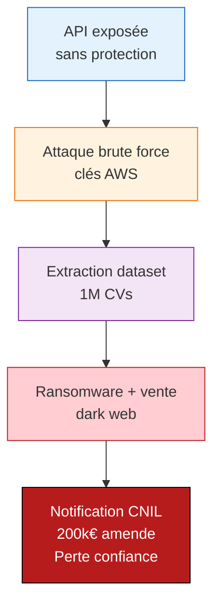
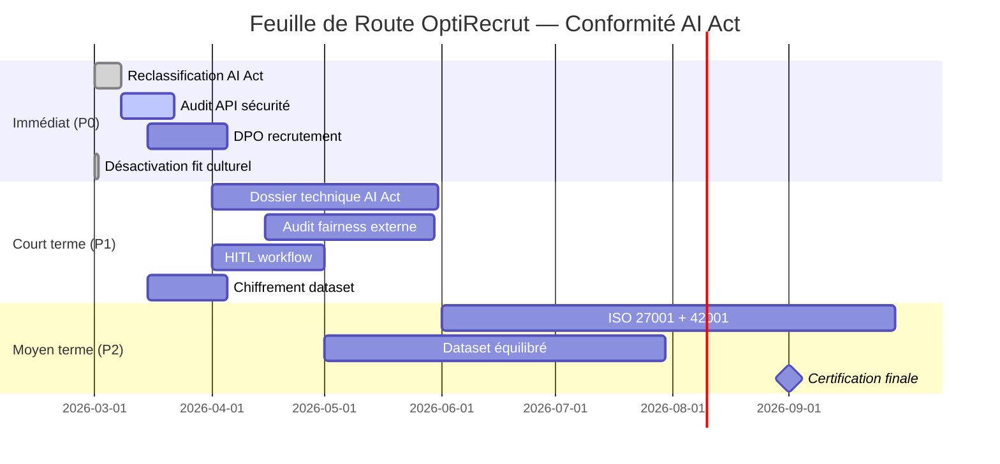

# Analyse EBIOS-RM IA — OptiRecrut / OptiMatch

**Référence** : EBIOS-OPTI-001 | **Date** : Mars 2026 | **Classification** : Confidentiel — Direction

---

## 1. CADRE ET CONTEXTE

### 1.1 Identification du Système

| Attribut | Valeur |
|:---------|:-------|
| **Nom** | OptiMatch |
| **Entreprise** | OptiRecrut (startup RH IA, 50 employés) |
| **Chiffre d'affaires** | 5M€ (2025) |
| **Clients** | 200 PME tech/retail |
| **Volume** | 10k candidatures/mois |
| **Modèle IA** | Llama 3.1 fine-tuné (1M CVs) |
| **Infrastructure** | AWS (data) + Azure (inférence) |

### 1.2 Classification AI Act

| Critère | Évaluation | Justification |
|:--------|:-----------|:--------------|
| **Annexe III** | Point 4(a) — Recrutement | Système de sélection candidats |
| **Décision automatique** | Partielle | Shortlist sans validation systématique |
| **Exception Art. 6(3)** | Non applicable | Pas de supervision humaine systématique |
| **Classification finale** | 🔴 **Haut Risque** | Obligations complètes AI Act |

> ⚠️ **Erreur d'évaluation interne** : L'équipe classait "limited risk" — cette analyse corrige en "haut risque".

### 1.3 Biens Essentiels

| ID | Bien | Valeur | Justification |
|:---|:-----|:-------|:--------------|
| BE-001 | Dataset CV (1M) | **Critique** | Asset core, IP différenciante |
| BE-002 | Modèle fine-tuné | **Critique** | Compétitivité produit |
| BE-003 | Réputation clients | **Élevée** | Confiance PME, churn si incident |
| BE-004 | Conformité réglementaire | **Critique** | AI Act + RGPD, sanctions possibles |
| BE-005 | Infrastructure cloud | **Élevée** | Disponibilité service |
| BE-006 | Équipe data (10 pers.) | **Élevée** | Compétences clés |

---

## 2. ÉVÉNEMENTS REDOUTÉS

### 2.1 Cyber

| ID | Événement | Impact | Vraisemblance |
|:---|:----------|:-------|:--------------|
| ER-CYBER-001 | Fuite dataset CV (1M) | Critique | Élevée |
| ER-CYBER-002 | Ransomware infrastructure | Majeur | Moyenne |
| ER-CYBER-003 | Extraction modèle (API) | Majeur | Moyenne |
| ER-CYBER-004 | Indisponibilité service (>24h) | Majeur | Moyenne |

### 2.2 Éthiques

| ID | Événement | Impact | Vraisemblance |
|:---|:----------|:-------|:--------------|
| ER-ETH-001 | Biais discriminant systémique | Critique | Élevée |
| ER-ETH-002 | "Fit culturel" = discrimination masquée | Critique | Élevée |
| ER-ETH-003 | Anonymisation partielle insuffisante | Majeur | Élevée |

### 2.3 Sociétaux

| ID | Événement | Impact | Vraisemblance |
|:---|:----------|:-------|:--------------|
| ER-SOC-001 | Scandale médiatique discrimination | Critique | Moyenne |
| ER-SOC-002 | Perte confiance marché RH IA | Majeur | Moyenne |
| ER-SOC-003 | Départ masse data scientists | Majeur | Faible |

### 2.4 Réglementaires

| ID | Événement | Impact | Vraisemblance |
|:---|:----------|:-------|:--------------|
| ER-REG-001 | Sanction AI Act (non-conformité) | Critique | Élevée |
| ER-REG-002 | Sanction CNIL (RGPD) | Majeur | Moyenne |
| ER-REG-003 | Interdiction service en UE | Critique | Moyenne |

---

## 3. SOURCES DE RISQUE

### 3.1 Attaquants



| Profil | Capacité | Motivation | Cibles |
|:-------|:---------|:-----------|:-------|
| Cybercriminel | Élevée | Ransomware, vente data | Dataset, infra |
| Concurrent US | Élevée | Vol IP, avantage compétitif | Modèle, algo |
| Activiste (éthique) | Moyenne | Exposer biais | Réputation |

### 3.2 Vulnérabilités Techniques

| Vulnérabilité | Source | Exploitation |
|:--------------|:-------|:-------------|
| API sans rate limiting | Mauvaise config | Brute force, extraction |
| Dataset non chiffré | Legacy | Accès interne malveillant |
| Dépendance AWS/Azure | Single cloud | Indisponibilité régionale |

### 3.3 Vulnérabilités IA Spécifiques

| Vulnérabilité | Risque | Mitigation actuelle | Écart |
|:--------------|:-------|:--------------------|:------|
| Biais genre (shortlist 70% hommes) | Discrimination | Aucune | **Insuffisant** |
| "Fit culturel" opaque | Discrimination masquée | Aucune | **Insuffisant** |
| Hallucination scoring | Mauvaise sélection | HITL partiel | Partiel |
| Drift modèle (pas de monitoring) | Dégradation performance | Aucune | **Insuffisant** |

---

## 4. SCÉNARIOS DE RISQUE

### 4.1 Scénario Critique : Biais Systémique + Scandale Médiatique



| Évaluation | Valeur |
|:-----------|:-------|
| **Vraisemblance** | 4/4 — Élevée (déjà observé) |
| **Impact technique** | 3/4 — Majeur (rebuild dataset) |
| **Impact métier** | 4/4 — Critique (faillite) |
| **Impact réglementaire** | 4/4 — Critique (sanction) |
| **Niveau risque** | ⚫ **Catastrophique** |

**Gravité** : ⚫ **4/4** | **Vraisemblance** : 🔴 **4/4** | **Risque** : ⚫ **Prioritaire immédiat**

### 4.2 Scénario Majeur : Fuite Dataset + Ransomware



| Évaluation | Valeur |
|:-----------|:-------|
| **Vraisemblance** | 3/4 — Moyenne à Élevée |
| **Impact technique** | 3/4 — Majeur |
| **Impact métier** | 3/4 — Majeur |
| **Impact réglementaire** | 3/4 — Majeur |
| **Niveau risque** | 🔴 **Critique** |

### 4.3 Scénario Majeur : Non-Conformité AI Act

```mermaid
flowchart TB
    C1[Classification<br/>"limited risk"] --> T1[Audit AI Office<br/>2026]
    T1 --> P1[Reclassification<br/>"haut risque"]
    P1 --> P2[Obligations non<br/>remplies]
    P2 --> F1[Sanction 35M€<br/>7% CA<br/>Interdiction UE]

    style C1 fill:#e3f2fd,stroke:#1565c0
    style T1 fill:#fff3e0,stroke:#ef6c00
    style P1 fill:#f3e5f5,stroke:#7b1fa2
    style P2 fill:#ffcdd2,stroke:#b71c1c
    style F1 fill:#b71c1c,stroke:#000,color:#fff
```

| Évaluation | Valeur |
|:-----------|:-------|
| **Vraisemblance** | 4/4 — Élevée (évaluation erronée) |
| **Impact technique** | 2/4 — Mineur |
| **Impact métier** | 4/4 — Critique (interdiction) |
| **Impact réglementaire** | 4/4 — Critique (sanction record) |
| **Niveau risque** | ⚫ **Catastrophique** |

---

## 5. PLAN DE TRAITEMENT PRIORISÉ

### 5.1 Mesures Immédiates (0-30 jours) — Budget : 50k€

| Priorité | Mesure | Risque couvert | Responsable | Coût |
|:---------|:-------|:---------------|:------------|:-----|
| 🔴 **P0** | Reclassification AI Act : Haut Risque | ER-REG-001 | CEO + Legal | 5k€ (conseil) |
| 🔴 **P0** | Audit API sécurité (externe) | ER-CYBER-001 | RSSI externe | 15k€ |
| 🔴 **P0** | DPO interne ou délégué | ER-REG-002 | RH | 8k€/mois |
| 🔴 **P0** | Désactiver "fit culturel" temporairement | ER-ETH-001/002 | Product | 0€ |
| 🟡 **P1** | Chiffrement dataset au repos | ER-CYBER-001 | DevOps | 10k€ |
| 🟡 **P1** | Monitoring drift modèle (baseline) | ER-ETH-001 | Data Science | 12k€ |

### 5.2 Mesures Courte Terme (1-3 mois) — Budget : 150k€

| Priorité | Mesure | Risque couvert | Livrable |
|:---------|:-------|:---------------|:---------|
| 🔴 **P0** | Conformité AI Act complète | ER-REG-001/003 | Dossier technique 200p |
| 🔴 **P0** | Audit fairness externe | ER-ETH-001 | Rapport + correctifs |
| 🔴 **P0** | HITL systématique (scores <70 ET >90) | ER-ETH-001/REG | Workflow validé |
| 🟡 **P1** | Anonymisation différentielle (vrai) | ER-ETH-003 | Dataset v2 |
| 🟡 **P1** | Redondance infra (multi-cloud) | ER-CYBER-004 | Architecture HA |
| 🟡 **P1** | SOC 2 Type II (début) | ER-CYBER-001/002 | Contrôles + audit |

### 5.3 Mesures Moyen Terme (3-6 mois) — Budget : 200k€

| Priorité | Mesure | Risque couvert | Objectif |
|:---------|:-------|:---------------|:---------|
| 🟡 **P1** | ISO 27001 + ISO 42001 | ER-CYBER-001/REG | Certification |
| 🟡 **P1** | Dataset équilibré (re-sampling) | ER-ETH-001 | 50/50 genre |
| 🟢 **P2** | Explicabilité SHAP/LIME | ER-ETH-001 | Justifications traçables |
| 🟢 **P2** | Bug bounty program | ER-CYBER-001/002/003 | Communauté |
| 🟢 **P2** | Assurance cyber + responsabilité IA | Tous | Transfert risque |

### 5.4 Budget Total Recommandé

| Période | Budget | % CA 2025 |
|:--------|:-------|:----------|
| Immédiat (30j) | 50k€ | 1% |
| Court terme (3m) | 150k€ | 3% |
| Moyen terme (6m) | 200k€ | 4% |
| **Total 6 mois** | **400k€** | **8%** |
| **Total 12 mois** | **600k€** | **12%** |

> Budget IT actuel : 500k€/an → **Nécessite augmentation à 800k€/an** (60%)

---

## 6. FEUILLE DE ROUTE



---

## 7. SYNTHÈSE EXÉCUTIVE

### Diagnostic

| Domaine | Évaluation | Commentaire |
|:--------|:-----------|:------------|
| Cyber | 🔴 | API exposée, dataset non chiffré |
| Éthique | 🔴 | Biais systémique confirmé, "fit culturel" opaque |
| Réglementaire | 🔴 | Classification erronée, non-conformité AI Act |
| Sociétal | 🟡 | Risque scandale médiatique élevé |

### Risques Prioritaires

1. **Biais discrimination** (ER-ETH-001) — Scénario ⚫ Catastrophique
2. **Fuite dataset** (ER-CYBER-001) — Scénario 🔴 Critique
3. **Sanction AI Act** (ER-REG-001) — Scénario ⚫ Catastrophique

### Recommandations Stratégiques

- **Immédiat** : Reclassifier "haut risque" + désactiver "fit culturel" + recruter DPO
- **Court terme** : Conformité AI Act complète + audit fairness externe
- **Moyen terme** : Certifications ISO 27001 + 42001 + dataset équilibré

### Investissement Nécessaire

- **6 mois** : 400k€ (8% CA)
- **12 mois** : 600k€ (12% CA)
- **ROI** : Éviter faillite (sanctions + perte clients)

---

## ARBITRAGE FIX / PIVOT / KILL

| Option | Description | Recommandation |
|:---|:---|:---:|
| **FIX** | Anonymisation CV + audit biais + transparence | ✅ **CHOISIR** |
| PIVOT | Recrutement traditionnel sans IA | ⚠️ Possible mais perte d'efficacité |
| KILL | Arrêt OptiRecrut | ❌ Trop préjudiciable (RH) |

---

*Analyse EBIOS-RM IA — OptiRecrut | Version 1.0 | Mars 2026*
