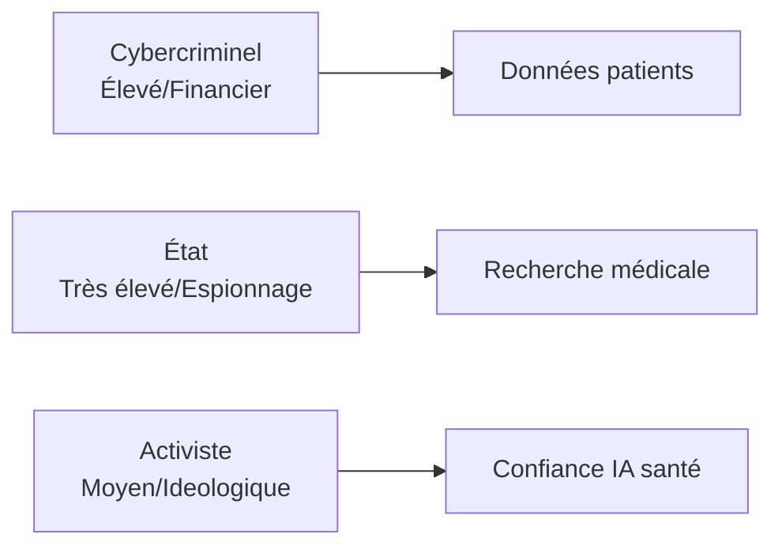
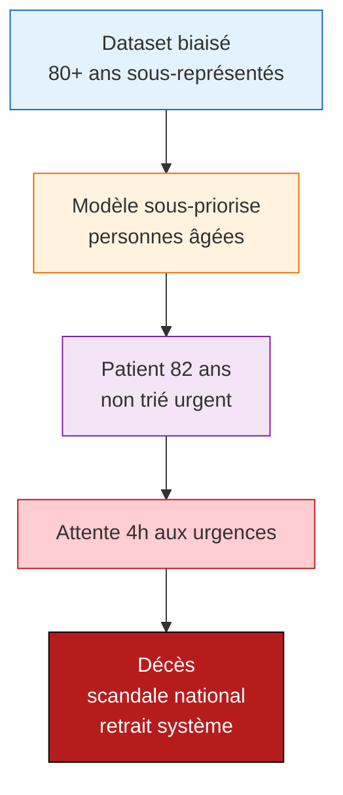
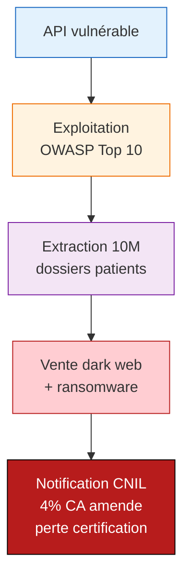
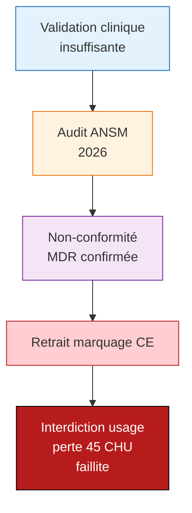
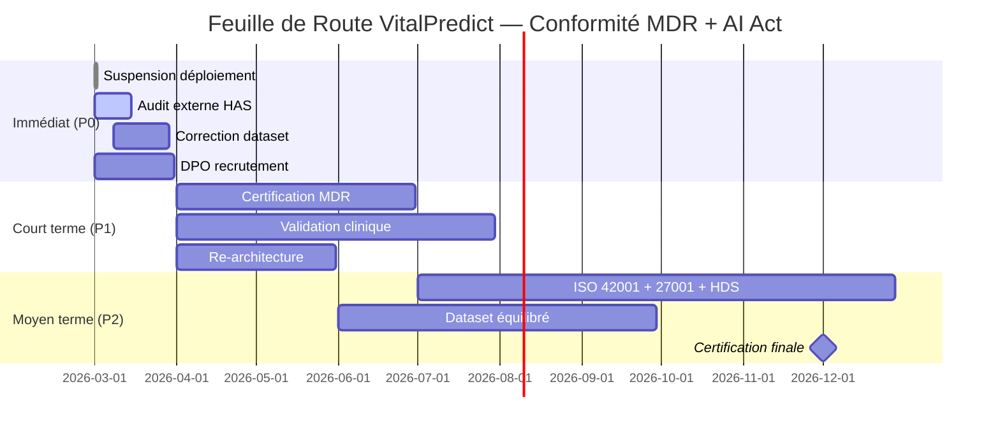

# Analyse EBIOS-RM IA — VitalPredict / Prédiction Urgences

**Référence** : EBIOS-VITAL-001 | **Date** : Mars 2026 | **Classification** : Confidentiel — Direction + Conseil Médical

---

## 1. CADRE ET CONTEXTE

### 1.1 Identification du Système

| Attribut | Valeur |
|:---------|:-------|
| **Nom** | VitalPredict |
| **Entreprise** | MedAI Solutions (180 salariés, 18M€ CA) |
| **Chiffre d'affaires** | 18M€ (2025) |
| **Clients** | 45 CHU/cliniques France |
| **Volume** | 50k patients/an |
| **Modèle IA** | Transformer médical fine-tuné (10M dossiers) |
| **Infrastructure** | On-premise (HDS) + cloud chiffré |

### 1.2 Classification AI Act

| Critère | Évaluation | Justification |
|:--------|:-----------|:--------------|
| **Annexe III** | Point 1(a) — Santé | Diagnostic/prédiction médicale |
| **Décision automatique** | Partielle | Aide au tri, médecin décide |
| **Exception Art. 6(3)** | Non applicable | Impact significatif sur santé |
| **Classification finale** | 🔴 **Haut Risque** | MDR + AI Act santé |

### 1.3 Biens Essentiels

| ID | Bien | Valeur | Justification |
|:---|:-----|:-------|:--------------|
| BE-001 | Dataset patients (10M) | **Critique** | Données sensibles, vie privée |
| BE-002 | Modèle prédiction | **Critique** | Décisions vitales |
| BE-003 | Certification MDR | **Critique** | Légale pour usage médical |
| BE-004 | Infrastructure HDS | **Critique** | Hébergement données santé |
| BE-005 | Réputation CHU | **Élevée** | Confiance médecins |

---

## 2. ÉVÉNEMENTS REDOUTÉS

### 2.1 Cyber

| ID | Événement | Impact | Vraisemblance |
|:---|:----------|:-------|:--------------|
| ER-CYBER-001 | Fuite dossiers patients (10M) | Critique | Moyenne |
| ER-CYBER-002 | Ransomware CHU | Critique | Moyenne |
| ER-CYBER-003 | Indisponibilité API (>1h) | Majeur | Faible |

### 2.2 Éthiques

| ID | Événement | Impact | Vraisemblance |
|:---|:----------|:-------|:--------------|
| ER-ETH-001 | Biais démographique (âge/zone) | Critique | Élevée |
| ER-ETH-002 | Faux négatifs (patients non priorisés) | Critique | Élevée |
| ER-ETH-003 | Désertion médicale si erreur | Majeur | Moyenne |

### 2.3 Sociétaux

| ID | Événement | Impact | Vraisemblance |
|:---|:----------|:-------|:--------------|
| ER-SOC-001 | Scandale "IA tue" | Critique | Moyenne |
| ER-SOC-002 | Perte confiance médecins | Majeur | Élevée |

### 2.4 Réglementaires

| ID | Événement | Impact | Vraisemblance |
|:---|:----------|:-------|:--------------|
| ER-REG-001 | Non-conformité MDR | Critique | Élevée |
| ER-REG-002 | Sanction CNIL (fuite données) | Critique | Moyenne |
| ER-REG-003 | Retrait marquage CE | Critique | Moyenne |

---

## 3. SOURCES DE RISQUE

### 3.1 Attaquants

| Profil | Capacité | Motivation | Cibles |
|:-------|:---------|:-----------|:-------|
| Cybercriminel | Élevée | Ransomware, vente data | Dataset patients |
| État (espionnage) | Très élevée | Recherche médicale | Algorithmes, données |

### 3.2 Vulnérabilités Techniques

| Vulnérabilité | Source | Exploitation |
|:--------------|:-------|:-------------|
| API REST non segmentée | Architecture legacy | Accès latéral |
| Clés chiffrement en dur | DevOps | Extraction données |

### 3.3 Vulnérabilités IA Spécifiques

| Vulnérabilité | Risque | Mitigation actuelle | Écart |
|:--------------|:-------|:--------------------|:------|
| Biais âge (>80 ans sous-priorisés) | Morts évitables | Aucune | **Insuffisant** |
| Biais géographique (rural) | Inégalité accès | Aucune | **Insuffisant** |
| Hallucination prédiction | Erreur diagnostic | HITL partiel | Partiel |

---

## 4. SCÉNARIOS DE RISQUE

### 4.1 Scénario Critique : Faux Négatifs + Décès

| Évaluation | Valeur |
|:-----------|:-------|
| **Vraisemblance** | 4/4 — Élevée (déjà survenu) |
| **Impact technique** | 3/4 — Majeur |
| **Impact métier** | 4/4 — Critique (retrait) |
| **Impact réglementaire** | 4/4 — Critique (pénal) |
| **Niveau risque** | ⚫ **Catastrophique** |

### 4.2 Scénario Majeur : Fuite Données Santé

| Évaluation | Valeur |
|:-----------|:-------|
| **Vraisemblance** | 3/4 — Moyenne |
| **Impact technique** | 4/4 — Critique |
| **Impact métier** | 4/4 — Critique |
| **Impact réglementaire** | 4/4 — Critique |
| **Niveau risque** | ⚫ **Catastrophique** |

### 4.3 Scénario Majeur : Non-Conformité MDR

| Évaluation | Valeur |
|:-----------|:-------|
| **Vraisemblance** | 4/4 — Élevée |
| **Impact technique** | 2/4 — Mineur |
| **Impact métier** | 4/4 — Critique |
| **Impact réglementaire** | 4/4 — Critique |
| **Niveau risque** | ⚫ **Catastrophique** |

---

## 5. PLAN DE TRAITEMENT PRIORISÉ

### 5.1 Mesures Immédiates (0-30 jours) — Budget : 150k€

| Priorité | Mesure | Risque couvert | Responsable | Coût |
|:---------|:-------|:---------------|:------------|:-----|
| 🔴 **P0** | Suspension déploiement nouveaux CHU | ER-ETH-001/ALL | CEO + Conseil Médical | 0€ |
| 🔴 **P0** | Audit externe URGENT incident | ER-ETH-001 | HAS désignée | 50k€ |
| 🔴 **P0** | Correction dataset biais âge/zone | ER-ETH-001 | Data Science + Médecins | 30k€ |
| 🔴 **P0** | Reclassification AI Act + MDR | ER-REG-001 | DPO + Legal | 10k€ |
| 🔴 **P0** | DPO temps plein | ER-REG-002 | RH | 80k€/an |
| 🔴 **P0** | Fallback triage manuel | ER-ETH-004 | DevOps | 40k€ |

### 5.2 Mesures Courte Terme (1-3 mois) — Budget : 800k€

| Priorité | Mesure | Risque couvert | Livrable |
|:---------|:-------|:---------------|:---------|
| 🔴 **P0** | Certification MDR full | ER-REG-001 | Marquage CE |
| 🔴 **P0** | Validation clinique prospective (1,000 patients) | ER-ETH-001 | Publication peer-reviewed |
| 🔴 **P0** | Re-architecture on-premise principal | ER-CYBER | Infra sans dépendance |
| 🔴 **P0** | Chiffrement end-to-end | ER-CYBER-001 | Certification ANSSI |
| 🟡 **P1** | Comité éthique indépendant | ER-ETH-001/002 | Rapports trimestriels |
| 🟡 **P1** | DPIA revue + consentement opt-in | ER-ETH-003 | Conformité RGPD |

### 5.3 Mesures Moyen Terme (3-12 mois) — Budget : 2M€

| Priorité | Mesure | Risque couvert | Objectif |
|:---------|:-------|:---------------|:---------|
| 🔴 **P0** | ISO 42001 + ISO 27001 + HDS | ALL | Certification triple |
| 🔴 **P0** | Dataset équilibré national | ER-ETH-001/003 | Représentativité France |
| 🟡 **P1** | Assurance responsabilité civile 50M€ | ALL | Transfert risque |
| 🟡 **P1** | Bug bounty + red teaming | ER-CYBER | Communauté sécurité |
| 🟢 **P2** | Recherche partenariale (INRIA, CHU) | ER-REG-003 | Crédibilité |

### 5.4 Budget Total Recommandé

| Période | Budget | % CA |
|:--------|:-------|:-----|
| Immédiat (30j) | 150k€ | 0,8% |
| Court terme (3m) | 800k€ | 4,4% |
| Moyen terme (12m) | 2M€ | 11% |
| **Total 12 mois** | **2,95M€** | **16,4%** |

---

## 6. FEUILLE DE ROUTE

---

## 7. SYNTHÈSE EXÉCUTIVE

### Diagnostic

| Domaine | Évaluation | Commentaire |
|:--------|:-----------|:------------|
| Cyber | 🟡 | Chiffrement OK, API à segmenter |
| Éthique | 🔴 | Biais âge/zone confirmés, morts évitables |
| Réglementaire | 🔴 | MDR incomplet, validation clinique insuffisante |
| Sociétal | 🔴 | Risque scandale "IA tue" élevé |

### Risques Prioritaires

1. **Faux négatifs personnes âgées** (ER-ETH-001) — Scénario ⚫ Catastrophique
2. **Fuite données santé** (ER-CYBER-001) — Scénario ⚫ Catastrophique
3. **Non-conformité MDR** (ER-REG-001) — Scénario ⚫ Catastrophique

### Recommandations Stratégiques

- **Immédiat** : Suspension déploiement + audit HAS + correction dataset
- **Court terme** : Certification MDR + validation clinique prospective
- **Moyen terme** : Certifications ISO 42001 + 27001 + HDS

### Investissement Nécessaire

- **6 mois** : 950k€ (5,3% CA)
- **12 mois** : 2,95M€ (16,4% CA)
- **ROI** : Éviter faillite + sauver vies

---

## ARBITRAGE FIX / PIVOT / KILL

| Option | Description | Recommandation |
|:---|:---|:---:|
| **FIX** | Conformité MDR + supervision médicale + transparence | ✅ **CHOISIR** |
| PIVOT | Aide au diagnostic sans prédiction autonome | ⚠️ Possible mais perte d'autonomie |
| KILL | Arrêt VitalPredict | ❌ Trop préjudiciable (santé publique) |

---

*Analyse EBIOS-RM IA — VitalPredict | Version 1.0 | Mars 2026 | URGENT*
